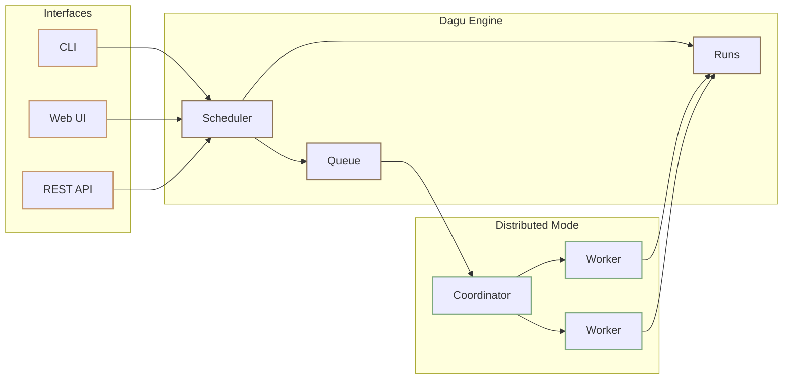

<div class="tagline" style="text-align: center;">
  <h2>Turn any operation into a durable workflow in minutes</h2>
  <p>Dagu wraps scripts, SQL, SSH commands, API calls, containers, and runbooks with typed inputs, validation, retries, visual execution, logs, artifacts, run history, and optional human review.</p>
</div>

<div class="hero-section">
  <div class="hero-actions">
    <a href="/getting-started/quickstart" class="VPButton brand">Get Started</a>
    <a href="/overview/deployment-models" class="VPButton alt">Deployment Models</a>
    <a href="/writing-workflows/examples" class="VPButton alt">View Examples</a>
  </div>
</div>

<video src="/cockpit-demo.mp4" controls preload="metadata" playsinline aria-label="Cockpit demo" style="width: 100%; border-radius: 12px; margin: 8px 0 24px;"></video>

::: tip Try It Live
Explore without installing: [Live Demo](https://dagu-demo-f5e33d0e.dagu.sh/)

Credentials: `demouser` / `demouser`
:::

## Why Dagu?

<div class="overview-card-grid">
  <div class="overview-card">
    <h3><a href="/overview/architecture">Local-first</a></h3>
    <p>Run workflows close to private networks, internal databases, local files, credentials, and existing CLIs. The common single-server setup uses one binary and file-backed state, with no required external database or broker.</p>
  </div>
  <div class="overview-card">
    <h3><a href="/writing-workflows/parameters">Self-service inputs</a></h3>
    <p>Declare workflow parameters once in YAML. Dagu uses them to render a guided start form in the Web UI, validate operator input, and keep submitted values attached to the run history.</p>
  </div>
  <div class="overview-card">
    <h3><a href="/mcp/">AI-agent ready</a></h3>
    <p>Use MCP-capable agents to inspect state, preview workflow changes, apply edits, and start, retry, or stop runs. Agent-authored workflows still run through the same logs, approvals, artifacts, and audit trail as human-authored YAML.</p>
  </div>
</div>

## Motivation

Important operations often start as scripts: a shell repair command, a Python cleanup job, a SQL check, an SSH backup, a dbt command, a container task, or a runbook that only works on a specific server. These tasks may become critical before they have a proper control plane. Inputs, permissions, approvals, logs, recovery steps, and operational context end up spread across crontabs, worker images, wiki pages, chat messages, and engineer knowledge.

Dagu was built for teams that already have useful automation but need a practical way to let the right people run it safely. Instead of asking teams to move execution into a cloud job platform, build a custom admin UI, or translate every job into a large orchestration stack, Dagu wraps existing work with typed parameters, generated input forms, visible dependencies, durable execution, approvals, logs, artifacts, queues, distributed workers, notifications, and Web UI controls.

By default, Dagu keeps workflows, run history, logs, and artifacts on local disk, so workflows can run near private networks, internal databases, local files, specialized hardware, and existing CLIs. Teams can move from manual engineer execution and fragmented cron to visible, retryable, self-service workflows without introducing a large platform project first.

## What Dagu Adds Around a Run

The YAML still looks like scripts, commands, and service calls. The difference is that the workflow also carries the inputs, runtime details, and review points operators usually keep in wiki pages, worker images, or chat history.

<div class="overview-card-grid">
  <div class="overview-card">
    <h3><a href="/writing-workflows/parameters">Generated parameter UI</a></h3>
    <p>A top-level <code>params</code> block defines names, types, defaults, descriptions, and allowed values for a workflow run. Dagu turns those declarations into a start form in the Web UI.</p>
    <p><strong>Why it matters:</strong> operators get a guided way to provide inputs, while engineers keep the contract versioned with the workflow.</p>
  </div>
  <div class="overview-card">
    <h3><a href="/writing-workflows/tools">Pinned tools</a></h3>
    <p>A top-level <code>tools</code> block lists the CLIs and versions the workflow needs. Dagu prepares them on the worker and puts them on <code>PATH</code> before host commands run.</p>
    <p><strong>Why it matters:</strong> the DAG names its toolchain. That means fewer surprises from stale worker images or hand-installed binaries.</p>
  </div>
  <div class="overview-card">
    <h3><a href="/dagu-actions/">Dagu Actions</a></h3>
    <p>A step can call <code>python-script@v1</code>, <code>duckdb@v1</code>, or <code>ffmpeg@v1</code>. Dagu resolves the action package and runs it as its own child workflow.</p>
    <p><strong>Why it matters:</strong> shared logic can live with its inputs, outputs, helper files, and tool dependencies. The caller stays small.</p>
  </div>
  <div class="overview-card">
    <h3><a href="/web-ui/notifications">Notifications</a></h3>
    <p>Channels and rules send run events to Slack, email, Telegram, Google Chat, or webhooks when a run fails, waits, gets rejected, is aborted, or succeeds.</p>
    <p><strong>Why it matters:</strong> teams manage routing in the Web UI, globally, by workspace, or for one DAG. The DAG does not need webhook URLs.</p>
  </div>
  <div class="overview-card">
    <h3><a href="/web-ui/incidents">Incident routing</a></h3>
    <p>Routes create provider incidents after final workflow failure and resolve them after a later successful run recovers the DAG.</p>
    <p><strong>Why it matters:</strong> failures and recovery stay tied to the workflow, with run links, dedup keys, and provider state stored by Dagu.</p>
  </div>
</div>

## How a Workflow Runs

Dagu does not make you rewrite the work. Your scripts, SQL files, containers, SSH commands, APIs, and services can stay as they are; the YAML adds inputs, order, logs, retries, approvals, artifacts, and recovery controls around them.

```yaml
params:
  - name: customer_id
    type: string
    description: Customer or account identifier
  - name: change_scope
    type: string
    description: What the repair is allowed to change
    enum:
      - metadata_only
      - permissions
      - full_account
    default: metadata_only
  - name: dry_run
    type: boolean
    default: true

steps:
  - id: inspect_account
    run: ./scripts/inspect-account.sh --customer "${customer_id}"
    stdout:
      artifact: reports/inspection.md

  - id: review
    action: noop
    depends: inspect_account
    approval:
      prompt: Review the inspection report before running the repair.

  - id: repair_account
    run: >-
      ./scripts/repair-account.sh
      --customer "${customer_id}"
      --scope "${change_scope}"
      --dry-run="${dry_run}"
    depends: review
    stdout:
      artifact: reports/repair.log
```

In this example, the DAG turns an existing account-repair runbook into a reviewed workflow. The `params` block gives Dagu enough information to render a guided input form before the run starts. The inspection output is stored as an artifact, the repair waits for explicit approval, and the submitted values, logs, artifacts, and status stay attached to the run history.

<div class="overview-lifecycle" aria-label="Dagu workflow lifecycle">
  <span>Write YAML</span>
  <span>Validate</span>
  <span>Schedule or Run</span>
  <span>Monitor</span>
  <span>Retry or Approve</span>
  <span>Notify and Audit</span>
</div>

During a run, Dagu resolves dependencies, starts ready steps, captures stdout and stderr, tracks status, applies retry rules, pauses for approvals, stores artifacts, and updates the Web UI in real time.

## Core Terminology

Understanding Dagu is easier once the main terms are clear.

| Term | Meaning |
|------|---------|
| **DAG** | A workflow file written in [YAML](/writing-workflows/yaml-specification). Steps run according to dependencies, so the execution order is explicit. |
| **Step** | One unit of work. A step can run a [command](/step-types/shell), [container](/step-types/docker), [SSH command](/step-types/ssh), [HTTP request](/step-types/http), [SQL query](/step-types/sql/), [readiness wait](/step-types/wait), [sub-workflow](/writing-workflows/control-flow), or [AI agent task](/features/agent/step). |
| **Action** | The kind of work a step runs, such as [`run`](/step-types/shell), [`docker.run`](/step-types/docker), [`kubernetes.run`](/step-types/kubernetes), [`ssh.run`](/step-types/ssh), [`http.request`](/step-types/http), [`postgres.query`](/step-types/sql/postgresql), [`wait.http`](/step-types/wait), [`s3.upload`](/step-types/s3), or [`agent.run`](/features/agent/step). You can also define [custom actions](/dagu-actions/custom), call [third-party actions](/dagu-actions/third-party), or use [official actions](/dagu-actions/official) such as [`duckdb@v1`](/dagu-actions/official/duckdb). |
| **Dagu Action** | A versioned action package such as [`python-script@v1`](/dagu-actions/official/python-script), [`duckdb@v1`](/dagu-actions/official/duckdb), or [`ffmpeg@v1`](/dagu-actions/official/ffmpeg). |
| **Parameter** | A declared run input with a name, type, default, description, or allowed values. Parameters power the generated Web UI start form and keep submitted values visible with the run. |
| **Tool** | A pinned CLI package declared with [`tools`](/writing-workflows/tools). Dagu installs these before the run so host command steps use the expected binary version. |
| **Run** | One execution of a DAG. Runs keep [status](/web-ui/cockpit), [logs](/overview/web-ui#run-history-and-logs), [timing](/overview/web-ui#run-details), [outputs](/writing-workflows/outputs), and [artifacts](/writing-workflows/artifacts). |
| **Notification** | A UI-managed route that sends run events to Slack, email, Telegram, Google Chat, or webhooks. |
| **Incident** | A provider-backed failure lifecycle that opens on final failure, deduplicates repeated failures, and resolves after recovery. |
| **Schedule** | [Cron-based automation](/writing-workflows/scheduling) for starting DAG runs, including timezone support. |
| **Queue** | [Concurrency control](/server-admin/queues) for workflows, useful when jobs must not overlap or when workers are shared. |
| **Worker** | A machine that executes tasks in [distributed mode](/server-admin/distributed/). Workers can be selected by [labels](/server-admin/distributed/worker-labels) such as region, GPU, or environment. |
| **Artifact** | A file produced by a run and stored with the [run history](/getting-started/cli#history) for [preview, download, or audit](/writing-workflows/artifacts). |

See [Core Concepts](/getting-started/concepts) for the deeper model.

## Why Teams Choose Dagu

The main reason teams choose Dagu is that it turns existing automation into safe, visible workflows without turning that work into a platform rollout.

<div class="overview-card-grid overview-strengths-grid">
  <div class="overview-card">
    <h3><a href="/getting-started/installation/">Single binary</a></h3>
    <p>Install <a href="/getting-started/installation/">one executable</a>. The default <a href="/getting-started/quickstart">quickstart setup</a> runs without an external <a href="/overview/architecture">database or broker</a> and without splitting the <a href="/writing-workflows/scheduling">scheduler</a>, queue, or <a href="/overview/web-ui">Web UI</a> into separate required services.</p>
  </div>
  <div class="overview-card">
    <h3><a href="/overview/architecture">Local-first storage</a></h3>
    <p><a href="/getting-started/cli#history">Run history</a>, <a href="/overview/web-ui#run-history-and-logs">logs</a>, and artifacts stay local by default, which keeps <a href="/overview/deployment-models">self-hosting</a> simple and fits private-network, data-local, and air-gapped deployment patterns.</p>
  </div>
  <div class="overview-card">
    <h3><a href="/writing-workflows/examples">No rewrite workflows</a></h3>
    <p>Wrap existing <a href="/step-types/shell">scripts and commands</a>, <a href="/step-types/sql/">SQL</a>, dbt commands, DuckDB jobs, <a href="/step-types/docker">containers</a>, SSH operations, HTTP calls, and other <a href="/writing-workflows/examples">automation tasks</a> instead of converting them into framework-specific jobs.</p>
  </div>
  <div class="overview-card">
    <h3><a href="/writing-workflows/parameters">Generated forms</a></h3>
    <p>Declare typed <a href="/writing-workflows/parameters">parameters</a> in YAML and Dagu automatically presents the right inputs in the <a href="/overview/web-ui">Web UI</a>, including defaults, descriptions, and allowed values.</p>
  </div>
  <div class="overview-card">
    <h3><a href="/writing-workflows/tools">Reproducible CLI tools</a></h3>
    <p>Declare pinned <a href="/writing-workflows/tools">external tool packages</a> in the DAG so portable CLIs such as <code>jq</code>, <code>yq</code>, and <code>duckdb</code> are installed automatically and every worker runs the same binary version.</p>
  </div>
  <div class="overview-card">
    <h3><a href="/overview/web-ui">Observable by default</a></h3>
    <p>Every run has <a href="/web-ui/cockpit">status</a>, <a href="/overview/web-ui#run-history-and-logs">per-step logs</a>, <a href="/overview/web-ui#run-details">timing and history</a>, <a href="/writing-workflows/artifacts">artifacts</a>, <a href="/writing-workflows/approval">approvals</a>, <a href="/web-ui/notifications">notifications</a>, <a href="/web-ui/incidents">incident routing</a>, and <a href="/overview/web-ui">UI controls</a> for debugging, recovery, and handoff.</p>
  </div>
  <div class="overview-card">
    <h3><a href="/server-admin/distributed/">Scales gradually</a></h3>
    <p>Start on <a href="/getting-started/quickstart">one machine</a>, then move heavy, regional, or specialized jobs to <a href="/server-admin/distributed/">distributed workers</a> with <a href="/server-admin/distributed/worker-labels">label-based routing</a>.</p>
  </div>
  <div class="overview-card">
    <h3><a href="/writing-workflows/yaml-specification">Plain YAML</a></h3>
    <p>Workflows live as <a href="/writing-workflows/yaml-specification">plain YAML</a>, can be reviewed in <a href="/server-admin/git-sync">Git</a>, generated with <a href="/dagu-actions/custom">reusable tooling</a>, edited by <a href="/getting-started/ai-agent">AI agents</a>, and checked with <a href="/getting-started/cli#validate">validation</a> before they run.</p>
  </div>
</div>

## Architecture at a Glance

Dagu can run in a small local setup or scale out when workloads grow. The operating model changes, but the workflow YAML does not need to be rewritten.

<div class="overview-mode-grid">
  <div class="overview-mode-card">
    <h3>Standalone</h3>
    <p><code>dagu start-all</code> runs the Web UI, scheduler, and workflow runtime in one process.</p>
    <p>Best for one server, a team utility box, a private automation host, or getting started quickly.</p>
  </div>
  <div class="overview-mode-card">
    <h3>Headless</h3>
    <p>Run workflows from the CLI or API without relying on the Web UI.</p>
    <p>Best for CI-like automation, locked-down servers, or environments where Dagu is managed by another system.</p>
  </div>
  <div class="overview-mode-card">
    <h3>Coordinator and Workers</h3>
    <p>The scheduler queues work, the coordinator assigns tasks, and workers execute DAGs over gRPC.</p>
    <p>Best for many machines, GPU jobs, regional routing, mixed workloads, and high-throughput batch processing.</p>
  </div>
</div>



See [Architecture](/overview/architecture) for internals and storage, and [Deployment Models](/overview/deployment-models) for local, self-hosted, managed, and hybrid deployment options.

## How Dagu Is Different

<div class="comparison-table">
  <table>
    <thead>
      <tr>
        <th>Existing problem</th>
        <th>Dagu path</th>
      </tr>
    </thead>
    <tbody>
      <tr>
        <td>Operational tasks are scattered across scripts, SQL files, SSH commands, API calls, cron entries, and engineer runbooks</td>
        <td>One YAML workflow with parameters, dependencies, approvals, retries, logs, artifacts, and run controls.</td>
      </tr>
      <tr>
        <td>A custom admin UI is needed just to let support or operations teams run a safe command</td>
        <td>Declare parameters in YAML and let Dagu generate the Web UI input form, validation, logs, and run history.</td>
      </tr>
      <tr>
        <td>A cloud job platform would move execution away from private data, credentials, and internal networks</td>
        <td>Run workflows where the data, credentials, files, and existing CLIs already live.</td>
      </tr>
      <tr>
        <td>A large orchestrator is too much infrastructure for scripts and runbooks</td>
        <td>Start with one binary and file-backed state, then add queues and distributed workers only when needed.</td>
      </tr>
      <tr>
        <td>Important runbooks still require manual SSH sessions and tribal knowledge</td>
        <td>Reviewed workflows give operators safe execution while engineers keep commands, logs, outputs, and approvals traceable.</td>
      </tr>
    </tbody>
  </table>
</div>

## Real-World Use Cases

Dagu is useful anywhere existing scripts, containers, SQL jobs, operational tasks, or agent-driven jobs need parameters, approvals, scheduling, retries, visibility, and a safe way for a team to run them.

<div class="overview-card-grid">
  <div class="overview-card overview-usecase-card">
    <h3>ETL and Data Operations</h3>
    <p><strong>Run:</strong> <a href="/step-types/sql/postgresql">PostgreSQL</a> and <a href="/step-types/sql/sqlite">SQLite</a> queries, <a href="/step-types/sql/duckdb">DuckDB through the official action</a>, dbt commands, <a href="/step-types/s3">S3 transfers</a>, pinned <a href="/writing-workflows/tools"><code>jq</code> or <code>yq</code> tools</a>, <a href="/step-types/wait">readiness waits</a>, validation steps, and <a href="/writing-workflows/control-flow">sub-workflows</a>.</p>
    <p><strong>Why Dagu fits:</strong> daily data workflows stay declarative, run close to private data, remain easy to inspect in the <a href="/overview/web-ui">Web UI</a>, and are straightforward to <a href="/writing-workflows/durable-execution">retry</a> when one step fails.</p>
  </div>
  <div class="overview-card overview-usecase-card">
    <h3>Cron and Legacy Script Management</h3>
    <p><strong>Run:</strong> existing <a href="/step-types/shell">shell scripts</a>, Python scripts, <a href="/step-types/http">HTTP calls</a>, and <a href="/writing-workflows/scheduling">scheduled jobs</a> without rewriting them.</p>
    <p><strong>Why Dagu fits:</strong> <a href="/getting-started/concepts">dependencies</a>, <a href="/overview/web-ui#run-history-and-logs">logs</a>, <a href="/writing-workflows/durable-execution">retries</a>, and <a href="/getting-started/cli#history">run history</a> become visible in the <a href="/overview/web-ui">Web UI</a> instead of being hidden across crontabs and server log files.</p>
  </div>
  <div class="overview-card overview-usecase-card">
    <h3>Media Conversion</h3>
    <p><strong>Run:</strong> shell-driven media tools like <code>ffmpeg</code>, thumbnail extraction, audio normalization, image processing, and other compute-heavy jobs.</p>
    <p><strong>Why Dagu fits:</strong> conversion work can run across <a href="/server-admin/distributed/">distributed workers</a> while <a href="/getting-started/cli#history">run history</a>, <a href="/overview/web-ui#run-history-and-logs">logs</a>, and <a href="/writing-workflows/artifacts">artifacts</a> stay visible in one place for monitoring, debugging, and <a href="/writing-workflows/durable-execution">retries</a>.</p>
  </div>
  <div class="overview-card overview-usecase-card">
    <h3>Infrastructure and Server Automation</h3>
    <p><strong>Run:</strong> <a href="/step-types/ssh">SSH backups</a>, cleanup jobs, deploy scripts, patch windows, precondition checks, and <a href="/writing-workflows/lifecycle-handlers">lifecycle hooks</a>.</p>
    <p><strong>Why Dagu fits:</strong> remote operations get <a href="/writing-workflows/scheduling">schedules</a>, <a href="/writing-workflows/durable-execution">retries</a>, <a href="/writing-workflows/email-notifications">notifications</a>, <a href="/web-ui/incidents">incident routing</a>, and <a href="/overview/web-ui#run-history-and-logs">per-step logs</a> without requiring operators to SSH into servers for every recovery.</p>
  </div>
  <div class="overview-card overview-usecase-card">
    <h3>GitHub-driven Workflows</h3>
    <p><strong>Run:</strong> PR validation, preview deployments, release workflows, check reruns, <code>workflow_dispatch</code>, and <code>repository_dispatch</code> from GitHub.</p>
    <p><strong>Why Dagu fits:</strong> <a href="/github-integration/">GitHub Integration</a> keeps GitHub as the trigger source while Dagu executes the DAG on your licensed server and reports checks, reactions, and comments back to GitHub.</p>
  </div>
  <div class="overview-card overview-usecase-card">
    <h3>Container and Kubernetes Workflows</h3>
    <p><strong>Run:</strong> <a href="/step-types/docker">Docker images</a>, <a href="/step-types/kubernetes">Kubernetes Jobs</a>, shell glue, and follow-up validation steps.</p>
    <p><strong>Why Dagu fits:</strong> teams can compose image-based tasks and route them to the right workers with <a href="/server-admin/distributed/worker-labels">worker labels</a> instead of building a custom control plane.</p>
  </div>
  <div class="overview-card overview-usecase-card">
    <h3>Customer Support Automation</h3>
    <p><strong>Run:</strong> diagnostics, account repair jobs, data checks, and <a href="/writing-workflows/approval">approval-gated support actions</a>.</p>
    <p><strong>Why Dagu fits:</strong> non-engineers can run reviewed workflows from the <a href="/overview/web-ui">Web UI</a> while engineers keep <a href="/overview/web-ui#run-history-and-logs">logs</a> and <a href="/writing-workflows/outputs">results</a> traceable.</p>
  </div>
  <div class="overview-card overview-usecase-card">
    <h3>IoT and Edge Workflows</h3>
    <p><strong>Run:</strong> sensor polling, local cleanup, offline sync, health checks, and device maintenance jobs.</p>
    <p><strong>Why Dagu fits:</strong> the <a href="/getting-started/installation/">single binary</a> works well on small devices while still providing visibility through the <a href="/overview/web-ui">Web UI</a>.</p>
  </div>
  <div class="overview-card overview-usecase-card">
    <h3>AI Agent Workflows</h3>
    <p><strong>Run:</strong> <a href="/features/agent/step">AI agent steps</a>, agent-authored <a href="/writing-workflows/yaml-specification">YAML workflows</a>, log analysis, repair steps, and <a href="/writing-workflows/approval">human-reviewed automation</a>.</p>
    <p><strong>Why Dagu fits:</strong> workflows stay in <a href="/writing-workflows/yaml-specification">plain YAML</a>, so agents can create and debug them while humans keep <a href="/overview/web-ui#run-history-and-logs">logs</a>, <a href="/writing-workflows/approval">approvals</a>, and <a href="/getting-started/cli#history">run history</a> in one place.</p>
  </div>
</div>

::: tip
If it can run from a <a href="/step-types/shell">shell command</a>, <a href="/step-types/docker">Docker image</a>, <a href="/step-types/kubernetes">Kubernetes Job</a>, <a href="/step-types/ssh">SSH session</a>, <a href="/step-types/http">HTTP call</a>, <a href="/step-types/wait">readiness wait</a>, or <a href="/step-types/sql/">SQL query</a>, Dagu can usually orchestrate it without rewriting the underlying tool. For portable host CLIs, add <a href="/writing-workflows/tools"><code>tools</code></a> so the DAG controls the binary version too.
:::

## AI Agents and Workflow Operator

Dagu includes AI features, but they build on the same local-first workflow model. The built-in MCP server lets MCP-capable agents read Dagu state, preview or apply workflow changes, and start, enqueue, retry, or stop runs. Agent steps and external agent CLIs can also run inside workflows, with the same scheduling, logs, retries, approvals, and run history as any other step.

```yaml
steps:
  - id: analyze_logs
    action: agent.run
    with:
      task: |
        Analyze /var/log/app/errors.log from the last hour.
        Summarize likely causes and suggest a safe recovery plan.
    output: ANALYSIS_RESULT
```

Workflow Operator connects Slack, Telegram, Discord, or LINE to the built-in steward, so teams can ask for run status, debug failures, re-run workflows, and approve actions from chat.

- [MCP Server](/mcp/) explains how agents can inspect state and operate workflows through Dagu.
- [AI Agent Authoring](/getting-started/ai-agent) explains workflow generation and debugging with coding agents.
- [Agent Step](/features/agent/step) explains how to run agent tasks inside DAGs.
- [Workflow Operator](/features/bots/) explains chat-operator setup.

## Learn More

<div class="next-steps">
  <div class="step-card">
    <h3><a href="/getting-started/quickstart">Quick Start</a></h3>
    <p>Install Dagu, create your first workflow, and run it locally.</p>
  </div>
  <div class="step-card">
    <h3><a href="/getting-started/concepts">Core Concepts</a></h3>
    <p>Learn workflows, steps, dependencies, parameters, and execution behavior.</p>
  </div>
  <div class="step-card">
    <h3><a href="/writing-workflows/">Writing Workflows</a></h3>
    <p>YAML syntax, scheduling, execution control, artifacts, outputs, and reliability settings.</p>
  </div>
  <div class="step-card">
    <h3><a href="/step-types/shell">Step Types</a></h3>
    <p>Explore command, Docker, Kubernetes, SSH, HTTP, SQL, wait, S3, and agent execution.</p>
  </div>
  <div class="step-card">
    <h3><a href="/writing-workflows/tools">Tools</a></h3>
    <p>Pin external CLI binaries directly in workflow YAML.</p>
  </div>
  <div class="step-card">
    <h3><a href="/dagu-actions/">Dagu Actions</a></h3>
    <p>Create reusable action APIs with official packages, remote packages, or custom wrappers.</p>
  </div>
  <div class="step-card">
    <h3><a href="/overview/architecture">Architecture</a></h3>
    <p>Understand standalone mode, distributed workers, storage, queues, and service layout.</p>
  </div>
  <div class="step-card">
    <h3><a href="/overview/deployment-models">Deployment Models</a></h3>
    <p>Compare local, self-hosted, managed, and hybrid operating models.</p>
  </div>
  <div class="step-card">
    <h3><a href="/mcp/">MCP Server</a></h3>
    <p>Connect AI agents to inspect state, preview changes, and operate workflow runs.</p>
  </div>
</div>

## Community

<div class="community-links">
  <a href="https://github.com/dagu-org/dagu" class="community-link">
    <span class="icon">GitHub</span>
  </a>
  <a href="https://discord.gg/gpahPUjGRk" class="community-link">
    <span class="icon">Discord</span>
  </a>
  <a href="https://bsky.app/profile/dagu-org.bsky.social" class="community-link">
    <span class="icon">Bluesky</span>
  </a>
  <a href="https://github.com/dagu-org/dagu/issues" class="community-link">
    <span class="icon">Issues</span>
  </a>
</div>
