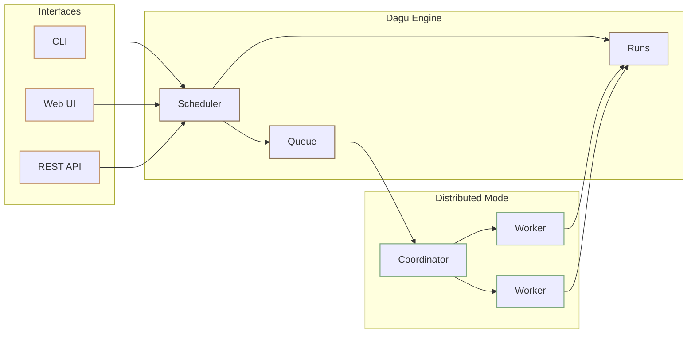

<div class="tagline" style="text-align: center;">
  <h2>Local-first workflow orchestrator with Web UI</h2>
  <div class="tagline" style="text-align: left;">
    <p>Dagu is a lightweight, self-contained alternative to Airflow or Cron with Web UI that runs on Linux / Mac / Windows. Define DAGs in a simple, declarative YAML format. It supports shell commands, Docker containers, Kubernetes Jobs, remote commands via SSH, and more. It was designed to be easy to use, self-contained, and require no coding, making it ideal for small teams.</p>
    <p>Start with one self-contained binary and file-backed state. No DBMS or message broker is required, and you can add queues, workers, MCP, chat completions, or external harness steps only when your workflows need them.</p>
  </div>
</div>

<div class="hero-section">
  <div class="hero-actions">
    <a href="/getting-started/quickstart" class="VPButton brand">Get Started</a>
    <a href="/overview/deployment-models" class="VPButton alt">Deployment Models</a>
    <a href="/writing-workflows/examples" class="VPButton alt">View Examples</a>
  </div>
</div>

<video src="/cockpit-demo.mp4" controls preload="metadata" playsinline aria-label="Cockpit demo" style="width: 100%; border-radius: 12px; margin: 8px 0 24px;"></video>

::: tip Try It Live
Explore without installing: [Live Demo](https://dagu-demo-f5e33d0e.dagu.sh/)

Credentials: `demouser` / `demouser`
:::

## Motivation

In complex systems often have implicit dependencies between jobs. When there are hundreds of cron jobs on a server, it can be difficult to keep track of these dependencies and to determine which job to rerun if one fails. It can also be a hassle to SSH into a server to view logs and manually rerun shell scripts one by one. Dagu aims to solve these problems by allowing you to explicitly visualize and manage pipeline dependencies as a DAG, and by providing a web UI for checking dependencies, execution status, and logs and for rerunning or stopping jobs with a simple mouse click.

There are many existing tools such as Airflow, Prefect, and Temporal, but many of these require you to write code in a programming language like Python to define your DAG. For many systems, there may already be complex jobs with hundreds of thousands of lines of code. Adding another layer of complexity on top of these codes can reduce maintainability. Dagu was designed to be easy to use, self-contained, and require no coding, making it ideal for small teams.

With declarative YAML syntax with MCP integration, AI agents can create and modify reproducible workflows with human oversight, making Dagu a great fit for AI-assisted automation.
  
## How a Workflow Runs

Dagu does not make you rewrite the work. Your scripts, SQL files, containers, SSH commands, APIs, and services can stay as they are; the YAML adds inputs, order, logs, retries, approvals, artifacts, and recovery controls around them.

```yaml
params:
  - name: customer_id
    type: string
    description: Customer or account identifier
  - name: change_scope
    type: string
    description: What the repair is allowed to change
    enum:
      - metadata_only
      - permissions
      - full_account
    default: metadata_only
  - name: dry_run
    type: boolean
    default: true

steps:
  - id: inspect_account
    run: ./scripts/inspect-account.sh --customer "${params.customer_id}"
    stdout:
      artifact: reports/inspection.md

  - id: review
    action: noop
    depends: inspect_account
    approval:
      prompt: Review the inspection report before running the repair.

  - id: repair_account
    run: >-
      ./scripts/repair-account.sh
      --customer "${params.customer_id}"
      --scope "${params.change_scope}"
      --dry-run="${params.dry_run}"
    depends: review
    stdout:
      artifact: reports/repair.log
```

In this example, the DAG turns an existing account-repair runbook into a reviewed workflow. The `params` block gives Dagu enough information to render a guided input form before the run starts. The inspection output is stored as an artifact, the repair waits for explicit approval, and the submitted values, logs, artifacts, and status stay attached to the run history.

<div class="overview-lifecycle" aria-label="Dagu workflow lifecycle">
  <span>Write YAML</span>
  <span>Validate</span>
  <span>Schedule or Run</span>
  <span>Monitor</span>
  <span>Retry or Approve</span>
  <span>Notify and Audit</span>
</div>

During a run, Dagu resolves dependencies, starts ready steps, captures stdout and stderr, tracks status, applies retry rules, pauses for approvals, stores artifacts, and updates the Web UI in real time.

## Core Terminology

Understanding Dagu is easier once the main terms are clear.

| Term | Meaning |
|------|---------|
| **DAG** | A workflow file written in [YAML](/writing-workflows/yaml-specification). Steps run according to dependencies, so the execution order is explicit. |
| **Step** | One unit of work. A step can run a [command](/step-types/shell), [container](/step-types/docker), [SSH command](/step-types/ssh), [HTTP request](/step-types/http), [SQL query](/step-types/sql/), [readiness wait](/step-types/wait), [sub-workflow](/writing-workflows/control-flow), [chat completion](/features/chat/), or [external CLI harness](/step-types/harness/). |
| **Action** | The kind of work a step runs, such as [`run`](/step-types/shell), [`docker.run`](/step-types/docker), [`kubernetes.run`](/step-types/kubernetes), [`ssh.run`](/step-types/ssh), [`http.request`](/step-types/http), [`postgres.query`](/step-types/sql/postgresql), [`wait.http`](/step-types/wait), [`s3.upload`](/step-types/s3), [`chat.completion`](/features/chat/), or [`harness.run`](/step-types/harness/). You can also define [custom actions](/dagu-actions/custom), call [third-party actions](/dagu-actions/third-party), or use [official actions](/dagu-actions/official) such as [`duckdb@v1`](/dagu-actions/official/duckdb). |
| **Dagu Action** | A versioned action package such as [`python-script@v1`](/dagu-actions/official/python-script), [`duckdb@v1`](/dagu-actions/official/duckdb), or [`ffmpeg@v1`](/dagu-actions/official/ffmpeg). |
| **Parameter** | A declared run input with a name, type, default, description, or allowed values. Parameters power the generated Web UI start form and keep submitted values visible with the run. |
| **Tool** | A pinned CLI package declared with [`tools`](/writing-workflows/tools). Dagu installs these before the run so host command steps use the expected binary version. |
| **State** | A small JSON value stored across DAG runs with [`state.*` actions](/writing-workflows/persistent-state), useful for cursors, checkpoints, previous snapshots, and change detection. |
| **Run** | One execution of a DAG. Runs keep [status](/web-ui/cockpit), [logs](/overview/web-ui#run-history-and-logs), [timing](/overview/web-ui#run-details), [outputs](/writing-workflows/outputs), and [artifacts](/writing-workflows/artifacts). |
| **Notification** | A UI-managed route that sends run events to Slack, email, Telegram, Google Chat, or webhooks. |
| **Incident** | A provider-backed failure lifecycle that opens on final failure, deduplicates repeated failures, and resolves after recovery. |
| **Schedule** | [Cron-based automation](/writing-workflows/scheduling) for starting DAG runs, including timezone support. |
| **Queue** | [Concurrency control](/server-admin/queues) for workflows, useful when jobs must not overlap or when workers are shared. |
| **Worker** | A machine that executes tasks in [distributed mode](/server-admin/distributed/). Workers can be selected by [labels](/server-admin/distributed/worker-labels) such as region, GPU, or environment. |
| **Artifact** | A file produced by a run and stored with the [run history](/getting-started/cli#history) for [preview, download, or audit](/writing-workflows/artifacts). |

See [Core Concepts](/getting-started/concepts) for the deeper model.

## Why Teams Choose Dagu

Teams choose Dagu when they want workflow orchestration without adopting a large platform. Start with one binary, describe work in YAML, keep existing scripts and tools intact, and add operational controls only where they help.

<div class="overview-card-grid overview-strengths-grid">
  <div class="overview-card">
    <h3><a href="/getting-started/installation/">Self-contained</a></h3>
    <p>Install <a href="/getting-started/installation/">one executable</a>. The default <a href="/getting-started/quickstart">quickstart setup</a> includes the scheduler, workflow runtime, and <a href="/overview/web-ui">Web UI</a> without requiring an external DBMS or message broker.</p>
  </div>
  <div class="overview-card">
    <h3><a href="/writing-workflows/yaml-specification">Declarative YAML</a></h3>
    <p>Define workflows in a simple, declarative <a href="/writing-workflows/yaml-specification">YAML format</a>. Dependencies, parameters, schedules, retries, and execution controls are visible in one file and easy to review in Git.</p>
  </div>
  <div class="overview-card">
    <h3><a href="/writing-workflows/persistent-state">Persistent workflow state</a></h3>
    <p>Store small JSON <a href="/writing-workflows/persistent-state">state</a> across runs for cursors, checkpoints, previous snapshots, and change detection without adding an external database.</p>
  </div>
  <div class="overview-card">
    <h3><a href="/writing-workflows/examples">CLI-oriented</a></h3>
    <p>Use existing <a href="/step-types/shell">scripts and commands</a>, Python jobs, SQL, dbt, DuckDB, <a href="/step-types/docker">containers</a>, SSH operations, HTTP calls, and other tools without modification.</p>
  </div>
  <div class="overview-card">
    <h3><a href="/overview/web-ui">Built-in Web UI</a></h3>
    <p>Inspect runs, read logs, retry failed steps, start workflows, and review history from the <a href="/overview/web-ui">Web UI</a> instead of SSHing into servers for routine operation.</p>
  </div>
  <div class="overview-card">
    <h3><a href="/step-types/">Native executors</a></h3>
    <p>Run <a href="/step-types/shell">shell commands</a>, <a href="/step-types/docker">Docker containers</a>, <a href="/step-types/kubernetes">Kubernetes Jobs</a>, <a href="/step-types/ssh">SSH commands</a>, HTTP requests, SQL queries, sub-workflows, chat completions, and external CLI harnesses.</p>
  </div>
  <div class="overview-card">
    <h3><a href="/overview/architecture">File-backed state</a></h3>
    <p><a href="/getting-started/cli#history">Run history</a>, <a href="/overview/web-ui#run-history-and-logs">logs</a>, and artifacts are stored as files by default, keeping local and self-hosted deployments simple.</p>
  </div>
  <div class="overview-card">
    <h3><a href="/server-admin/distributed/">Scales gradually</a></h3>
    <p>Start on <a href="/getting-started/quickstart">one machine</a>, then move heavy, regional, or specialized jobs to <a href="/server-admin/distributed/">distributed workers</a> with <a href="/server-admin/distributed/worker-labels">label-based routing</a>.</p>
  </div>
  <div class="overview-card">
    <h3><a href="/mcp/">AI and MCP ready</a></h3>
    <p>Use MCP-capable agents to inspect state, preview workflow changes, and operate runs, or call agent CLIs from workflow steps when automation needs AI assistance.</p>
  </div>
</div>

## Architecture at a Glance

Dagu can run in a small local setup or scale out when workloads grow. The operating model changes, but the workflow YAML does not need to be rewritten.

<div class="overview-mode-grid">
  <div class="overview-mode-card">
    <h3>Standalone</h3>
    <p><code>dagu start-all</code> runs the Web UI, scheduler, and workflow runtime in one process.</p>
    <p>Best for one server, a team utility box, a private automation host, or getting started quickly.</p>
  </div>
  <div class="overview-mode-card">
    <h3>Headless</h3>
    <p>Run workflows from the CLI or API without relying on the Web UI.</p>
    <p>Best for CI-like automation, locked-down servers, or environments where Dagu is managed by another system.</p>
  </div>
  <div class="overview-mode-card">
    <h3>Coordinator and Workers</h3>
    <p>The scheduler queues work, the coordinator assigns tasks, and workers execute DAGs over gRPC.</p>
    <p>Best for many machines, GPU jobs, regional routing, mixed workloads, and high-throughput batch processing.</p>
  </div>
</div>



See [Architecture](/overview/architecture) for internals and storage, and [Deployment Models](/overview/deployment-models) for local, self-hosted, managed, and hybrid deployment options.

## How Dagu Is Different

<div class="comparison-table">
  <table>
    <thead>
      <tr>
        <th>Existing problem</th>
        <th>Dagu path</th>
      </tr>
    </thead>
    <tbody>
      <tr>
        <td>Operational tasks are scattered across scripts, SQL files, SSH commands, API calls, cron entries, and engineer runbooks</td>
        <td>One YAML workflow with parameters, dependencies, approvals, retries, logs, artifacts, and run controls.</td>
      </tr>
      <tr>
        <td>A custom admin UI is needed just to let support or operations teams run a safe command</td>
        <td>Declare parameters in YAML and let Dagu generate the Web UI input form, validation, logs, and run history.</td>
      </tr>
      <tr>
        <td>A cloud job platform would move execution away from private data, credentials, and internal networks</td>
        <td>Run workflows where the data, credentials, files, and existing CLIs already live.</td>
      </tr>
      <tr>
        <td>A large orchestrator is too much infrastructure for scripts and runbooks</td>
        <td>Start with one binary and file-backed state, then add queues and distributed workers only when needed.</td>
      </tr>
      <tr>
        <td>Important runbooks still require manual SSH sessions and tribal knowledge</td>
        <td>Reviewed workflows give operators safe execution while engineers keep commands, logs, outputs, and approvals traceable.</td>
      </tr>
    </tbody>
  </table>
</div>

## Real-World Use Cases

Dagu is useful anywhere existing scripts, containers, SQL jobs, operational tasks, or agent-driven jobs need parameters, approvals, scheduling, retries, visibility, and a safe way for a team to run them.

<div class="overview-card-grid">
  <div class="overview-card overview-usecase-card">
    <h3>ETL and Data Operations</h3>
    <p><strong>Run:</strong> <a href="/step-types/sql/postgresql">PostgreSQL</a> and <a href="/step-types/sql/sqlite">SQLite</a> queries, <a href="/step-types/sql/duckdb">DuckDB through the official action</a>, dbt commands, <a href="/step-types/s3">S3 transfers</a>, pinned <a href="/writing-workflows/tools"><code>jq</code> or <code>yq</code> tools</a>, <a href="/step-types/wait">readiness waits</a>, validation steps, and <a href="/writing-workflows/control-flow">sub-workflows</a>.</p>
    <p><strong>Why Dagu fits:</strong> daily data workflows stay declarative, run close to private data, remain easy to inspect in the <a href="/overview/web-ui">Web UI</a>, and are straightforward to <a href="/writing-workflows/durable-execution">retry</a> when one step fails.</p>
  </div>
  <div class="overview-card overview-usecase-card">
    <h3>Cron and Legacy Script Management</h3>
    <p><strong>Run:</strong> existing <a href="/step-types/shell">shell scripts</a>, Python scripts, <a href="/step-types/http">HTTP calls</a>, and <a href="/writing-workflows/scheduling">scheduled jobs</a> without rewriting them.</p>
    <p><strong>Why Dagu fits:</strong> <a href="/getting-started/concepts">dependencies</a>, <a href="/overview/web-ui#run-history-and-logs">logs</a>, <a href="/writing-workflows/durable-execution">retries</a>, and <a href="/getting-started/cli#history">run history</a> become visible in the <a href="/overview/web-ui">Web UI</a> instead of being hidden across crontabs and server log files.</p>
  </div>
  <div class="overview-card overview-usecase-card">
    <h3>Media Conversion</h3>
    <p><strong>Run:</strong> shell-driven media tools like <code>ffmpeg</code>, thumbnail extraction, audio normalization, image processing, and other compute-heavy jobs.</p>
    <p><strong>Why Dagu fits:</strong> conversion work can run across <a href="/server-admin/distributed/">distributed workers</a> while <a href="/getting-started/cli#history">run history</a>, <a href="/overview/web-ui#run-history-and-logs">logs</a>, and <a href="/writing-workflows/artifacts">artifacts</a> stay visible in one place for monitoring, debugging, and <a href="/writing-workflows/durable-execution">retries</a>.</p>
  </div>
  <div class="overview-card overview-usecase-card">
    <h3>Infrastructure and Server Automation</h3>
    <p><strong>Run:</strong> <a href="/step-types/ssh">SSH backups</a>, cleanup jobs, deploy scripts, patch windows, precondition checks, and <a href="/writing-workflows/lifecycle-handlers">lifecycle hooks</a>.</p>
    <p><strong>Why Dagu fits:</strong> remote operations get <a href="/writing-workflows/scheduling">schedules</a>, <a href="/writing-workflows/durable-execution">retries</a>, <a href="/writing-workflows/email-notifications">notifications</a>, <a href="/web-ui/incidents">incident routing</a>, and <a href="/overview/web-ui#run-history-and-logs">per-step logs</a> without requiring operators to SSH into servers for every recovery.</p>
  </div>
  <div class="overview-card overview-usecase-card">
    <h3>Container and Kubernetes Workflows</h3>
    <p><strong>Run:</strong> <a href="/step-types/docker">Docker images</a>, <a href="/step-types/kubernetes">Kubernetes Jobs</a>, shell glue, and follow-up validation steps.</p>
    <p><strong>Why Dagu fits:</strong> teams can compose image-based tasks and route them to the right workers with <a href="/server-admin/distributed/worker-labels">worker labels</a> instead of building a custom control plane.</p>
  </div>
  <div class="overview-card overview-usecase-card">
    <h3>Customer Support Automation</h3>
    <p><strong>Run:</strong> diagnostics, account repair jobs, data checks, and <a href="/writing-workflows/approval">approval-gated support actions</a>.</p>
    <p><strong>Why Dagu fits:</strong> non-engineers can run reviewed workflows from the <a href="/overview/web-ui">Web UI</a> while engineers keep <a href="/overview/web-ui#run-history-and-logs">logs</a> and <a href="/writing-workflows/outputs">results</a> traceable.</p>
  </div>
  <div class="overview-card overview-usecase-card">
    <h3>IoT and Edge Workflows</h3>
    <p><strong>Run:</strong> sensor polling, local cleanup, offline sync, health checks, and device maintenance jobs.</p>
    <p><strong>Why Dagu fits:</strong> the <a href="/getting-started/installation/">single binary</a> works well on small devices while still providing visibility through the <a href="/overview/web-ui">Web UI</a>.</p>
  </div>
  <div class="overview-card overview-usecase-card">
    <h3>AI-Assisted Workflows</h3>
    <p><strong>Run:</strong> external coding-agent CLIs through <a href="/step-types/harness/">harness steps</a>, <a href="/features/chat/">chat completion steps</a>, agent-authored <a href="/writing-workflows/yaml-specification">YAML workflows</a>, log analysis, report generation, and <a href="/writing-workflows/approval">human-reviewed automation</a>.</p>
    <p><strong>Why Dagu fits:</strong> workflows stay in <a href="/writing-workflows/yaml-specification">plain YAML</a>, so agents can help create and debug them while humans keep <a href="/overview/web-ui#run-history-and-logs">logs</a>, <a href="/writing-workflows/approval">approvals</a>, and <a href="/getting-started/cli#history">run history</a> in one place.</p>
  </div>
</div>

::: tip
If it can run from a <a href="/step-types/shell">shell command</a>, <a href="/step-types/docker">Docker image</a>, <a href="/step-types/kubernetes">Kubernetes Job</a>, <a href="/step-types/ssh">SSH session</a>, <a href="/step-types/http">HTTP call</a>, <a href="/step-types/wait">readiness wait</a>, or <a href="/step-types/sql/">SQL query</a>, Dagu can usually orchestrate it without rewriting the underlying tool. For portable host CLIs, add <a href="/writing-workflows/tools"><code>tools</code></a> so the DAG controls the binary version too.
:::

## AI Agents and MCP

Dagu includes AI-facing workflow features, but they build on the same self-contained workflow engine. The built-in MCP server lets MCP-capable agents read Dagu state, preview or apply workflow changes, and start, enqueue, retry, or stop runs. External agent CLIs can also run inside workflows through `harness.run`, with the same scheduling, logs, retries, approvals, and run history as any other step.

```yaml
steps:
  - id: analyze_logs
    action: harness.run
    with:
      provider: codex
      prompt: |
        Analyze /var/log/app/errors.log from the last hour.
        Summarize likely causes and suggest a safe recovery plan.
    output: ANALYSIS_RESULT
```

- [MCP Server](/mcp/) explains how agents can inspect state and operate workflows through Dagu.
- [Harness](/step-types/harness/) explains how to run external coding-agent CLIs inside DAGs.
- [Chat & LLM](/features/chat/) explains chat completion and DAG tool-calling steps.

## Learn More

<div class="next-steps">
  <div class="step-card">
    <h3><a href="/getting-started/quickstart">Quick Start</a></h3>
    <p>Install Dagu, create your first workflow, and run it locally.</p>
  </div>
  <div class="step-card">
    <h3><a href="/getting-started/concepts">Core Concepts</a></h3>
    <p>Learn workflows, steps, dependencies, parameters, and execution behavior.</p>
  </div>
  <div class="step-card">
    <h3><a href="/writing-workflows/">Writing Workflows</a></h3>
    <p>YAML syntax, scheduling, execution control, artifacts, outputs, and reliability settings.</p>
  </div>
  <div class="step-card">
    <h3><a href="/step-types/shell">Step Types</a></h3>
    <p>Explore command, Docker, Kubernetes, SSH, HTTP, SQL, wait, S3, chat, and harness execution.</p>
  </div>
  <div class="step-card">
    <h3><a href="/writing-workflows/tools">Tools</a></h3>
    <p>Pin external CLI binaries directly in workflow YAML.</p>
  </div>
  <div class="step-card">
    <h3><a href="/dagu-actions/">Dagu Actions</a></h3>
    <p>Create reusable action APIs with official packages, remote packages, or custom wrappers.</p>
  </div>
  <div class="step-card">
    <h3><a href="/overview/architecture">Architecture</a></h3>
    <p>Understand standalone mode, distributed workers, storage, queues, and service layout.</p>
  </div>
  <div class="step-card">
    <h3><a href="/overview/deployment-models">Deployment Models</a></h3>
    <p>Compare local, self-hosted, managed, and hybrid operating models.</p>
  </div>
  <div class="step-card">
    <h3><a href="/mcp/">MCP Server</a></h3>
    <p>Connect AI agents to inspect state, preview changes, and operate workflow runs.</p>
  </div>
</div>

## Community

<div class="community-links">
  <a href="https://github.com/dagu-org/dagu" class="community-link">
    <span class="icon">GitHub</span>
  </a>
  <a href="https://discord.gg/gpahPUjGRk" class="community-link">
    <span class="icon">Discord</span>
  </a>
  <a href="https://bsky.app/profile/dagu-org.bsky.social" class="community-link">
    <span class="icon">Bluesky</span>
  </a>
  <a href="https://github.com/dagu-org/dagu/issues" class="community-link">
    <span class="icon">Issues</span>
  </a>
</div>
