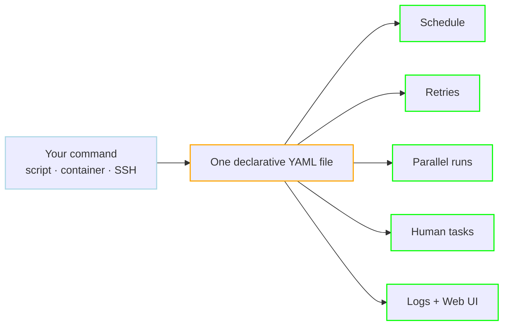
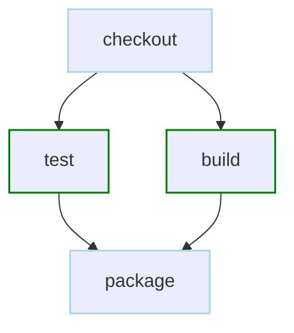
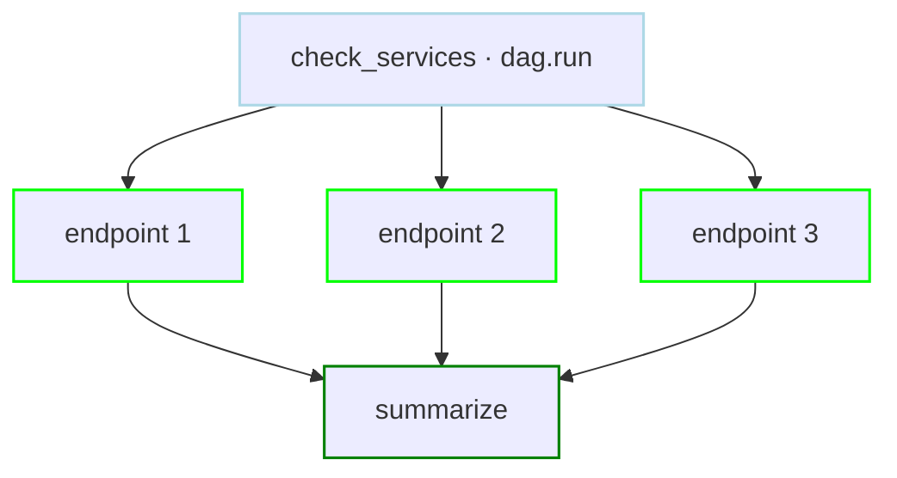

# Local-first orchestration that just works

Define workflows in declarative YAML over your existing commands and tools. One open-source binary adds schedules, retries, human tasks, logs, and a Web UI, with state in local files. No database, no decorators, no framework. The same engine runs AI coding agents and LLM calls.

<div class="hero-section">
  <div class="hero-actions">
    <a href="#run-your-first-workflow" class="VPButton brand">Get started</a>
    <a href="https://dagu-demo-f5e33d0e.dagu.sh/" class="VPButton alt">Try the Live Demo</a>
    <a href="/writing-workflows/examples" class="VPButton alt">View Examples</a>
  </div>
  <p>Live demo login: username <code>demouser</code>, password <code>demouser</code>.</p>
</div>

## Simple declarative orchestration

Your commands stay the same. One declarative YAML file adds the operational layer around them: schedule, retries, parallel runs, human tasks, and run history:


```mermaid
flowchart LR
    C["Your command<br/>script · container · SSH"] --> W["One declarative YAML file"]
    W --> S["Schedule"]
    W --> R["Retries"]
    W --> P["Parallel runs"]
    W --> H["Human tasks"]
    W --> L["Logs + Web UI"]

    style C stroke:lightblue,stroke-width:1.6px,color:#333
    style W stroke:orange,stroke-width:1.6px,color:#333
    style S stroke:lime,stroke-width:1.6px,color:#333
    style R stroke:lime,stroke-width:1.6px,color:#333
    style P stroke:lime,stroke-width:1.6px,color:#333
    style H stroke:lime,stroke-width:1.6px,color:#333
    style L stroke:lime,stroke-width:1.6px,color:#333
```

<div class="overview-card-grid overview-strengths-grid">
  <div class="overview-card">
    <h3><a href="/writing-workflows/">Commands, containers, and SSH</a></h3>
    <p>Run shell commands, scripts, Docker containers, Kubernetes Jobs, SSH commands, SQL, HTTP requests, and other tools without rewriting them into a framework.</p>
  </div>
  <div class="overview-card">
    <h3><a href="/writing-workflows/sub-dags">Parallel and reusable Sub-DAGs</a></h3>
    <p>Call child DAGs with parameters, run them over lists of items with concurrency limits, and inspect every nested run independently.</p>
  </div>
  <div class="overview-card">
    <h3><a href="/writing-workflows/scheduling">Scheduling and execution control</a></h3>
    <p>Use cron schedules, timezones, overlap policies, catch-up windows, queues, retries, timeouts, and human tasks in workflow YAML.</p>
  </div>
  <div class="overview-card">
    <h3><a href="/web-ui/notifications">Notifications and webhooks</a></h3>
    <p>Route run events to notification providers and trigger workflows from external systems through per-DAG webhooks.</p>
  </div>
  <div class="overview-card">
    <h3><a href="/overview/web-ui">Logs and run history</a></h3>
    <p>Use the Web UI to inspect live status, read step logs, review history, retry failures, and edit workflow YAML.</p>
  </div>
  <div class="overview-card">
    <h3><a href="/getting-started/installation/">One binary, no external database</a></h3>
    <p>Run Dagu on Linux, macOS, or Windows with local file-backed state. Add queues or distributed workers when needed.</p>
  </div>
</div>

## Run your first workflow

Install Dagu on Windows, macOS, or Linux:

::: code-group

```powershell [Windows]
irm https://raw.githubusercontent.com/dagucloud/dagu/main/scripts/installer.ps1 | iex
```

```bash [macOS/Linux]
curl -fsSL https://raw.githubusercontent.com/dagucloud/dagu/main/scripts/installer.sh | bash
```

:::

The installers can add Dagu to your `PATH`, set up a background service, and create the first admin account. See [Installation](/getting-started/installation/) for Docker, Homebrew, npm, and manual options.

Save this as `first-workflow.yaml`. Steps run after the steps they depend on; independent steps run in parallel:

```yaml
steps:
  - id: checkout
    run: echo "code checked out"

  - id: test
    depends: checkout
    run: echo "tests passed"

  - id: build
    depends: checkout
    run: echo "build ready"

  - id: package
    depends: [test, build]
    run: echo "package created"
```


```mermaid
flowchart TD
    C[checkout] --> T[test]
    C --> B[build]
    T --> P[package]
    B --> P

    style C stroke:lightblue,stroke-width:1.6px,color:#333
    style T stroke:green,stroke-width:1.6px,color:#333
    style B stroke:green,stroke-width:1.6px,color:#333
    style P stroke:lightblue,stroke-width:1.6px,color:#333
```

Start the scheduler and Web UI in the same directory:

```bash
dagu start-all --dags .
```

Open <http://localhost:8080> and start `first-workflow` from the UI. `test` and `build` run in parallel after `checkout`; `package` waits for both. The dependency graph, per-step logs, and full run history are all there. The [full quickstart](/getting-started/quickstart) covers command-line runs, Docker, parameters, retries, and other fundamentals.

### A more realistic workflow

A real job often fans out one step into many runs. This one checks three endpoints in parallel with retries, then reports the result:

```yaml
schedule: "CRON_TZ=UTC 0 9 * * *" # Daily at 09:00 UTC

steps:
  - id: check_services
    action: dag.run
    with:
      dag: check-endpoint
      params:
        url: ${ITEM}
    parallel:
      items:
        - https://dagu.sh
        - https://docs.dagu.sh
        - https://github.com/dagucloud/dagu
      max_concurrent: 3
    output: CHECKS

  - id: summarize
    depends: check_services
    run: echo "${CHECKS.summary.succeeded}/${CHECKS.summary.total} services healthy"

---
name: check-endpoint

params:
  - name: url
    type: string

steps:
  - id: request
    action: http.request
    with:
      method: GET
      url: ${params.url}
      timeout: 10
      silent: true
    retry_policy:
      limit: 3
      interval_sec: 2
```


```mermaid
flowchart TD
    P["check_services · dag.run"] --> A["endpoint 1"]
    P --> B["endpoint 2"]
    P --> C["endpoint 3"]
    A --> S[summarize]
    B --> S
    C --> S

    style P stroke:lightblue,stroke-width:1.6px,color:#333
    style A stroke:lime,stroke-width:1.6px,color:#333
    style B stroke:lime,stroke-width:1.6px,color:#333
    style C stroke:lime,stroke-width:1.6px,color:#333
    style S stroke:green,stroke-width:1.6px,color:#333
```

The `check_services` step starts three `check-endpoint` child runs in parallel, each with its own status, logs, and retry history. The `summarize` step waits for all three and reports the result.

## See the Web UI

<video src="/cockpit-demo.mp4" poster="/cockpit-demo-poster.jpg" controls preload="none" playsinline aria-label="Dagu Cockpit demo" style="width: 100%; border-radius: 12px; margin: 8px 0 24px;"></video>

Want to explore without installing anything? Open the [live demo](https://dagu-demo-f5e33d0e.dagu.sh/) and sign in with `demouser` / `demouser`.

## Why Dagu exists

Most teams that land here are not looking for a workflow platform. Their scripts and containers already work. The scheduler around them is the problem: it takes more time to operate than it saves.

**Orchestration is not your main work.** A big platform brings its own database, worker fleet, upgrades, and alerts. You wanted to schedule some jobs. Now you operate a second system.

**Workflow structure is not business logic.** The YAML declares order, retries, schedules, and human tasks. What each step actually does stays in the script or container you already have.

**A script should not carry its own schedule.** No cron parsing, no retry loop, no check for whether the last run is still going. That belongs to whatever runs the script, not the script itself.

Dagu keeps workflow structure in one YAML file next to the tools that do the work. Nothing moves into a framework, so your scripts keep working with or without Dagu. The YAML is what adds a dependency graph, retries, per-step logs, history, and a Web UI to every run.

## The Dagu mascot

The degu (*Octodon degus*), a small rodent native to Chile related to chinchillas and porcupines, serves as the Dagu project mascot. It aptly symbolizes Dagu's characteristics, such as simplicity, industry, and self-sufficiency. Degus reflect Dagu's mission to run schedules, retries, and everyday automation efficiently, without external databases or heavyweight frameworks. The name also echoes "DAG," Dagu's core unit of work. The degu crafts a brand identity that reflects the project's core principles.

## Choose your next step

<div class="next-steps">
  <div class="step-card">
    <h3><a href="/writing-workflows/sub-dags">Parallel Sub-DAGs</a></h3>
    <p>Compose reusable child workflows and run them over items with concurrency limits.</p>
  </div>
  <div class="step-card">
    <h3><a href="/step-types/ssh">SSH execution</a></h3>
    <p>Run commands on remote hosts while keeping status and logs in Dagu.</p>
  </div>
  <div class="step-card">
    <h3><a href="/writing-workflows/scheduling">Scheduling</a></h3>
    <p>Configure cron expressions, timezones, overlap policies, and catch-up behavior.</p>
  </div>
  <div class="step-card">
    <h3><a href="/web-ui/notifications">Notifications and webhooks</a></h3>
    <p>Route workflow events and trigger DAGs from external systems.</p>
  </div>
  <div class="step-card">
    <h3><a href="/writing-workflows/examples">Workflow examples</a></h3>
    <p>Start from practical YAML for scripts, data jobs, containers, and operations.</p>
  </div>
  <div class="step-card">
    <h3><a href="/overview/deployment-models">Deployment models</a></h3>
    <p>Compare a local server, headless execution, and distributed workers.</p>
  </div>
</div>

### AI

<div class="next-steps">
  <div class="step-card">
    <h3><a href="/ai/">AI overview</a></h3>
    <p>Compare every surface: model calls, coding agents, LLM-directed runs, and MCP.</p>
  </div>
  <div class="step-card">
    <h3><a href="/getting-started/quickstart-ai">AI quickstart</a></h3>
    <p>Run coding agents as steps, call LLMs, or let an agent pick the path.</p>
  </div>
  <div class="step-card">
    <h3><a href="/mcp/">MCP server</a></h3>
    <p>Let MCP clients inspect workflows, start runs, and read results through the built-in endpoint.</p>
  </div>
</div>

## Community

<div class="community-links">
  <a href="https://discord.gg/gpahPUjGRk" class="community-link">
    <span class="icon">Discord</span>
  </a>
  <a href="https://github.com/dagucloud/dagu/issues" class="community-link">
    <span class="icon">Issues</span>
  </a>
</div>
