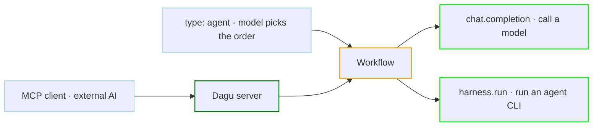
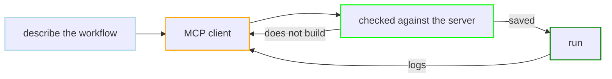
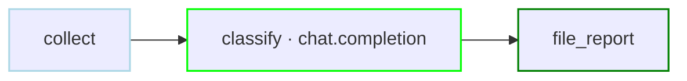
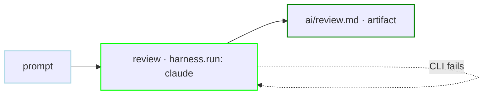
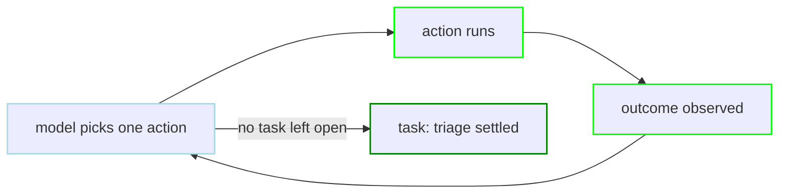
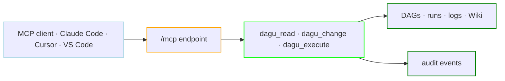
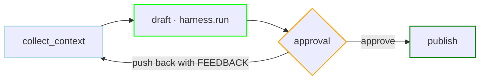

# AI

A workflow can call a model, and an AI client can operate the server from outside through the same authenticated boundary as the REST API. Both ship in the single binary; there is no separate AI package to install.

Inside a workflow, AI is an ordinary step. `chat.completion` and `harness.run` take dependencies, retries, approvals, and artifacts like any other action, and their output lands in the same run history with the same logs.



## Which surface

| What you want | Use | Reference |
|---|---|---|
| Send a prompt or message list to a model provider | `action: chat.completion` | [LLM Steps](/step-types/llm/) |
| Let a model call your DAGs as functions | `with.tools` on a completion | [Tool Calling](/features/chat/tool-calling) |
| Get typed answers to several questions about the same material, then branch | `action: decision.evaluate` | [Decision Steps](/step-types/decision) |
| Run Claude Code, Codex, Copilot, or another agent CLI as a step | `action: harness.run` | [Harness Steps](/step-types/harness/) |
| Let a model decide which declared step runs next | `type: agent` | [Agent DAGs](/writing-workflows/agent) |
| Let an external AI client inspect and control a running server | Built-in MCP endpoint | [MCP](/mcp/) |
| Have an AI tool write your workflows for you | MCP, or the skill with no server | [Write workflows with an AI tool](#write-workflows-with-an-ai-tool) |

New to this? The [AI Quickstart](/getting-started/quickstart-ai) runs a coding agent and an Agent DAG with one OpenRouter key.

## Write workflows with an AI tool

The most common use of AI here involves no model call inside a workflow at all. You describe what you want in a chat or a coding agent, and it writes the YAML.

### Connect an MCP client (recommended)

Point any MCP client at a running server:

```bash
dagu start-all
export DAGU_MCP_URL=http://localhost:8080/mcp
```

From there, describe what you want. The agent writes the workflow definition, checks it against the server before saving, and reports any errors if it does not build. When requesting changes, it reads the current specification first. When asked to run, it starts execution, inspects logs, and explains any failures.

Nothing is installed on the client side. The server supplies the authoring reference itself, so the agent already knows the field names and which action to reach for.



See the [MCP Quickstart](/mcp/quickstart) for auth and remote URLs, and [Clients](/mcp/clients/) for per-client setup.

### Install the skill (no server needed)

When the tool works on files with no server to talk to, give it the reference directly:

```bash
gh skill install dagucloud/dagu dagu
```

Tools that read a URL instead of installing a skill can point at the same material as one file:

```text
https://raw.githubusercontent.com/dagucloud/dagu/main/llms.txt
```

Here the validation loop is yours to wire up: tell the tool to run `dagu validate` after each edit, which builds the DAG and reports the same errors the server would without running anything. [Skills](/ai/skills) covers the full setup.

## Call a model from a step

`action: chat.completion` sends a prompt to a provider and captures the response like any other step output. A DAG-level `llm` block sets the provider once; a `secrets` entry resolves the key at run time and masks it in logs.

```yaml
secrets:
  - name: OPENROUTER_API_KEY
    provider: env
    key: OPENROUTER_API_KEY

llm:
  provider: openrouter
  model: deepseek/deepseek-v4-flash

steps:
  - id: collect
    run: ./collect-errors.sh
    output: ERRORS

  - id: classify
    action: chat.completion
    depends: collect
    with:
      prompt: |
        Group these errors by root cause. Reply with a Markdown list.
        ${ERRORS}
    output: SUMMARY

  - id: file_report
    action: file.write
    depends: classify
    with:
      path: reports/errors.md
      content: ${SUMMARY}
      create_dirs: true
```



### Supported providers

Eight providers are built in for `action: chat.completion`. Set `llm.provider`, and the default endpoint and credential variable are configured automatically. Both can be overridden with `base_url` and `api_key_name`.

| Provider | `provider:` | Models | API key |
|---|---|---|---|
| OpenAI | `openai` | GPT | `OPENAI_API_KEY` |
| Anthropic | `anthropic` | Claude | `ANTHROPIC_API_KEY` |
| Google Gemini | `gemini` | Gemini | `GOOGLE_API_KEY` |
| OpenRouter | `openrouter` | Multi-vendor gateway | `OPENROUTER_API_KEY` |
| Z.AI | `zai` | GLM | `ZAI_API_KEY` |
| OpenCode | `opencode` | Kimi, DeepSeek, GLM via opencode.ai | `OPENCODE_API_KEY` |
| ChatGPT / Codex | `openai-codex` | GPT through an existing subscription | None |
| Local | `local` | Whatever the local server hosts | None |

Aliases: `google` for `gemini`; `ollama`, `vllm`, and `llama` for `local`; `zhipu`, `zhipuai`, and `glm` for `zai`.

[Decision steps](/step-types/decision) have their own provider list, `openrouter` and `typesafe`, because they call a decision API rather than a chat completion endpoint.

### Local models

`provider: local` targets any OpenAI-compatible server on your own hardware, including Ollama, llama.cpp, vLLM, and LM Studio. It needs no API key and defaults to the Ollama endpoint at `http://localhost:11434/v1`:

```yaml
llm:
  provider: local
  model: qwen3
  base_url: http://localhost:11434/v1

steps:
  - id: summarize
    action: chat.completion
    with:
      prompt: Summarize this release in two sentences.
```

Because the request never leaves the machine, this is the path for prompts carrying data that cannot go to a vendor. [Local Models](/step-types/llm/local-models) covers the base-URL rules, the networking trap when Dagu runs in a container, and the current limits. Any other OpenAI-compatible endpoint works the same way through `base_url`: see [Providers & Endpoints](/step-types/llm/providers).

## Run a coding agent as a step

`action: harness.run` launches an external agent CLI as an ordinary step, so it composes with dependencies, retries, approvals, and artifacts. Fifteen providers are built in, including Claude Code, Codex, Copilot, Gemini CLI, Cursor, OpenCode, Aider, and Goose.

```yaml
steps:
  - id: review
    action: harness.run
    with:
      provider: claude
      prompt: |
        Review the most recent commit. Do not modify any files.
        Return short Markdown with: summary, risks, and verdict.
    stdout:
      artifact: ai/review.md
    retry_policy:
      limit: 2
      interval_sec: 30
```



The CLI must be on `PATH` on the worker, installed per-DAG with [`tools`](/writing-workflows/tools), or supplied by a container. [Sandboxed Execution](/step-types/harness/sandbox/) is the recommended shape when an agent should run with explicit mounts, network mode, and credentials.

## Let a model choose the order

A `graph` workflow states what runs in what order. An Agent DAG states what must be true when the run finishes and lets a model pick the order. Steps stop being a plan and become a catalog of actions, `tasks` state the goals, and each turn the model picks an action, observes the result, and picks again.

```yaml
type: agent

secrets:
  - name: OPENROUTER_API_KEY
    provider: env
    key: OPENROUTER_API_KEY

llm:
  provider: openrouter
  model: deepseek/deepseek-v4-flash

steps:
  - id: disk
    description: Show filesystem usage.
    run: df -h
    output: DISK

  - id: load
    description: Show uptime and load average.
    run: uptime
    output: LOAD

  - id: processes
    description: List processes with CPU and memory usage.
    run: ps aux | head -20

tasks:
  - name: triage
    description: >
      Finished when the machine has been checked and the result explained.
      Inspect processes only if disk or load looks unhealthy.
```



No step declares `depends`, as execution ordering is determined dynamically by the agent. The run page records the order actually chosen as a decision timeline, and the **Chat** tab holds the transcript. [Agent DAGs](/writing-workflows/agent) covers the semantics; [Agent DAG Internals](/writing-workflows/agent-internals) covers cost, limits, and what survives a crash.

## Operate Dagu from an AI client

In the reverse direction, Dagu's HTTP server exposes a built-in Model Context Protocol endpoint at `/mcp`, so an MCP client can inspect workflows, read run state, maintain Wiki pages, apply scoped edits, and control runs through the same authenticated boundary as the REST API. There is no separate package to install.

```text
http://localhost:8080/mcp
```



Every request, tool call, and downstream DAG action is audit-attributed to the accepted credential. Thirteen client guides cover the common setups: [Clients](/mcp/clients/). Start with the [MCP Quickstart](/mcp/quickstart).

## Keeping agents safe

Non-determinism is the cost of putting a model in the path. Three mechanisms bound it, and none of them are AI-specific: they are ordinary workflow features that agent steps inherit.

**Approval gates** pause a step after it runs and wait for a person. `rewind_to` sends a rejected run back to an earlier step instead of failing it, which is what makes a review loop possible.

```yaml
steps:
  - id: collect_context
    run: ./collect-changes.sh
    output: CHANGES

  - id: draft
    action: harness.run
    depends: collect_context
    with:
      provider: codex
      prompt: |
        Draft the release notes for these changes.
        ${CHANGES}
    approval:
      prompt: Review the generated notes before publishing
      input: [FEEDBACK]
      rewind_to: collect_context

  - id: publish
    run: ./publish-notes.sh
    depends: draft
```



A push-back resets `collect_context` and everything downstream of it, so the agent redrafts against fresh context and the reviewer's `FEEDBACK`.

**Sandboxing** confines an agent CLI to a container with declared mounts, toolchain, network mode, and credentials. See [Sandboxed Execution](/step-types/harness/sandbox/).

**Secrets** keep provider keys out of the YAML and mask them in logs. See [Secrets](/writing-workflows/secrets).

For a step that should wait for a person without running anything first, use a [human task](/writing-workflows/human-tasks) instead of an approval.

## Where to go next

<div class="overview-card-grid">
  <div class="overview-card">
    <h3><a href="/getting-started/quickstart-ai">AI Quickstart</a></h3>
    <p>Run a coding agent and an Agent DAG in under five minutes with one OpenRouter key.</p>
  </div>
  <div class="overview-card">
    <h3><a href="/step-types/llm/">LLM Steps</a></h3>
    <p>Complete <code>chat.completion</code> reference: providers, sessions, reasoning, web search, model fallback, and retries.</p>
  </div>
  <div class="overview-card">
    <h3><a href="/step-types/harness/">Harness Steps</a></h3>
    <p>Fifteen agent CLIs, custom harness definitions, structured results, and containerized execution.</p>
  </div>
  <div class="overview-card">
    <h3><a href="/writing-workflows/agent">Agent DAGs</a></h3>
    <p>Declare goals instead of order, recover from failure as information, and dispatch sub-workflows.</p>
  </div>
  <div class="overview-card">
    <h3><a href="/mcp/">MCP</a></h3>
    <p>Connect Claude Code, Cursor, VS Code, or any MCP client to a running server with scoped credentials.</p>
  </div>
  <div class="overview-card">
    <h3><a href="/ai/skills">Skills</a></h3>
    <p>Install the bundled skill and point a coding tool at <code>llms.txt</code> so it writes valid Dagu YAML.</p>
  </div>
</div>

## Examples

- [Chat & LLM Examples](/writing-workflows/examples/ai) covers secrets, custom endpoints, sessions, extended thinking, workflows as tools, and model fallback.
- [Agent DAG Examples](/writing-workflows/examples/agent) builds the feature up capability by capability, including failure recovery and asking a person.
- [Harness Run Examples](/writing-workflows/examples/harness-run) covers patch review, validated JSON output, zero-install OpenCode, and custom harnesses.
