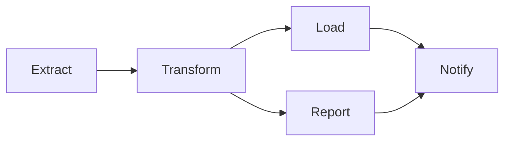
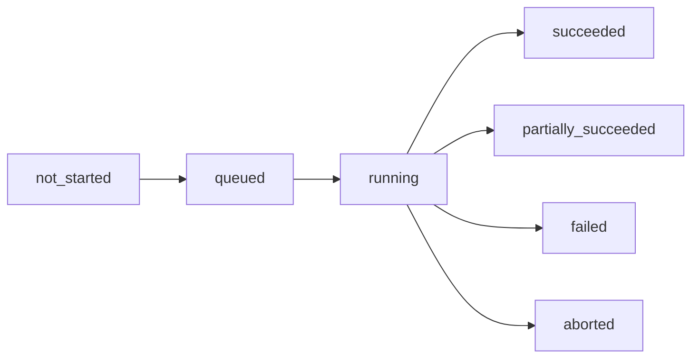

# Core Concepts

Essential concepts for working with Dagu.

## DAG (Directed Acyclic Graph)

A DAG defines your workflow as a graph of dependencies:

- **Directed**: Steps execute in a specific order
- **Acyclic**: No circular dependencies allowed
- **Graph**: Steps connected by dependency relationships



## Workflow Components

### Steps

The basic unit of execution. Each step runs a command or action:

```yaml
tools:
  - astral-sh/uv@0.11.14

steps:
  - id: download
    run: curl -O https://example.com/data.csv
  - id: analyze
    run: uv run --python 3.13.9 python analyze.py data.csv
    depends: download
```

Steps can execute multiple commands that share the same configuration:

```yaml
tools:
  - nodejs/node@v22.21.1

steps:
  - id: build_and_test
    run: |
      npm install
      npm run build
      npm test
    env:
      - NODE_ENV: production
```

### Dependencies

Declare step relationships with `depends`:

```yaml
steps:
  - id: A
    run: echo "First"

  - id: B
    run: echo "Second (after A)"
    depends: A

  - id: C
    run: echo "Parallel with B"
    depends: A  # Only depends on A, runs parallel to B

  - id: D
    run: echo "After both B and C"
    depends: [B, C]
```

### Parameters

```yaml
params:
  - name: env
    type: string
    default: dev
    enum: [dev, staging, prod]
    description: Target environment
  - name: region
    default: us-east-1
    description: Deployment region

steps:
  - run: echo "Deploying to ${env} in ${region}"
```

Override at runtime:
```bash
dagu start workflow.yaml -- env=prod region=eu-west-1
```

Parameter defaults are literal by default. If you need `$VAR` or backtick evaluation for a DAG param, use `eval:` on an inline rich parameter definition. Runtime overrides from the CLI, API, and sub-DAG calls remain literal.

### Variables

Pass data between steps using `output`:

```yaml
steps:
  - id: date_stamp
    run: date +%Y%m%d
    output: TODAY
  - id: backup
    run: tar -czf backup_${TODAY}.tar.gz /data
    depends: date_stamp
```

### Tools

Declare portable CLI dependencies at the DAG level when the workflow needs a reproducible binary version:

```yaml
tools:
  - jqlang/jq@jq-1.7.1

steps:
  - run: jq --version
```

Dagu installs these tools before the run and exposes them to host command steps through `PATH`. See [Tools](/writing-workflows/tools) for syntax and limitations.

## Status Management

### Execution States

- `not_started`: DAG has been defined but execution has not begun
- `queued`: DAG is waiting to be executed
- `running`: DAG is currently executing
- `succeeded`: All steps completed successfully
- `partially_succeeded`: Some steps failed but execution continued (via `continue_on`)
- `failed`: DAG execution failed
- `aborted`: DAG was manually aborted

### Status Transitions



### Step Status

- `not_started`: Step is waiting for dependencies
- `running`: Step is executing
- `succeeded`: Step completed successfully
- `partially_succeeded`: Step completed with warnings or continue-on logic
- `failed`: Step execution failed
- `aborted`: Step was aborted
- `skipped`: Step was skipped (precondition not met)

### Status Hooks

```yaml
handler_on:
  success:
    run: notify-team.sh "Workflow succeeded"
  failure:
    run: alert-oncall.sh "Workflow failed"
  partial_success:
    run: log-partial.sh "Some steps partially succeeded"
```

## Actions

### Shell (Default)

Runs commands in the system shell. Set it once per DAG or override per step:

```yaml
shell: [bash, -e]  # Default shell + args for all steps
steps:
  - run: echo "Hello"   # Uses DAG shell
  - run: echo "Using zsh"
    with:
      shell: /usr/bin/zsh  # Per-step override
```

See [Shell](/step-types/shell) for more details.

### Docker

Execute in containers:

```yaml
container:
  image: python:3.11
  working_dir: /app
  volumes:
    - /app/data:/data
steps:
  - run: python script.py
```

See [Docker](/step-types/docker) for more details.

### SSH

Run on remote machines:

```yaml
ssh:
  user: ubuntu
  host: server.example.com
  key: ~/.ssh/id_rsa

steps:
  - run: echo "Running remote script"
```

See [SSH](/step-types/ssh) for more details.

### HTTP

Make API calls:

```yaml
steps:
  - action: http.request
    with:
      method: POST
      url: https://api.example.com/trigger
      headers:
        Authorization: Bearer ${API_TOKEN}
```

See [HTTP](/step-types/http) for more details.

### Git

Clone or update a repository during a workflow run:

```yaml
steps:
  - id: checkout_source
    action: git.checkout
    with:
      repository: https://github.com/example/app.git
      ref: main
      path: ./workspace/app
```

See [Git](/step-types/git) for more details.

### Wait

Wait for time, file state, or HTTP readiness:

```yaml
steps:
  - id: wait_for_api
    action: wait.http
    with:
      url: https://api.example.com/health
      status: 200
      poll_interval: 5s
    timeout_sec: 300
```

See [Wait](/step-types/wait) for more details.

### Custom Actions

Define reusable actions in `actions` when you want a typed wrapper around a built-in step type:

```yaml
actions:
  greet:
    input_schema:
      type: object
      additionalProperties: false
      required: [message]
      properties:
        message:
          type: string
    template:
      run: |
        #!/bin/bash
        printf '%s\n' {{ json .input.message }}

steps:
  - action: greet
    with:
      message: hello
```

The common case is a custom action with a templated `run` step. Schema defaults can be applied to the `with` object, the result is validated against `input_schema`, and then the template expands to a built-in step before execution. See [Custom Actions](/dagu-actions/custom) for the full rules.

## Scheduling

Cron-based scheduling:

```yaml
schedule: "0 2 * * *"  # Daily at 2 AM
```

Multiple schedules:

```yaml
schedule:
  - "0 9 * * MON-FRI"  # Weekdays at 9 AM
  - "0 14 * * SAT,SUN" # Weekends at 2 PM
```

Start/stop schedules:

```yaml
schedule:
  start: "0 8 * * *"   # Start at 8 AM
  stop: "0 18 * * *"   # Stop at 6 PM
```

See [Scheduling](/writing-workflows/scheduling) for more details.

## Lifecycle Handlers

Execute commands on workflow events:

```yaml
handler_on:
  init:
    run: echo "Setting up environment"  # Runs before any steps

  success:
    run: echo "Workflow succeeded"

  failure:
    run: |
      echo "Workflow failed" | mail -s "Alert" admin@example.com

  abort:
    run: echo "Cleaning up resources"

  exit:
    run: echo "Always runs"
```

## See Also

- [Writing Workflows](/writing-workflows/) - Create your own workflows
- [Examples](/writing-workflows/examples) - Ready-to-use patterns
- [CLI Reference](/getting-started/cli) - Command-line usage
