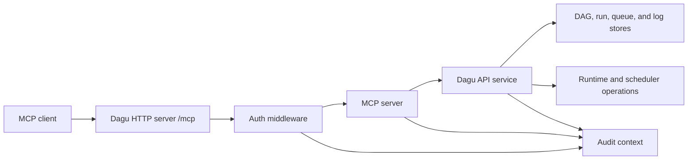

# MCP Architecture

Dagu serves MCP from the same HTTP server as the Web UI and REST API. The MCP route is not a separate daemon, package, or sidecar.

## Request Path

1. The MCP client connects to the public `/mcp` route with Streamable HTTP.
2. Dagu applies the same auth stack used by stream endpoints: query-token support, client IP capture, API key or session validation, and default stream-user injection.
3. MCP requests must satisfy the MCP API-key surface when an API key is used.
4. The MCP server handles tools, resources, prompts, subscriptions, and unsubscribe requests.
5. Tool implementations call the internal frontend API service rather than bypassing Dagu's normal authorization and validation paths.

The route honors the server base path. With `base_path: /dagu`, the route is `/dagu/mcp`.

## Tool Boundary

Dagu exposes a small tool surface by design:

- `dagu_read` reads state and reference resources.
- `dagu_change` validates and optionally writes DAG YAML.
- `dagu_execute` starts, enqueues, retries, or stops DAG runs.

This keeps client instructions stable and avoids exposing every REST endpoint as a separate MCP tool.

## Resource Boundary

The MCP server exposes resource templates for current Dagu state:

| Resource | Backing operation |
|----------|-------------------|
| `dagu://dags/{name}/spec` | Current DAG YAML from the DAG spec API |
| `dagu://runs/{name}/{dagRunId}` | DAG-run details from the run details API |
| `dagu://runs/{name}/{dagRunId}/logs` | DAG-run logs from the logs API |
| `dagu://reference/{topic}` | Built-in MCP guidance bundled with the server |

Run resources can be subscribed to. Dagu watches subscribed run resources and sends a resource update notification when a run reaches a terminal state.

## Audit Context

The MCP route seeds an audit context before authentication. That context records:

- `source=mcp`
- `surface=mcp`
- `transport=streamable_http`
- request and correlation IDs
- optional requested workspace from the `workspace` query parameter

After authentication, Dagu adds credential and subject attribution. Tool calls and downstream API actions share the same correlation ID, so an MCP attempt can be connected with the DAG, run, or API-key events it caused.
