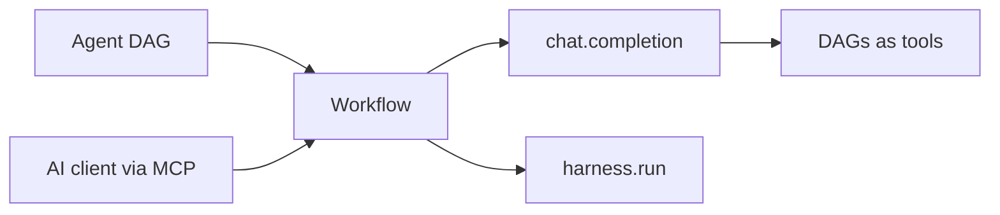

# LLM Overview

Call a model from a step with `action: chat.completion`, and go further from there: let the completion call workflows as functions, let a model decide which step runs next, run a full coding agent as a step, or let an external AI operate Dagu.

## Where a model fits



- **A model call inside a step**: `action: chat.completion` sends a prompt or message list; the response streams to stdout. This page.
- **Workflows as functions**: a completion with `tools` can call your DAGs, with arguments derived from their `params`. See [Tool Calling](/features/chat/tool-calling).
- **A model deciding what runs**: `type: agent` inverts control; steps become a catalog and the model picks one or more independent actions per turn until the goals are met. See [Agent DAGs](/writing-workflows/agent) and the [Agent DAG examples](/writing-workflows/examples/agent).
- **Typed answers instead of prose**: `action: decision.evaluate` asks a model several questions about the same material and returns a selected option, a score, or a probability, each with its own confidence. See [Decision Steps](/step-types/decision).
- **A coding agent as a step**: `harness.run` launches supported coding-agent CLIs such as Claude Code, Codex, Gemini CLI, Cursor, or DeepSeek Harness inside a workflow. See [Harness](/step-types/harness/).
- **AI operating Dagu**: the [MCP server](/mcp/) is the inverse relationship; an external AI client inspects workflows, starts runs, and reads results.

The examples below run as-is with an `OPENROUTER_API_KEY` exported; swap the `llm` block for [any configured provider](/step-types/llm/providers).

## First completion

```yaml
secrets:
  - name: OPENROUTER_API_KEY
    provider: env
    key: OPENROUTER_API_KEY

llm:
  provider: openrouter
  model: deepseek/deepseek-v4-flash

steps:
  - id: ask
    action: chat.completion
    with:
      prompt: |
        What is 2+2? Reply with just the number.
    output: ANSWER

  - id: use_answer
    run: echo "The model said ${ANSWER}"
    depends: ask
```

Three things carry this example:

- The `secrets` entry reads the key from the Dagu process environment and masks it in logs. Exporting the variable alone is not enough, because only a small set of environment variables [passes through to workflows](/step-types/llm/providers#making-the-key-reachable).
- The DAG-level `llm` block is inherited by every chat step that sets no LLM fields of its own, so steps stay small.
- `output: ANSWER` captures the response for any dependent step as `${ANSWER}`. Object-form `output` namespaces it to the step instead (`response: { from: stdout }`, read as `${ask.output.response}`), and a large response can [stream straight to an artifact](/writing-workflows/artifacts#stream-output-to-artifacts).

## Messages and system prompts

Use `messages` when the request needs an explicit conversation, and `system` to set the role:

```yaml
steps:
  - id: diagnose
    action: chat.completion
    with:
      provider: openrouter
      model: deepseek/deepseek-v4-flash
      system: |
        Answer as a concise operations runbook author.
      messages:
        - role: user
          content: |
            Explain how to diagnose a saturated connection pool.
            Keep it under 80 words.
```

Specify either `prompt` or `messages`; `prompt` is converted to one `user` message and takes precedence when both are present. Roles can be `system`, `user`, or `assistant`.

Note the explicit `provider` and `model` here: when an action sets **any** LLM field under `with` (even just `system`), its configuration replaces the complete DAG-level `llm` block rather than merging with it.

## What a completion can do

Each capability below is one field away. Snippets show the shape; the [AI examples page](/writing-workflows/examples/ai) has full runnable versions of each.

**Multi-turn sessions.** Chat steps inherit the conversation from the steps they depend on:

```yaml
  - id: follow_up
    action: chat.completion
    with:
      prompt: Multiply that by 3.
    depends: ask
```

See [Sessions](#sessions).

**Call workflows as tools.** Names in `tools` expose DAGs as functions; each call is a real child run:

```yaml
    with:
      tools:
        - calculator
      prompt: What is 15 times 23? Use the calculator tool.
```

See [Tool Calling](/features/chat/tool-calling).

**Route on the answer.** Ask for a label, then branch with `router.route`:

```yaml
  - id: route_request
    depends: [classify_request]
    action: router.route
    with:
      value: ${REQUEST_TYPE}
      routes:
        bug: [handle_bug]
        feature: [handle_feature]
```

Constrain the model to known labels and keep an explicit fallback route; a response that matches no route runs no handler. See [Router](/step-types/router).

When the answer is a label rather than prose, [`decision.evaluate`](/step-types/decision) does this without the hand-constraining: the options are declared as `criteria`, the answer is always one of them, and it comes back with a confidence you can gate on with a [numeric comparison](/writing-workflows/control-flow#numeric-comparison).

**Extended reasoning.** `thinking` maps to the provider's reasoning controls:

```yaml
    with:
      thinking:
        enabled: true
        effort: low
```

See [Reasoning](/step-types/llm/reasoning-web-search#reasoning).

**Model fallback.** An ordered `model` list tries the next entry after retries are exhausted:

```yaml
    with:
      model:
        - provider: openrouter
          name: deepseek/deepseek-v4
        - provider: openrouter
          name: deepseek/deepseek-v4-flash
```

See [Reliability](/step-types/llm/reliability).

**Web search.** Provider-integrated search grounds the answer in current results:

```yaml
    with:
      web_search:
        enabled: true
        max_uses: 3
```

See [Web Search](/step-types/llm/reasoning-web-search#web-search).

## Sessions

The completed session is saved with the DAG run, including the provider, model, and token usage reported for assistant messages. A chat step also inherits conversation history from the steps in its `depends` list, which is what makes the multi-turn pattern above work:

- History is transitive: every chat step saves its inherited messages, its own messages, and the response.
- Histories from multiple dependencies are merged in the order listed in `depends`.
- Only the first system message is kept when inherited histories contain several.
- Retries continue with the session already attached to the DAG run.

When [approval push-back](/writing-workflows/approval#push-back-environment) re-executes a chat step, Dagu restores the previous conversation and appends the reviewer feedback as the next user message; the workflow does not need to wire `${FEEDBACK}` itself.

## Configuration

All action-specific fields belong under `with`.

| Field | Type | Default | Description |
|-------|------|---------|-------------|
| `prompt` | string | - | A non-empty user prompt. Required when `messages` is omitted. |
| `messages` | array | - | A non-empty list of `{role, content}` messages. Required when `prompt` is omitted. |
| `provider` | string | inherited | LLM provider. Required for a string `model` unless inherited; omit it when every fallback model entry has its own provider. |
| `model` | string or array | inherited | Model identifier, or an ordered list of model configurations for [fallback](/step-types/llm/reliability#model-fallback). Inherited only when the action sets no LLM configuration fields. |
| `system` | string | - | Default system prompt. An explicit system message in `messages` takes precedence. |
| `temperature` | number | provider default | Sampling randomness from `0.0` to `2.0`. |
| `max_tokens` | integer | provider default | Maximum number of tokens to generate. |
| `top_p` | number | provider default | Nucleus sampling value from `0.0` to `1.0`. |
| `base_url` | string | provider default | Base URL for a [custom or OpenAI-compatible endpoint](/step-types/llm/providers#openai-compatible-endpoints). |
| `api_key_name` | string | provider default | Environment variable that contains the API key. |
| `stream` | boolean | `true` | Stream response tokens to stdout as they arrive. |
| `thinking` | object | disabled | Provider-specific [extended reasoning](/step-types/llm/reasoning-web-search#reasoning). |
| `tools` | array | - | DAG names exposed to the model as callable tools. |
| `max_tool_iterations` | integer | `10` | Maximum tool-calling rounds. |
| `web_search` | object | disabled | [Built-in web-search integration](/step-types/llm/reasoning-web-search#web-search) settings. |

`messages[].content`, `system`, and `base_url` support scoped value references such as `${params.TOPIC}` and `${env.LLM_BASE_URL}`.

## Security

Values registered as Dagu secrets are masked before messages are sent to the provider. The run's saved session retains the resolved message content, so avoid placing unnecessary secrets in prompts and restrict access to run history.

## Next Steps

- [AI Examples](/writing-workflows/examples/ai) for runnable copy-paste versions of every capability above
- [Providers & Endpoints](/step-types/llm/providers) for credentials, custom endpoints, and shared defaults
- [Agent DAGs & Completions](/step-types/llm/agent-completions) for the step-by-step path from one completion to LLM-directed workflows
- [Agent DAGs](/writing-workflows/agent) when the order of the work is itself the model's decision
- [Harness](/step-types/harness/) for running external coding agents as steps
- [Chat & LLM](/features/chat/) for choosing between the shapes at a glance
