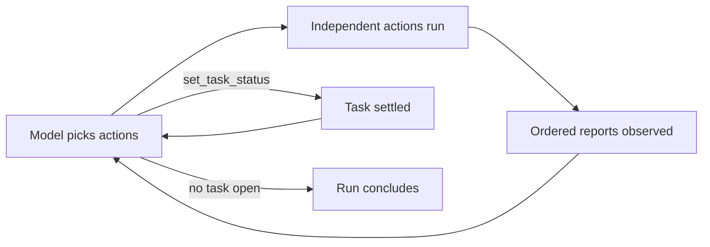

# Agent DAGs

A `graph` or `chain` workflow says *what runs in what order*. An **Agent DAG**
says *what must be true when the run is finished* and lets an LLM decide the
order. Steps stop being a plan and become a catalog of actions;
`tasks` state the goals; each turn the model picks one or more independent
actions, watches what happens, and picks again until every goal is settled.

That inversion is what the type buys. The order can follow from what earlier
steps revealed, a failure becomes information rather than an abort, and a run
can stop to wait for a person without holding a process. This page builds the
machinery up from a first runnable Agent DAG to driving a coding agent.
[Agent DAG Examples](/writing-workflows/examples/agent) drills complete
scenarios the same way, and
[Agent DAG Internals](/writing-workflows/agent-internals) covers the
runtime mechanics (cost, limits, recovery) behind all of it.

Every example runs as-is with an `OPENROUTER_API_KEY` exported; swap the `llm`
block for [any configured provider](/step-types/llm/providers).

## A first Agent DAG

The smallest Agent DAG is a catalog of two commands and one goal:

```yaml
type: agent

secrets:
  - name: OPENROUTER_API_KEY
    provider: env
    key: OPENROUTER_API_KEY

llm:
  provider: openrouter
  model: deepseek/deepseek-v4-flash

steps:
  - name: report_time
    description: Report the current server time.
    run: date
  - name: report_user
    description: Report which user this workflow runs as.
    run: whoami

tasks:
  - name: reported
    description: Finished when both the time and the user have been reported.
```

Save it as `hello-agent.yaml` in your DAGs directory and run it:

```bash
dagu start hello-agent
```

The model is offered both steps as tools, runs each once, in whichever order
it prefers, and settles the task. The run page shows the decisions as a
timeline:

```text
1  ▶ report_time   succeeded
2  ▶ report_user   succeeded
3  ✓ reported      task complete
```

The `secrets:` block is not decoration: Dagu only propagates `DAGU_*`, `DAG_*`,
`LC_*`, and `KUBERNETES_*` from your shell, so the exported key must be bound
before the provider can see it. `llm.provider` takes `openai`, `anthropic`,
`gemini`, `openrouter`, `zai`, `opencode`, or `local`; add `base_url` to point
the same provider at a proxy or an OpenAI-compatible server of your own, and
`api_key_name` when the credential lives under a variable other than the
provider's default. [Providers & Endpoints](/step-types/llm/providers) lists
the credential variable each provider reads;
[Local Models](/step-types/llm/local-models) covers what a local base URL has
to look like.

### Model fallback

Set `llm.model` to an ordered array when the agent should continue after
a model or provider failure:

```yaml
llm:
  model:
    - provider: openrouter
      name: deepseek/deepseek-v4-flash
    - provider: anthropic
      name: claude-sonnet-4-5
```

The first entry is primary. After its request retries are exhausted, Dagu tries
the remaining entries in order. A successful fallback stays active for later
decisions in the same process, so an unavailable primary is not retried every
turn. Failed requests do not consume a turn or change the transcript, and each
successful decision records the provider and model that answered.

Each provider still needs its own credential binding. A process created after
suspension or by `dagu retry` begins with the primary again and continues from
the saved transcript. See [Reliability](/step-types/llm/reliability) for retry
order and [Agent DAG Internals](/writing-workflows/agent-internals#decision-calls)
for the complete decision-call behavior.

## The loop

Every declared step becomes one tool the model can call, named after the step
and described by its `description`, which is the only thing the model reads
when deciding what to run. Without one, a `dag.run` action falls back to the
target workflow's own description. Two built-in tools are always present:
`set_task_status` settles a task with a reason, and `ask_user` puts a question
to a person.

Each turn the model can call one action or a batch of distinct, independent
actions. A batch runs concurrently, bounded by `max_active_steps`; `0` leaves
the batch unlimited and `1` makes it serial. Dagu waits for the entire batch,
then returns one short observation per action in the order the model called
them. The run ends once no task is open; the model then replies with a short
summary instead of a tool call.

`set_task_status` and `ask_user` are control calls and must be called alone.
Mixing a control call into an action batch, repeating an action in the same
batch, or including any invalid call rejects the whole batch without starting
an action.



Ordering belongs to the agent, so `depends` is not allowed, and neither
are router steps. Steps the agent never chose are marked skipped when the
run finishes.

### Parallel action batches

Use `max_active_steps` when an agent may discover several independent checks
at once but the run must respect a resource limit:

```yaml
type: agent
max_active_steps: 2

secrets:
  - name: OPENROUTER_API_KEY
    provider: env
    key: OPENROUTER_API_KEY

llm:
  provider: openrouter
  model: deepseek/deepseek-v4-flash

steps:
  - name: check_disk
    description: Check disk capacity.
    run: df -h
  - name: check_load
    description: Check system load.
    run: uptime
  - name: check_processes
    description: Report the heaviest processes.
    run: ps aux

tasks:
  - name: checked
    description: Finished when disk, load, and processes have all been checked.
```

Every member resolves variables before any member starts. Siblings therefore
see only outputs from earlier turns, never outputs produced by the same batch.
A failed member does not cancel its siblings; all outcomes return to the model
as observations. If one or more actions wait for human input, completed sibling
results remain withheld until every waiting member is resolved, including
across process restarts.

## Tasks

`tasks` is both the goal list and the termination condition.

```yaml
tasks:
  - name: designed
    description: Finished when the design workflow ran and a person approved it.
```

The `description` is what the agent judges against, so write it as a
completion test rather than a summary. "Finished when the PR URL has been
produced" gives the model something to check; "open a PR" does not.

Both fields are required, and names must be unique.

Every task starts open, and the agent settles it with one call:

| Status | When | Run outcome |
|---|---|---|
| `completed` | the criteria are met | - |
| `skipped` | it turned out there was nothing to do | still succeeds |
| `failed` | it cannot be achieved | run fails, naming the task |
| `open` | undo a decision later work invalidated | back into the loop |

`skipped` matters more than it looks. Without it, a task that is moot (like signing
a Windows build for a project that has none) leaves the agent with no
honest move: it either burns turns pretending to work, or stalls out and fails
a run that was fine. Here it is in action:

```yaml
type: agent

secrets:
  - name: OPENROUTER_API_KEY
    provider: env
    key: OPENROUTER_API_KEY

llm:
  provider: openrouter
  model: deepseek/deepseek-v4-flash

steps:
  - name: check_scratch
    description: Check for leftover scratch files from earlier runs.
    run: ls /tmp/dagu-scratch 2>/dev/null || echo "no scratch files"
  - name: clean_scratch
    description: Delete the leftover scratch files.
    run: rm -rf /tmp/dagu-scratch

tasks:
  - name: cleaned
    description: >
      Finished when leftover scratch files were deleted. Skip if the check
      shows there are none.
```

On a machine with no scratch directory, the check reports nothing to do, the
agent settles `cleaned` as skipped without ever running `clean_scratch`,
and the run succeeds, with the agent's reason recorded on the task.

## Parameterising the instructions

`llm.system` and each task `description` take variables, so the same Agent DAG
can be pointed at different work per run:

```yaml
type: agent

params:
  - TARGET: staging

secrets:
  - name: OPENROUTER_API_KEY
    provider: env
    key: OPENROUTER_API_KEY

llm:
  provider: openrouter
  model: deepseek/deepseek-v4-flash
  system: |
    Deploy to ${params.TARGET}. Never touch any other environment.

steps:
  - name: deploy
    description: Deploy to the target environment.
    run: echo "deploying to ${TARGET}"

tasks:
  - name: deployed
    description: Finished when the deploy to ${params.TARGET} succeeded.
```

```bash
dagu start release                      # deploys to staging
dagu start release -- TARGET=production # deploys to production
```

## Actions and arguments

A plain command step is a tool that takes no arguments: the model chooses
*when* it runs, never *what* it runs. A step that launches a sub-workflow is
different. Parameters the step leaves open are advertised as tool arguments,
and the agent fills them in from the goal.

Write a value in `params` for anything the agent should not decide. A
parameter the step supplies is not advertised, so the model cannot supply its
own value for it, and a step that supplies every parameter takes no arguments
at all. Use this to fix what a step is for and leave the model only the genuine
choices:

```yaml
type: agent

secrets:
  - name: OPENROUTER_API_KEY
    provider: env
    key: OPENROUTER_API_KEY

llm:
  provider: openrouter
  model: deepseek/deepseek-v4-flash

steps:
  - name: check_vocabulary
    description: Grade the draft for AI word choice.
    action: dag.run
    with:
      dag: check
      params:
        aspect: vocabulary      # fixed: the model only picks `depth`

  - name: check_structure
    description: Grade the draft for sentence shape.
    action: dag.run
    with:
      dag: check
      params:
        aspect: structure

tasks:
  - name: graded
    description: Finished when the draft was graded for vocabulary and structure.

---
name: check
params:
  - name: aspect
    type: string
  - name: depth
    type: string
    default: normal

steps:
  - id: grade
    run: echo "grading ${params.aspect} at depth ${params.depth}"
```

Without the fixed `aspect`, both tools would look the same to the model and it
would have to reproduce the right value each call. Leaving a parameter open when
it should be fixed is the more expensive mistake: a model that guesses wrong, or
sends an empty string, produces a child run that does the wrong work and still
reports success.

Each call is a real child DAG run with its own run ID, logs, and history. This
is the pattern that scales: a library of reviewed, parameterized workflows as
the catalog, goals as the interface. The
[catalog example](/writing-workflows/examples/agent#a-catalog-of-workflows)
shows an agent reading `staging first` out of a goal and calling the same
deploy tool twice with different arguments.

## What the agent sees

After an action runs, the agent reads a short report of it and nothing
else. It never sees the step's command, its environment, or the state of any
other step. Everything it knows about the run it built up from these reports,
one per turn.

A report carries the step's status, and then whichever of these apply:

| Line | When it appears |
|------|-----------------|
| `error:` | The step failed. |
| `answer:` / `submitted:` | A human task was completed. |
| `outputs:` | The step published outputs explicitly. |
| `output:` | Nothing was published explicitly, but the step set `output:`. |
| `child run:` | The step ran a sub-workflow. |
| `log:` / `stderr:` | Otherwise: the last 40 lines of each. |

```text
status: succeeded
outputs: {"verdict":"VERDICT: ISSUES (4)","aspect":"word choice"}
child run: check (succeeded)
```

The copy added to the transcript is capped by
`llm.observation_max_bytes` (512 KiB by default). This does not change the
step's stored output, logs, or human-task submission. Before observation aging
starts, each report is sent again on every later turn, so keeping reports small
still matters. Once the provider-reported prompt reaches
`llm.max_context_tokens`, older reports become one-line summaries while the
most recent reports stay complete. [Agent DAG Internals](/writing-workflows/agent-internals)
has the full accounting and recovery behavior.

### Reporting from a sub-workflow

A `dag.run` action is reported from the child run rather than from the step's
own stdout, which only mirrors the child's status JSON.

By default the report lists every output variable the child's steps set. That
includes variables the child only uses internally, such as a file loaded to
build a prompt, and a large one costs tokens on every turn that follows.

End the child with `outputs.write` (or `stdout.outputs`) to decide what crosses
the boundary. When a child publishes outputs that way, the agent reports
those and stops listing the child's internal variables:

```yaml
# check.yaml
steps:
  - id: load_standard
    run: cat standard.txt      # internal: never reported to the agent
    output: STANDARD

  - id: grade
    depends: [load_standard]
    action: chat.completion
    with: { prompt: "..." }
    output: FINDINGS

  - id: publish                # the report the agent reads
    depends: [grade]
    action: outputs.write
    with:
      values:
        verdict: ${FINDINGS}
```

A child that publishes nothing keeps the default listing. Failed steps in the
child are reported either way. See
[Reading Child Results](/writing-workflows/sub-dags#reading-child-results) for
how the same two mechanisms work for an ordinary caller.

## Failure and repetition

A failing action does not abort an agent run. The failure is reported to the
agent like any other outcome, and it can retry the action, try something
else, or give up and fail the run.

The agent may also re-run an action it has already run, which is what makes
a review-and-redo cycle work. Any single action runs at most 5 times per run.

Final status follows the steps as they ended up. If a failed action was re-run
and passed, the run is **succeeded**. If an action was left failed and the
agent completed every task anyway, the run is **partially succeeded**.

The
[service-recovery example](/writing-workflows/examples/agent#failure-is-an-observation)
plays this out as a full cycle: check fails, remedy runs, check re-runs and
passes, with no error-handling wiring anywhere in the file.

## Waiting for a person

An `action: human.task` step works exactly as it does elsewhere, and it is the
reason agents are durable. When the agent opens one, the run reports
`waiting` and the process exits, releasing the worker slot. Completing the task
resumes the same run, and the agent picks the conversation back up with the
submitted answer as its next observation.

```yaml
type: agent

secrets:
  - name: OPENROUTER_API_KEY
    provider: env
    key: OPENROUTER_API_KEY

llm:
  provider: openrouter
  model: deepseek/deepseek-v4-flash

steps:
  - name: draft
    description: Draft the release notes.
    run: echo "v2.4.1 fixes the timezone bug"
    output: NOTES

  - id: approve
    name: approve
    description: Ask a person to approve the drafted notes.
    action: human.task
    with:
      prompt: Publish these release notes?
      form:
        type: object
        properties:
          approved: { type: boolean }
          feedback: { type: string }
        required: [approved]

  - name: publish
    description: Publish the approved notes.
    run: echo "published ${NOTES}"

tasks:
  - name: published
    description: >
      Finished when the notes were drafted, a person set approved=true, and
      the notes were published.
```

The agent drafts, opens the approval, and the run waits. Answer from the
Web UI or the CLI, and a running scheduler (or `dagu start-all`) resumes the
run:

```bash
dagu human-task complete release-notes --run-id <id> --step approve \
  --inputs-json '{"approved":true,"feedback":"ship it"}'
```

Human tasks stay root-only, so declare them on the agent itself rather
than inside a child workflow.

## Asking a person

Not every question can be written down in advance. When the agent hits one,
it calls `ask_user` with a question of its own wording. The run reports
`waiting`, exactly as a declared human task does, and the reply comes back as the
agent's next observation.

```bash
dagu human-task complete <dag-name> --run-id <run-id> --step ask_user \
  --input answer="staging only, never production"
```

No configuration is needed: every agent can ask. Three things keep it from
pestering anyone. The answers so far are restated to the agent every turn,
an exact repeat is refused with the answer it already got, and a run may ask at
most 5 questions. An agent running as somebody's child cannot ask at all,
since nobody is watching a sub-workflow, which is what keeps agents
composable as sub-workflows. The
[asking example](/writing-workflows/examples/agent#asking-a-person) runs
the whole cycle, wait and resume included.

## Driving a coding agent

An [`action: harness.run`](/step-types/harness/) step runs a coding agent CLI,
which makes it the natural action for work too open-ended to write down. Declare
it on the agent and the model can fire it, but not aim it: only `dag.run`
advertises parameters, so every other action is a tool that takes no arguments
and the prompt stays whatever the author wrote.

To let the agent write the instruction, put the harness in a child workflow
and expose the prompt as a parameter. This example needs the `claude` CLI
installed for the child; the agent itself stays on OpenRouter:

```yaml
type: agent

secrets:
  - name: OPENROUTER_API_KEY
    provider: env
    key: OPENROUTER_API_KEY

llm:
  provider: openrouter
  model: deepseek/deepseek-v4-flash

steps:
  - name: write_slogan
    description: Have a coding agent write one slogan line. Tell it exactly what to write.
    action: dag.run
    with:
      dag: agent

  - id: review
    name: review
    description: Ask a person to approve the slogan.
    action: human.task
    with:
      prompt: Approve this slogan?
      form:
        type: object
        properties:
          approved: { type: boolean }
          feedback: { type: string }
        required: [approved]

tasks:
  - name: approved
    description: Finished when write_slogan produced a slogan and the reviewer set approved=true.

---
name: agent
params:
  - name: INSTRUCTION
    type: string
    description: What the agent should write, in full.

harness:
  provider: claude
  model: sonnet

steps:
  - id: work
    action: harness.run
    with:
      prompt: ${INSTRUCTION}
    output: RESULT

  - id: publish
    depends: [work]
    action: outputs.write
    with:
      values:
        slogan: ${RESULT}
```

Rejecting the review resumes the run, and the agent reaches for the same
action with a new `INSTRUCTION` written against the feedback. That cycle is what
the pairing buys: a person judges, and the agent re-aims the agent.

The `publish` step is not decoration. An agent CLI writes a lot to stdout, and a
step that publishes nothing is reported as the last 40 lines of its log, resent
on every remaining turn. Ending the child with `outputs.write` keeps the
transcript to the line that matters.

Budget the redo cycle against the per-step cap: any one action runs at most 5
times per run, so five rejections exhaust `write_slogan`. Split the work across
distinct steps when a longer cycle is expected.

A DAG-level `harness:` block sets defaults for the harness steps under it. Steps
that declare a command are unaffected and still run it.

## Watching a run

An agent has no dependency edges, so a graph of it carries no information.
The **Status** tab shows a decision timeline in that slot instead: one row per
turn, in the order things happened.


Repeated actions carry an attempt number, and durations are wall time, so a step
that retried internally reads as the time it actually consumed. The steps table
sits below, showing each step's latest attempt.

The **Tasks** tab shows each goal, whether it is complete, and the reason the
agent gave. The **Chat** tab has the saved transcript. If observation
aging has started, older tool results appear there as the same one-line
summaries sent to the model on later turns.

## Limits

`llm.max_tool_iterations` caps the number of decisions in one run; it defaults
to 50 for agents. Hitting the cap with tasks still open fails the run and
names the tasks that were left open.

The root `llm` block also controls observation size and context aging:

```yaml
llm:
  max_tool_iterations: 50
  observation_max_bytes: 524288
  max_context_tokens: 200000
  observation_keep_recent: 20
```

| Field | Default | Effect | Zero value |
|---|---:|---|---|
| `observation_max_bytes` | 524288 | Caps each agent-facing tool result and repeated human answer without changing the source record. | Disables the size cap. |
| `max_context_tokens` | 200000 | Starts aging after a decision reports a prompt at or above the threshold. | Disables proactive aging. |
| `observation_keep_recent` | 20 | Keeps this many recent tool results complete after aging starts; older results become one-line summaries. | Disables aging and overflow recovery. |

Dagu does not infer the model's window, so set `max_context_tokens` low enough
to leave room for another decision and response. If the provider reports a
context overflow before the threshold is reached, Dagu compacts every tool
result that can be made smaller and retries the current model once. A second
overflow, or a request compaction cannot reduce, advances to the next configured
model. The run fails if no model remains.

If the model answers without choosing an action while tasks remain open, it gets
one reminder. A second silent turn fails the run.

These are the caps an author sets. For the full runtime picture (every limit
in one table, context-window behavior, retry layers, and what survives a
suspension or retry), see
[Agent DAG Internals](/writing-workflows/agent-internals).

## When to reach for an Agent DAG

Reach for an Agent DAG when the order genuinely cannot be written down in
advance: the next step depends on what a reviewer says, on what an earlier step
produced, or on how many times something has already been tried.

If you can draw the graph, draw the graph. `type: graph` is cheaper, faster, and
reproducible.

For concrete shapes this fits (runbook automation, self-healing operations,
dispatch over a workflow library, human-in-the-loop), see
[when to reach for an Agent DAG](/writing-workflows/examples/agent#when-to-reach-for-an-agent-dag).
