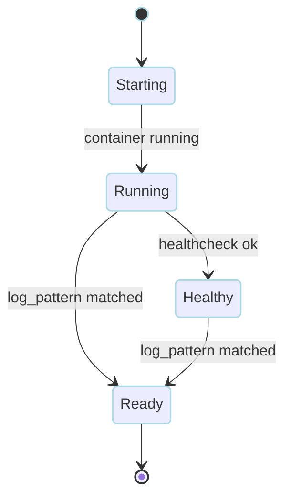
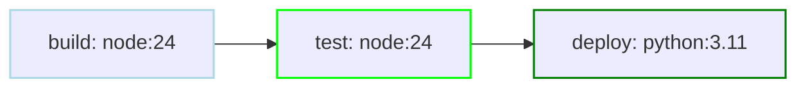
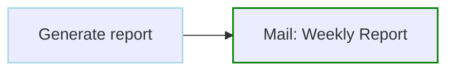

# Actions & Integrations Examples

Examples for custom actions, containers, Kubernetes, SSH, HTTP, jq, archive extraction, and mail.

<div class="examples-grid">

<div class="example-card">

### Custom Action

```yaml
actions:
  say:
    description: Print a reusable message
    input_schema:
      type: object
      additionalProperties: false
      required: [message]
      properties:
        message:
          type: string
    template:
      action: exec
      with:
        command: echo
        args:
          - {$input: message}

steps:
  - action: say
    with:
      message: "build finished"
```

`with` is validated by `input_schema`; the rendered template runs as a builtin `exec` action.

Add `outputs` when a step should publish validated values for downstream steps. Downstream references then use `steps.<id>.outputs.<name>`.

<a href="/dagu-actions/custom" class="learn-more">Learn more →</a>

</div>

<div class="example-card">

### Container Workflow

```yaml
# DAG-level container for all steps
container:
  image: python:3.11
  env:
    - PYTHONPATH=/app
  volumes:
    - ./src:/app

steps:
  - id: install
    run: pip install -r requirements.txt
  - id: test
    run: pytest tests/
    depends: install

  - id: build
    run: python setup.py build
    depends: test
```

<a href="/writing-workflows/yaml-specification#container-configuration" class="learn-more">Learn more →</a>

</div>

<div class="example-card">

### Keep Container Running

```yaml
# Use keep_container at DAG level
container:
  image: postgres:16
  keep_container: true
  env:
    - POSTGRES_PASSWORD=secret
  ports:
    - "5432:5432"

steps:
  - id: start_postgres
    run: postgres -D /var/lib/postgresql/data
  - id: wait_for_postgres
    run: pg_isready -U postgres -h localhost
    retry_policy:
      limit: 10
      interval_sec: 2
    depends: start_postgres
```

<a href="/writing-workflows/yaml-specification#container-configuration" class="learn-more">Learn more →</a>

</div>

<div class="example-card">

### Step-Level Container

```yaml
steps:
  - id: build
    container:
      image: node:18
      volumes:
        - ./src:/app
      working_dir: /app
    run: npm run build
```

<a href="/step-types/docker" class="learn-more">Learn more →</a>

</div>

<div class="example-card">

### Kubernetes Job

```yaml
kubernetes:
  namespace: batch
  service_account: dagu-runner

steps:
  - id: report
    action: k8s.run
    with:
      image: alpine:3.20
      command: [sh, -c, 'echo hello from kubernetes']
```

<a href="/step-types/kubernetes" class="learn-more">Learn more →</a>

</div>

<div class="example-card">

### Exec Into Existing Container

```yaml
# Run commands in an already-running container
container: my-app-container

steps:
  - id: migrate
    run: php artisan migrate
  - id: clear_cache
    run: php artisan cache:clear
    depends: migrate
```

<a href="/writing-workflows/container#exec-mode-use-existing-container" class="learn-more">Learn more →</a>

</div>

<div class="example-card">

### Exec Mode with Overrides

```yaml
# Override user and working directory
container:
  exec: my-app-container
  user: root
  working_dir: /var/www
  env:
    - APP_DEBUG=true

steps:
  - id: install
    run: composer install
  - id: fix_permissions
    run: chown -R www-data:www-data storage
    depends: install
```

<a href="/writing-workflows/container#exec-mode-use-existing-container" class="learn-more">Learn more →</a>

</div>

<div class="example-card">

### Mixed Exec and Image Mode

```yaml
steps:
  # Exec into app container
  - id: maintenance_mode
    container: my-app
    run: php artisan down

  # Run migration in fresh container
  - id: migrate
    container:
      image: my-app:latest
    run: php artisan migrate
    depends: maintenance_mode

  # Exec back into app container
  - id: restart
    container: my-app
    run: php artisan up
    depends: migrate
```

<a href="/step-types/docker#mixed-mode-example" class="learn-more">Learn more →</a>

</div>

<div class="example-card">

### Remote Commands via SSH

```yaml
# Configure SSH once for all steps
ssh:
  user: deploy
  host: production.example.com
  key: ~/.ssh/deploy_key

steps:
  - id: health_check
    run: curl -f localhost:8080/health
  - id: restart_app
    run: systemctl restart myapp
    depends: health_check
```

<a href="/step-types/ssh" class="learn-more">Learn more →</a>

</div>

<div class="example-card">

### Container Volumes: Relative Paths

```yaml
working_dir: /app/project
container:
  image: python:3.11
  volumes:
    - ./data:/data        # Resolves to /app/project/data:/data
    - .:/workspace        # Resolves to /app/project:/workspace
steps:
  - run: python process.py
```

<a href="/writing-workflows/yaml-specification#working-directory-and-volume-resolution" class="learn-more">Learn more →</a>

</div>

<div class="example-card">

### HTTP Requests

```yaml
steps:
  - action: http.request
    with:
      method: POST
      url: https://api.example.com/webhook
      headers:
        Content-Type: application/json
      body: '{"status": "started"}'
```

<a href="/step-types/http" class="learn-more">Learn more →</a>

</div>

<div class="example-card">

### Wait for Readiness

```yaml
steps:
  - id: wait_for_api
    action: wait.http
    with:
      url: https://api.example.com/health
      status: 200
      poll_interval: 5s
    timeout_sec: 300

  - id: continue_after_ready
    run: ./run-after-ready.sh
    depends: wait_for_api
```

<a href="/step-types/wait" class="learn-more">Learn more →</a>

</div>

<div class="example-card">

### JSON Processing

```yaml
steps:
  # Fetch sample users from a public mock API
  - id: fetch_users
    run: |
      response="$(curl -fsS https://reqres.in/api/users)"
      {
        printf 'api_response<<JSON\n'
        printf '%s\n' "$response"
        printf 'JSON\n'
      } >> "$DAGU_OUTPUT_FILE"
    outputs:
      - name: api_response
        type: json

  # Extract user emails from the JSON response
  - id: extract_emails
    action: jq.filter
    with:
      filter: '.data[] | .email'
      data: ${steps.fetch_users.outputs.api_response}
    depends: fetch_users
```

<a href="/step-types/jq" class="learn-more">Learn more →</a>

</div>

<div class="example-card">

### Archive Extraction

```yaml
working_dir: /tmp/data

steps:
  - action: archive.extract
    with:
      source: dataset.tar.zst
      destination: ./dataset
```

<a href="/step-types/archive" class="learn-more">Learn more →</a>

</div>

<div class="example-card">

### Container Startup & Readiness

```yaml
container:
  image: alpine:latest
  startup: command           # keepalive | entrypoint | command
  command: ["sh", "-c", "my-daemon"]
  wait_for: healthy           # running | healthy
  log_pattern: "Ready"        # Optional regex to wait for
  restart_policy: unless-stopped

steps:
  - run: echo "Service is ready"
```



<a href="/writing-workflows/container#startup-modes" class="learn-more">Learn more →</a>

</div>

<div class="example-card">

### Private Registry Auth

```yaml
registry_auths:
  ghcr.io:
    username: ${env.GITHUB_USER}
    password: ${env.GITHUB_TOKEN}

container:
  image: ghcr.io/myorg/private-app:latest

steps:
  - run: ./app
```

<a href="/step-types/docker#registry-authentication" class="learn-more">Learn more →</a>

</div>

<div class="example-card">

### Multi-Container Workflow

```yaml
steps:
  - id: build
    container:
      image: node:24
      volumes:
        - ./src:/app
      working_dir: /app
    run: npm run build

  - id: test
    container:
      image: node:24
      volumes:
        - ./src:/app
      working_dir: /app
    run: npm test
    depends: build

  - id: deploy
    container:
      image: python:3.11
      env:
        - AWS_DEFAULT_REGION=us-east-1
    run: python deploy.py
    depends: test
```



<a href="/writing-workflows/container#step-level-container" class="learn-more">Learn more →</a>

</div>

<div class="example-card">

### SSH: Advanced Options

```yaml
ssh:
  user: deploy
  host: app.example.com
  port: 2222
  key: ~/.ssh/deploy_key
  strict_host_key: true
  known_host_file: ~/.ssh/known_hosts

steps:
  - run: systemctl status myapp
```

<a href="/writing-workflows/yaml-specification#ssh-configuration" class="learn-more">Learn more →</a>

</div>

<div class="example-card">

### Mail

```yaml
smtp:
  host: smtp.gmail.com
  port: "587"
  username: "${env.SMTP_USER}"
  password: "${env.SMTP_PASS}"

steps:
  - action: mail.send
    with:
      to: team@example.com
      from: noreply@example.com
      subject: "Weekly Report"
      message: "Attached."
      attachments:
        - run: report.txt
```



<a href="/step-types/mail" class="learn-more">Learn more →</a>

</div>

</div>
