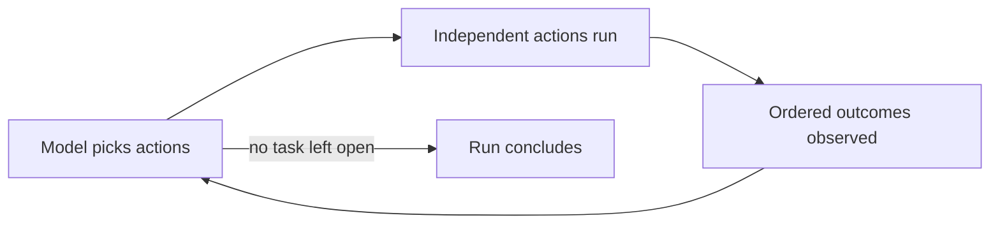
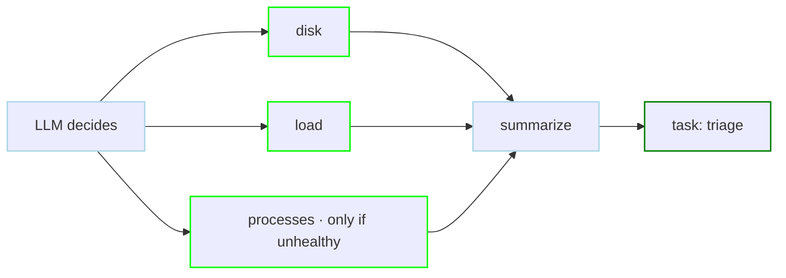
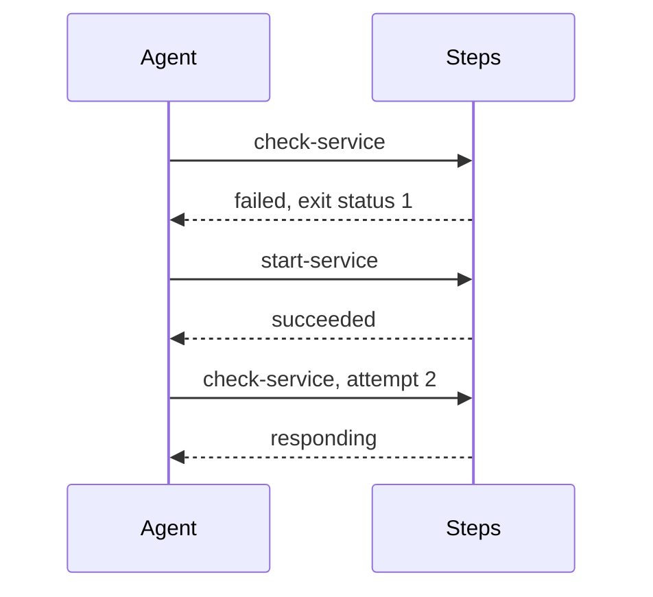
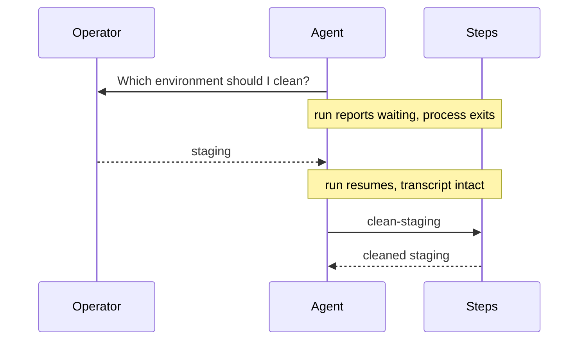
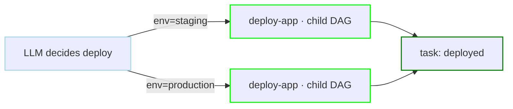

# Agent DAG Examples

An Agent DAG (`type: agent`) declares what a run must achieve instead of the order steps run in. Steps become a catalog of actions, `tasks` state the goals, and an LLM picks one or more independent actions per turn until every goal is settled.

This page builds up the feature one capability at a time. Every example runs as-is with an `OPENROUTER_API_KEY` exported; swap the `llm` block for [any configured provider](/step-types/llm/providers), and see the [LLM configuration fields](/step-types/llm/#configuration) for everything the block accepts (model fallback, `system`, `temperature`, `thinking`, and more). For the full semantics behind these examples, see [Agent DAGs](/writing-workflows/agent).

## When to reach for an Agent DAG

An Agent DAG earns its cost when the decision logic, not the work, is what keeps needing maintenance. A `graph` workflow encodes *how*; an Agent DAG encodes *what must be true*. The pattern fits when the "how" varies from run to run:

- **Runbook automation.** Probes and remedies as steps, the goal as a task: "service healthy, or escalated with evidence". A diagnosis tree is never finished as branching logic; as judgment against a goal it does not have to be. The [triage example](#judgment-and-reporting) is this in miniature.
- **Self-healing operations.** Different failures need different remedies: a full disk, a stale lock, a missing directory. Because [failure is an observation](#failure-is-an-observation), remedies do not have to be wired to every way a step can break.
- **A dispatcher over reviewed workflows.** With open parameters, tested sub-workflows become a vocabulary and goals become the interface. Power grows with the [catalog](#a-catalog-of-workflows); safety stays inside the sub-workflows.
- **Human judgment at the right moment.** Fixed workflows gate at fixed points. The agent [asks only when it is uncertain](#asking-a-person), and a waiting run holds no process while it waits.

The inverse cases matter as much. When the order is known and the branches are enumerable, a plain workflow is cheaper, faster, and reproducible. A single condition is `preconditions` or a `router` step, not an Agent DAG. The signal to switch: a workflow whose branches get edited after every incident is encoding judgment as wiring; move the goals to `tasks` and the remedies to `steps`.

## The loop

The smallest useful Agent DAG is a catalog of two commands and one goal.

```yaml
type: agent

secrets:
  - name: OPENROUTER_API_KEY
    provider: env
    key: OPENROUTER_API_KEY

llm:
  provider: openrouter
  model: deepseek/deepseek-v4-flash

steps:
  - name: disk
    description: Show filesystem usage.
    run: df -h
  - name: load
    description: Show uptime and load average.
    run: uptime

tasks:
  - name: checked
    description: Finished when both disk and load have been checked.
```

Each step is offered to the model as a function-calling tool, named after the step, described by its `description`. Two built-in tools are always added: `set_task_status`, which settles a task as `completed`, `skipped`, or `failed` with a reason, and `ask_user`, which puts a question to a person.



Each turn the model may pick one action or several distinct, independent actions. A batch runs concurrently, a bounded tail of each action's stdout and stderr comes back in call order, and the model decides again. Set `max_active_steps` on the DAG to cap concurrent actions; `0` is unlimited and `1` is serial. `set_task_status` and `ask_user` must each be called alone.

Steps declare no `depends`, and may not: ordering belongs to the agent. The run page records the order that was actually chosen as a decision timeline, and the **Chat** tab holds the full transcript.

Actions in the same batch cannot consume one another's outputs. Each member sees outputs completed before the turn began. If one action fails, its siblings continue; if one waits for a person, the batch's observations are delivered together only after every waiting action is resolved.

## Judgment and reporting

Descriptions steer the agent the way a runbook steers an operator. This workflow triages the machine it runs on: the task tells the agent when digging deeper is warranted, and a `chat.completion` step turns the findings into prose.

```yaml
type: agent

secrets:
  - name: OPENROUTER_API_KEY
    provider: env
    key: OPENROUTER_API_KEY

llm:
  provider: openrouter
  model: deepseek/deepseek-v4-flash

steps:
  - name: disk
    description: Show filesystem usage.
    run: df -h
    output: DISK
  - name: load
    description: Show uptime and load average.
    run: uptime
    output: LOAD
  - name: processes
    description: List processes with CPU and memory usage.
    run: ps aux | head -20
  - name: summarize
    description: Write the health summary. Run last, after the checks.
    action: chat.completion
    with:
      prompt: |
        Summarize this machine's health in three sentences:
        ${DISK}
        ${LOAD}

tasks:
  - name: triage
    description: >
      Finished when the machine has been checked and a health summary has been
      written. Inspect processes only if disk or load looks unhealthy.
```

Two mechanics carry this example:

- An Agent DAG has no dependency edges, so every action that has already finished counts as upstream of the one starting now. The `output:` variables `${DISK}` and `${LOAD}` are in scope for `summarize` once those probes have run.
- `chat.completion` steps inherit the workflow-level `llm` config, so the summary uses the same provider with no extra configuration.

On a healthy machine the agent checks disk and load, skips `processes`, writes the summary, and completes the task. Under load it inspects processes first and says so in the completion reason. Put the file on a `schedule` and it is a nightly check that explains itself.



## Failure is an observation

A failed step does not abort an Agent DAG run. The failure comes back as that turn's observation, and the model decides what to do about it.

```yaml
type: agent

secrets:
  - name: OPENROUTER_API_KEY
    provider: env
    key: OPENROUTER_API_KEY

llm:
  provider: openrouter
  model: deepseek/deepseek-v4-flash

steps:
  - name: check-service
    description: Check that the service is responding.
    run: test -f /tmp/demo-service.pid && echo responding
  - name: start-service
    description: Start the service.
    run: touch /tmp/demo-service.pid

tasks:
  - name: service-up
    description: >
      Finished when check-service has confirmed the service responds.
      Do not start the service unless a check shows it down.
```

The marker file stands in for a real service. On a fresh machine the run plays out like this:



The agent checked first because the task forbids blind restarts, observed the failure, ran the remedy, and re-ran the check to confirm. It then closed the task with its own account of what happened: "The service was down; I started it and verified it is now responding." Recovery paths like this normally cost explicit error-handling wiring; here the failing observation and the goal are enough. A single action may be re-run at most 5 times per run.

Delete `/tmp/demo-service.pid` to watch the recovery again; while it exists, the first check succeeds and the run completes in one action.

## Asking a person

When the goal cannot be settled without a human decision, the agent asks one. `ask_user` opens a human task with the agent's question, the run releases its process while it waits, and the answer becomes the next observation.

```yaml
type: agent

secrets:
  - name: OPENROUTER_API_KEY
    provider: env
    key: OPENROUTER_API_KEY

llm:
  provider: openrouter
  model: deepseek/deepseek-v4-flash

steps:
  - name: clean-staging
    description: Remove temporary files from the staging area.
    run: echo cleaned staging
  - name: clean-production
    description: Remove temporary files from production.
    run: echo cleaned production

tasks:
  - name: cleaned
    description: >
      Finished when the environment the operator chose has been cleaned.
      Ask which environment to clean; do not guess.
```

Started with `dagu start`, the run ends in the `waiting` status with the question recorded:

```
ask_user [waiting]
  prompt: Which environment would you like me to clean?
          Options are "staging" or "production".
```

Answer it in the Web UI, or from the CLI:

```sh
dagu human-task complete <dag-name> --run-id <run-id> --step ask_user --input answer=staging
```

Completing the task re-queues the run; a running scheduler (or `dagu start-all`) picks it up and the agent resumes with its transcript and goal progress intact. Given the answer `staging`, it runs `clean-staging`, leaves `clean-production` untouched, and completes. The untouched step is marked `skipped`.



An agent asks at most 5 questions per run, never repeats an answered one, and only asks when it is the root run, so agents stay composable as sub-workflows.

## A catalog of workflows

Plain command steps are nullary tools: the model chooses when they run, never what they run. A step that launches a sub-workflow is different. Parameters the step leaves open become tool arguments, and the agent fills them in.

```yaml
type: agent

secrets:
  - name: OPENROUTER_API_KEY
    provider: env
    key: OPENROUTER_API_KEY

llm:
  provider: openrouter
  model: deepseek/deepseek-v4-flash

steps:
  - name: deploy
    description: Deploy a version of the app to an environment.
    action: dag.run
    with:
      dag: deploy-app

tasks:
  - name: deployed
    description: >
      Finished when version 2.4.1 has been deployed to staging and
      production, staging first.

---
name: deploy-app
params:
  - name: env
    type: string
  - name: version
    type: string
steps:
  - name: ship
    run: echo "deploying ${params.version} to ${params.env}"
```

The `deploy` step names no `env` or `version`, so both become arguments of the `deploy` tool. Reading the goal, the agent calls it twice:

```
deploy   succeeded              env=staging     version=2.4.1
deploy   succeeded  (attempt 2) env=production  version=2.4.1
task deployed  completed
```

Each call is a real child DAG run with its own run ID, logs, and history. A parameter the step does supply is never offered to the model: values written in the workflow are the author's decision. This is the pattern that scales: a library of reviewed, parameterized workflows as the catalog, goals as the interface.



## Cost and limits

New observations are resent to the model on later turns until context aging compacts them. Each agent-facing observation is capped at 512 KiB by default, but smaller reports still reduce cost on every turn before aging; for sub-workflows, end the child with `outputs.write` to control exactly what crosses back. See [reporting](/writing-workflows/agent#reporting-from-a-sub-workflow).

`llm.max_tool_iterations` caps decisions per run (default 50). A task the agent cannot achieve should be settled as `failed` with a reason rather than left to exhaust the limit.

[Agent DAG Internals](/writing-workflows/agent-internals) has the full runtime accounting: observation aging defaults, one-shot overflow recovery, every limit in one table, and what survives a suspension or a retry.
