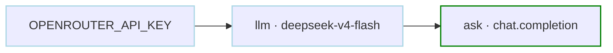
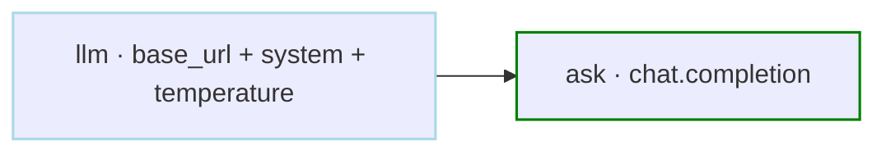
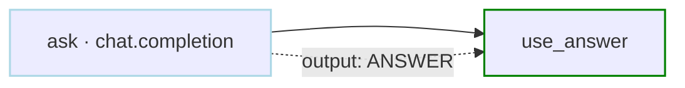
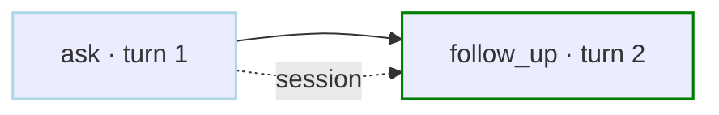
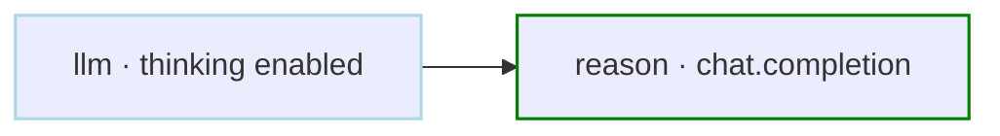
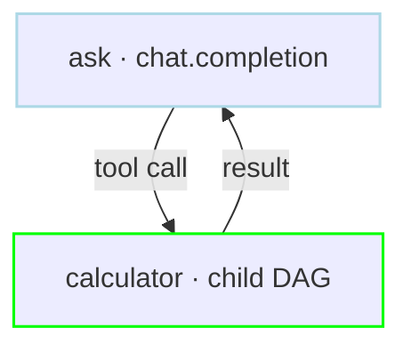
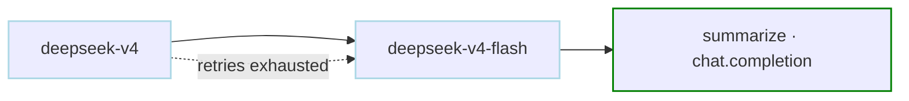
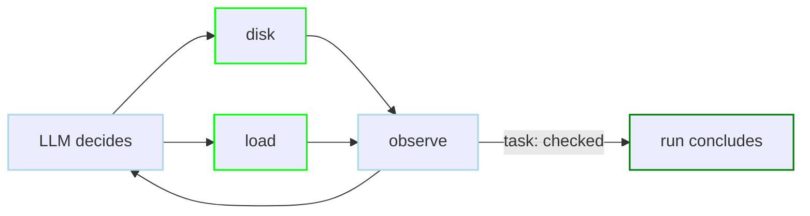
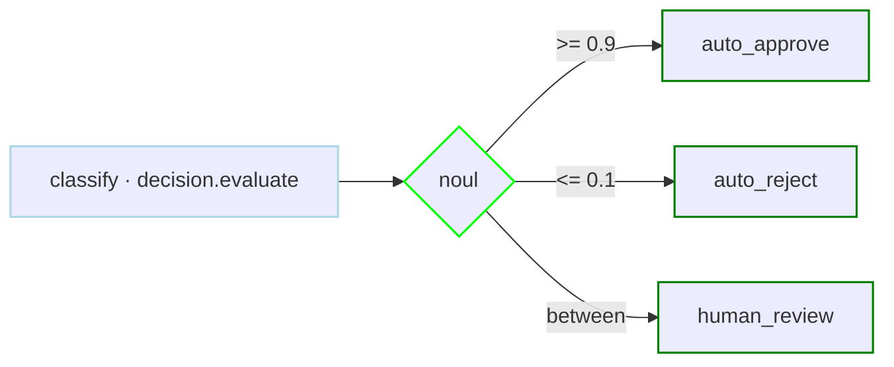

# AI Examples

Chat completions with OpenRouter and a secret-managed key, DAG-level defaults with a custom endpoint, response reuse, sessions, extended thinking, workflows as tools, model fallback, and typed decisions that route on confidence. Every example runs as-is with an `OPENROUTER_API_KEY` exported. Cards that omit `secrets` and `llm` assume the setup block from the first card.

<div class="examples-grid">

<div class="example-card">

### Provider Setup with a Secret

```yaml
secrets:
  - name: OPENROUTER_API_KEY
    provider: env
    key: OPENROUTER_API_KEY

llm:
  provider: openrouter
  model: deepseek/deepseek-v4-flash

steps:
  - id: ask
    action: chat.completion
    with:
      prompt: |
        What is 2+2? Reply with just the number.
```

The `secrets` entry resolves the key at run time and masks it in logs. The DAG-level `llm` block is inherited by every chat step that sets no LLM fields of its own.



<a href="/step-types/llm/providers" class="learn-more">Learn more →</a>

</div>

<div class="example-card">

### Endpoint and Defaults at DAG Level

```yaml
llm:
  provider: openrouter
  model: deepseek/deepseek-v4-flash
  base_url: https://openrouter.ai/api/v1
  api_key_name: OPENROUTER_API_KEY
  system: |
    Answer in one short sentence.
  temperature: 0.2
  max_tokens: 200

steps:
  - id: ask
    action: chat.completion
    with:
      prompt: What does a DAG scheduler do?
```

`base_url` points at any [OpenAI-compatible endpoint](/step-types/llm/providers#openai-compatible-endpoints) (shown with OpenRouter's own URL made explicit; the same field targets [vLLM, Ollama, or LM Studio](/step-types/llm/local-models) or a corporate proxy), `api_key_name` picks the environment variable holding the key, and `system` plus the sampling fields become defaults for every chat step. The [full field list](/step-types/llm/#configuration) has the rest.



<a href="/step-types/llm/providers#openai-compatible-endpoints" class="learn-more">Learn more →</a>

</div>

<div class="example-card">

### Use the Response in a Later Step

```yaml
steps:
  - id: ask
    action: chat.completion
    with:
      prompt: |
        What is 2+2? Reply with just the number.
    output: ANSWER

  - id: use_answer
    run: echo "The model said ${ANSWER}"
    depends: ask
```

`output` captures the completion text as a variable for downstream steps.



<a href="/writing-workflows/outputs" class="learn-more">Learn more →</a>

</div>

<div class="example-card">

### Multi-turn Session

```yaml
steps:
  - id: ask
    action: chat.completion
    with:
      prompt: |
        What is 2+2? Reply with just the number.

  - id: follow_up
    action: chat.completion
    with:
      prompt: |
        Multiply that by 3. Reply with just the number.
    depends: ask
```

Chat steps inherit the conversation from the steps they depend on, so "that" resolves to the earlier answer.



<a href="/step-types/llm/#sessions" class="learn-more">Learn more →</a>

</div>

<div class="example-card">

### Extended Thinking

```yaml
steps:
  - id: reason
    action: chat.completion
    with:
      provider: openrouter
      model: deepseek/deepseek-v4-flash
      thinking:
        enabled: true
        effort: low
      prompt: |
        A bat and a ball cost 1.10 in total. The bat costs
        1.00 more than the ball. How much does the ball
        cost? Reply with just the amount.
```

`thinking` maps to the provider's reasoning controls; raise `effort` for harder problems.



<a href="/step-types/llm/reasoning-web-search#reasoning" class="learn-more">Learn more →</a>

</div>

<div class="example-card">

### Workflows as Tools

```yaml
steps:
  - id: ask
    action: chat.completion
    with:
      provider: openrouter
      model: deepseek/deepseek-v4-flash
      tools:
        - calculator
      prompt: |
        What is 15 times 23? Use the calculator tool,
        then reply with just the number.

---
name: calculator
description: Multiply two numbers.
params: "a b"
steps:
  - id: multiply
    run: echo $(($1 * $2))
```

Each name in `tools` exposes a DAG as a callable tool; its `params` become the tool's argument schema, and each call is a real child run. The explicit `provider` and `model` are required here: setting any LLM field under `with` (such as `tools`) replaces the DAG-level `llm` block instead of merging with it.



<a href="/features/chat/tool-calling" class="learn-more">Learn more →</a>

</div>

<div class="example-card">

### Model Fallback

```yaml
steps:
  - id: summarize
    action: chat.completion
    with:
      model:
        - provider: openrouter
          name: deepseek/deepseek-v4
        - provider: openrouter
          name: deepseek/deepseek-v4-flash
      prompt: |
        Reply with the single word "ready".
```

An ordered `model` list tries the next entry after retries for the current one are exhausted.



<a href="/step-types/llm/reliability#model-fallback" class="learn-more">Learn more →</a>

</div>

<div class="example-card">

### Agent Workflow

```yaml
type: agent

llm:
  provider: openrouter
  model: deepseek/deepseek-v4-flash

steps:
  - name: disk
    description: Show filesystem usage.
    run: df -h
  - name: load
    description: Show uptime and load average.
    run: uptime

tasks:
  - name: checked
    description: Finished when both disk and load have been checked.
```

Steps become a catalog of actions and `tasks` state the goals; the model decides what runs next. Built up example by example on the [agent examples page](/writing-workflows/examples/agent).



<a href="/writing-workflows/examples/agent" class="learn-more">Learn more →</a>

</div>

<div class="example-card">

### Route on a Typed Decision

```yaml
type: graph
steps:
  - id: classify
    action: decision.evaluate
    with:
      provider: openrouter
      model: typesafe/jev-1.13
      state: Please refund my duplicate charge.
      questions:
        refund:
          type: noul
          instructions: Is the customer asking for a refund?

  - id: triage
    action: router.route
    with:
      value: ${classify.output.answers.refund.noul}
      routes:
        "num:>=0.9": [auto_approve]
        "num:<=0.1": [auto_reject]
    depends: classify

  - id: auto_approve
    run: echo "Refund approved"

  - id: auto_reject
    run: echo "Not a refund request"

  - id: human_review
    preconditions:
      - condition: ${classify.output.answers.refund.noul}
        expected: "num:<0.9"
      - condition: ${classify.output.answers.refund.noul}
        expected: "num:>0.1"
    run: echo "Needs a human"
    depends: classify
```

A `noul` question answers yes or no as a probability, so the confident ends route automatically and the middle band goes to a person. A route carries one pattern, so the middle band states both bounds as preconditions instead.



<a href="/step-types/decision" class="learn-more">Learn more →</a>

</div>

</div>
