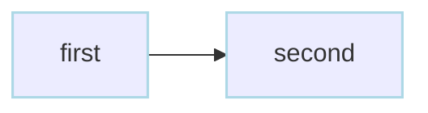
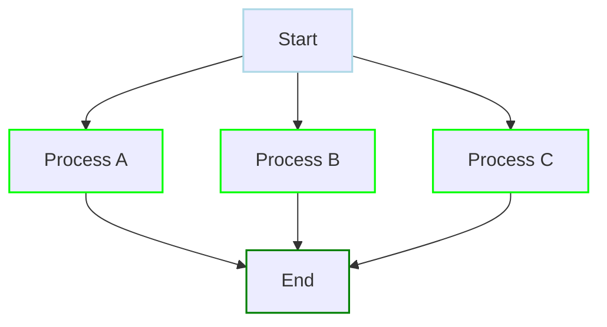
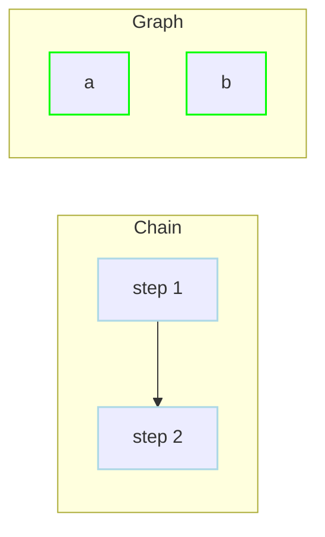

# Basic Examples

Small copy-paste examples for the common workflow building blocks.

## Basic Workflows

<div class="examples-grid">

<div class="example-card">

### Basic Sequential Steps

```yaml
steps:
  - id: first
    run: echo "Step 1"
  - id: second
    run: echo "Step 2"
    depends: first
```



<a href="/writing-workflows/basics#sequential-execution" class="learn-more">Learn more →</a>

</div>

<div class="example-card">

### Parallel Execution (Iterator)

```yaml
steps:
  - action: dag.run
    with:
      dag: processor
      params: "item=${ITEM}"
    parallel:
      items: [A, B, C]
      max_concurrent: 2
---
name: processor
params:
  - name: item
    required: true
steps:
  - run: echo "Processing ${params.item}"
```



<a href="/writing-workflows/execution-control#parallel" class="learn-more">Learn more →</a>

</div>

<div class="example-card">

### Multiple Commands per Step

```yaml
tools:
  - nodejs/node@v22.21.1

steps:
  - id: build_and_test
    run: |
      npm install
      npm run build
      npm test
    env:
      - NODE_ENV: production
    working_dir: /app
```

Share step config (`env`, `working_dir`, `retry_policy`, etc.) across commands instead of duplicating across steps.

<a href="/writing-workflows/basics#multiple-commands" class="learn-more">Learn more →</a>

</div>

<div class="example-card">

### Reproducible CLI Tools

```yaml
tools:
  - jqlang/jq@jq-1.7.1

steps:
  - id: transform
    run: jq '.items[] | .name' input.json
```

Pin portable command-line dependencies in the DAG so workers install the expected binary before running host command steps.

<a href="/writing-workflows/tools" class="learn-more">Learn more →</a>

</div>

<div class="example-card">

### Dependency Modes

```yaml
# Default graph mode: explicit dependencies define order
steps:
  - id: step_1
    run: echo "step 1"
  - id: step_2
    run: echo "step 2"
    depends: step_1

# Independent steps can run in parallel
---
steps:
  - id: a
    run: echo A
  - id: b
    run: echo B
```



<a href="/writing-workflows/basics#parallel-execution" class="learn-more">Learn more →</a>

</div>

</div>
