# Control Flow Examples

Examples for conditions, repetition, routing, DAG composition, and worker placement.

<div class="examples-grid">

<div class="example-card">

### Conditional Execution

```yaml
steps:
  - run: echo "Deploying application"
    preconditions:
      - condition: "${env.ENV}"
        expected: "production"
```

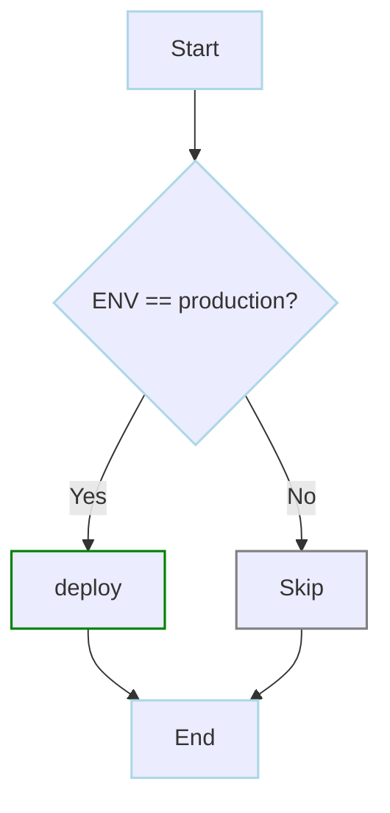

<a href="/writing-workflows/control-flow#conditions" class="learn-more">Learn more →</a>

</div>

<div class="example-card">

### Repeat Until Condition

> Looking for iteration over a list? See [Parallel Execution](/writing-workflows/examples/basic#parallel-execution-iterator).

```yaml
steps:
  - run: curl -f http://service/health
    repeat_policy:
      repeat: true
      interval_sec: 10
      exit_code: [1]  # Repeat while exit code is 1
```

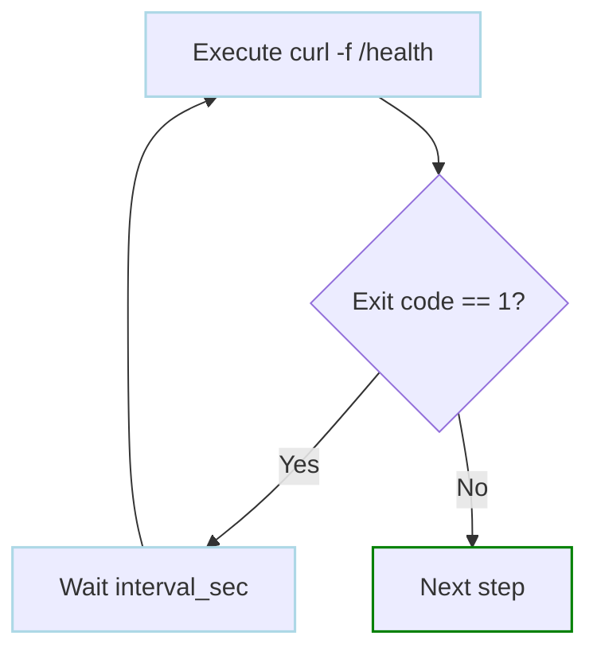

<a href="/writing-workflows/control-flow#repeat" class="learn-more">Learn more →</a>

</div>

<div class="example-card">

### Repeat Until Command Succeeds

```yaml
steps:
  - run: curl -f http://service:8080/health
    repeat_policy:
      repeat: until        # Repeat UNTIL service is healthy
      exit_code: [0]        # Exit code 0 means success
      interval_sec: 10      # Wait 10 seconds between attempts
      limit: 30            # Maximum 5 minutes
```

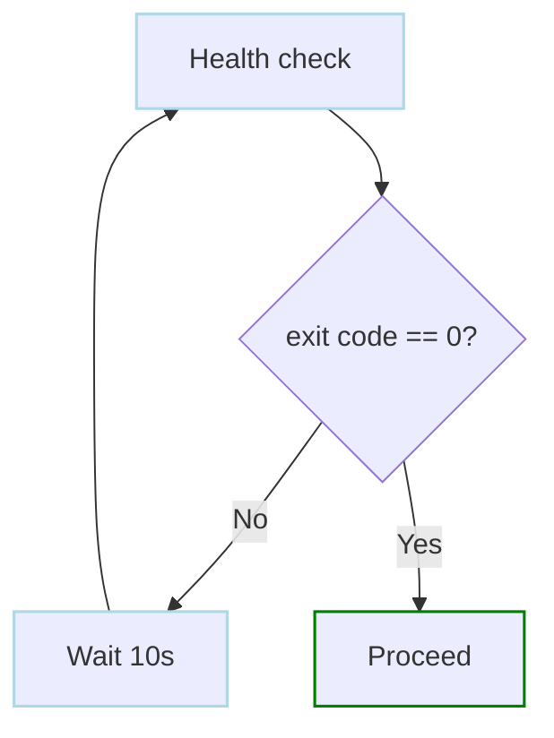

<a href="/writing-workflows/control-flow#repeat" class="learn-more">Learn more →</a>

</div>

<div class="example-card">

### Repeat Until Output Match

```yaml
 steps: 
  - run: echo "COMPLETED"  # Simulates job status check
    env:
      - JOB_STATUS: COMPLETED
    repeat_policy:
      repeat: until        # Repeat UNTIL job completes
      condition: "${env.JOB_STATUS}"
      expected: "COMPLETED"
      interval_sec: 30
      limit: 120           # Maximum 1 hour (120 attempts)
```

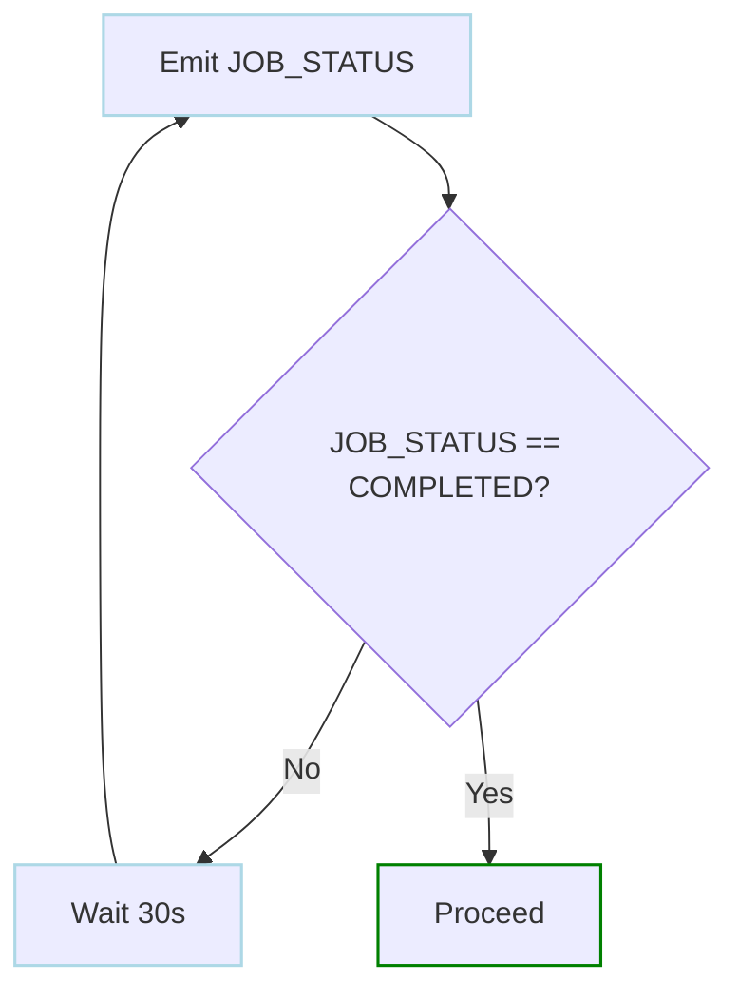

<a href="/writing-workflows/control-flow#repeat" class="learn-more">Learn more →</a>

</div>

<div class="example-card">

### Repeat Steps

```yaml
steps:
  - run: echo "heartbeat"  # Sends heartbeat signal
    repeat_policy:
      repeat: while            # Repeat indefinitely while successful
      interval_sec: 60
```

<a href="/writing-workflows/control-flow#repeat-basic" class="learn-more">Learn more →</a>

</div>

<div class="example-card">

### Repeat Steps Until Success

```yaml
steps:
  - run: echo "Checking status"
    repeat_policy:
      repeat: until        # Repeat until exit code 0
      exit_code: [0]
      interval_sec: 30
      limit: 20            # Maximum 10 minutes
```

<a href="/writing-workflows/control-flow#repeat-basic" class="learn-more">Learn more →</a>

</div>

<div class="example-card">

### DAG-Level Preconditions

```yaml
preconditions:
  - eval: "$(date +%u)"
    expected: "re:[1-5]"  # Weekdays only

steps:
  - run: echo "Run on business days"
```

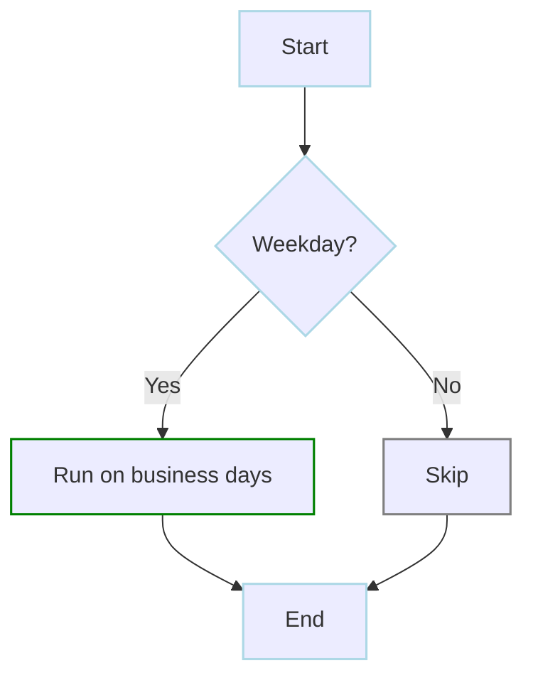

<a href="/writing-workflows/control-flow#dag-level-conditions" class="learn-more">Learn more →</a>

</div>

<div class="example-card">

### Negated Preconditions

```yaml
steps:
  # Run only when NOT in production
  - run: echo "Running dev task"
    preconditions:
      - condition: "${env.ENVIRONMENT}"
        expected: "production"
        negate: true

  # Run only on weekends
  - run: echo "Weekend maintenance"
    preconditions:
      - eval: "$(date +%u)"
        expected: "re:[1-5]"  # Weekdays
        negate: true          # Invert: run on weekends
```

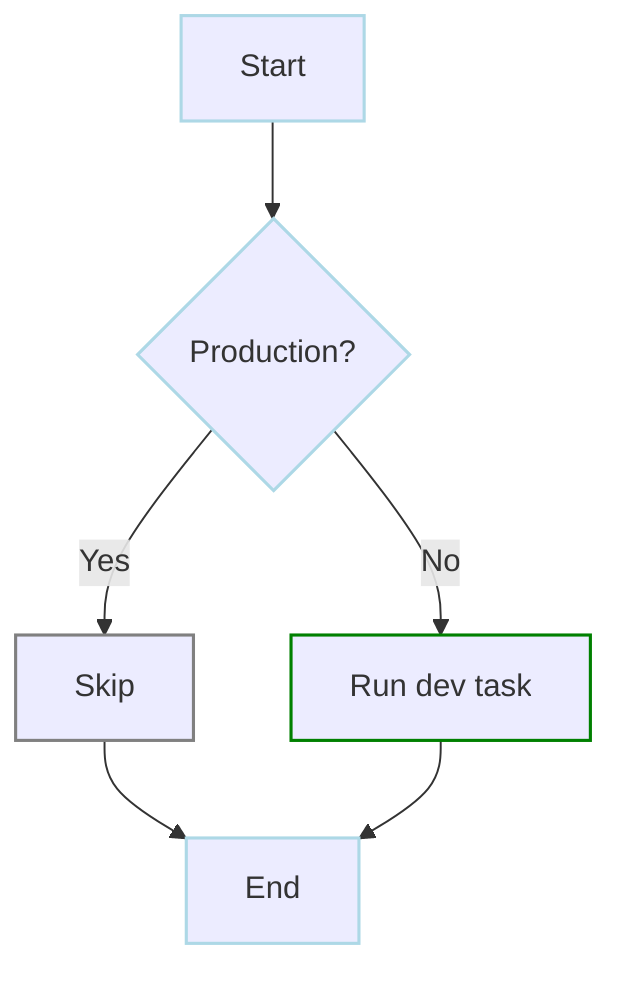

<a href="/writing-workflows/control-flow#negated-conditions" class="learn-more">Learn more →</a>

</div>

<div class="example-card">

### Routing Based on Value

```yaml
env:
  - STATUS: production
steps:
  - id: router
    action: router.route
    with:
      value: ${env.STATUS}
      routes:
        "production": [prod_handler]
        "staging": [staging_handler]

  - id: prod_handler
    run: echo "Production"

  - id: staging_handler
    run: echo "Staging"
```

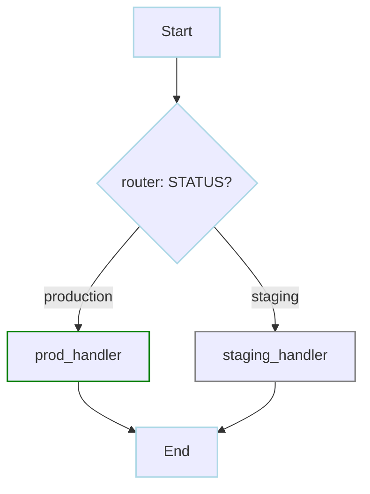

<a href="/step-types/router" class="learn-more">Learn more →</a>

</div>

<div class="example-card">

### Routing Based on Step Output

```yaml
steps:
  - id: check_status
    run: printf 'status=success\n' >> "$DAGU_OUTPUT_FILE"
    outputs:
      - name: status

  - id: router
    action: router.route
    with:
      value: ${steps.check_status.outputs.status}
      routes:
        "success": [success_handler]
        "failure": [failure_handler]
    depends: check_status

  - id: success_handler
    run: echo "Handling success"

  - id: failure_handler
    run: echo "Handling failure"
```

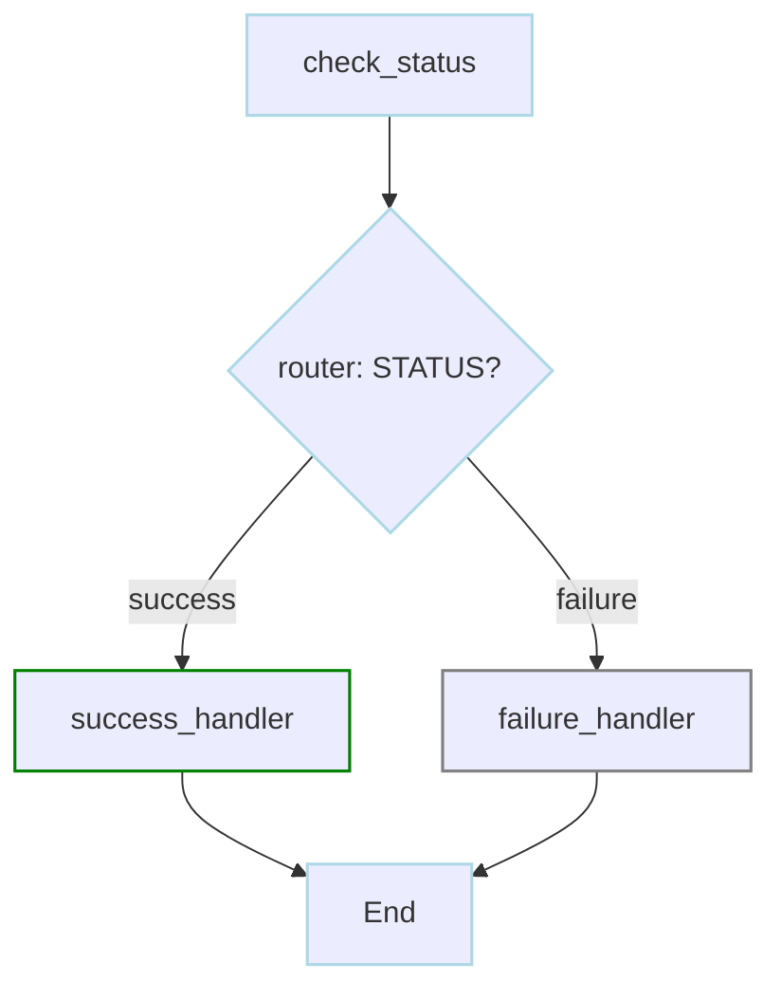

<a href="/step-types/router#routing-based-on-step-output" class="learn-more">Learn more →</a>

</div>

<div class="example-card">

### Continue On: Exit Codes and Output

```yaml
steps:
  - id: optional_check
    run: exit 3  # This will exit with code 3
    continue_on:
      exit_code: [0, 3]        # Treat 0 and 3 as non-fatal
      output:
        - "WARNING"
        - "re:^INFO:.*"       # Regex match
      mark_success: true       # Mark as success when matched
  - id: continue_after_check
    run: echo "Continue regardless"
    depends: optional_check
```

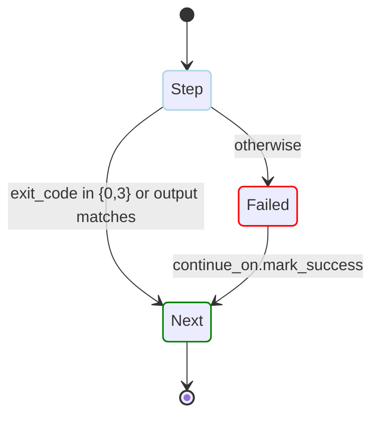

<a href="/writing-workflows/continue-on" class="learn-more">Learn more →</a>

</div>

<div class="example-card">

### Nested Workflows

```yaml
steps:
  - id: run_etl
    action: dag.run
    with:
      dag: etl.yaml
      params: "ENV=prod DATE=today"

  - id: run_analysis
    action: dag.run
    with:
      dag: analyze.yaml
    depends: run_etl
```

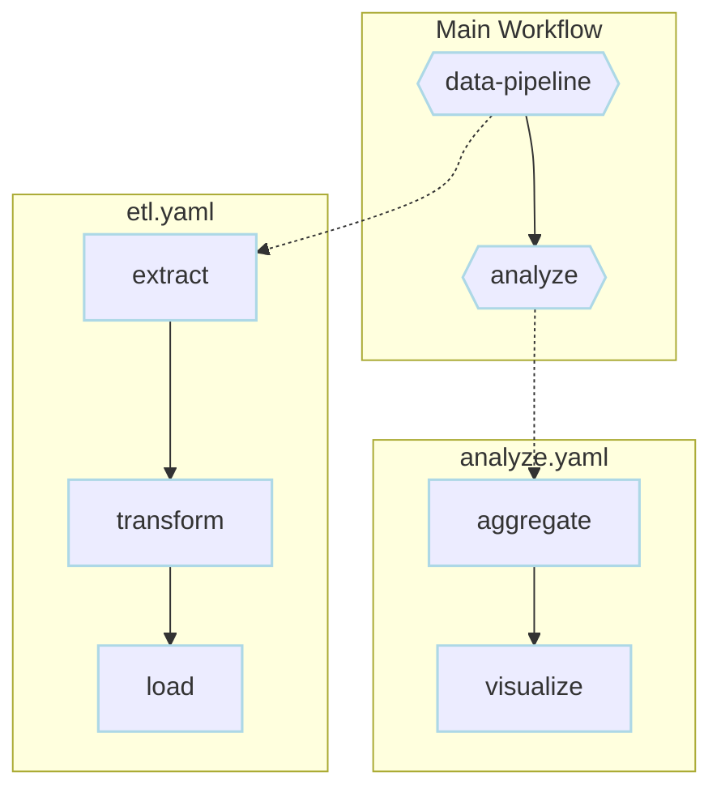

<a href="/writing-workflows/control-flow#nested-workflows" class="learn-more">Learn more →</a>

</div>

<div class="example-card">

### Multiple DAGs in One File

```yaml
steps:
  - action: dag.run
    with:
      dag: data-processor
      params: "type=daily"
---
name: data-processor
params:
  - name: type
    default: batch
steps:
  - id: extract
    run: echo "Extracting ${params.type} data"

  - id: transform
    run: echo "Transforming data"
    depends: extract
```

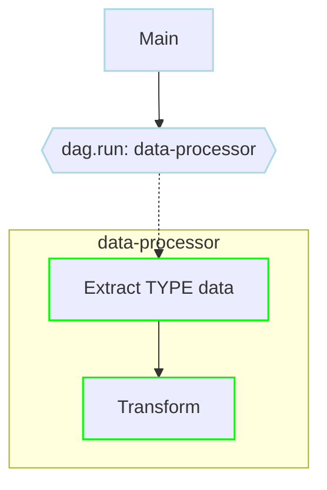

<a href="/writing-workflows/control-flow#multiple-dags-in-one-file" class="learn-more">Learn more →</a>

</div>

<div class="example-card">

### Dispatch to Specific Workers

```yaml
tools:
  - astral-sh/uv@0.11.14

steps:
  - id: prepare_dataset
    run: uv run --python 3.13.9 python prepare_dataset.py

  - id: train_model
    action: dag.run
    with:
      dag: train-model
    depends: prepare_dataset

  - id: evaluate_model
    action: dag.run
    with:
      dag: evaluate-model
    depends: train_model
---
name: train-model
worker_selector:
  gpu: "true"
  cuda: "11.8"
  memory: "64G"
tools:
  - astral-sh/uv@0.11.14

steps:
  - run: uv run --python 3.13.9 python train.py --gpu
---
name: evaluate-model
worker_selector:
  gpu: "true"
tools:
  - astral-sh/uv@0.11.14

steps:
  - run: uv run --python 3.13.9 python evaluate.py
```

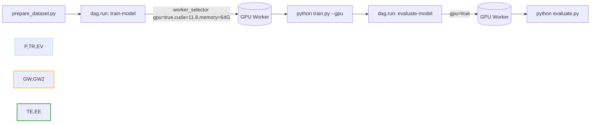

<a href="/server-admin/distributed/" class="learn-more">Learn more →</a>

</div>

<div class="example-card">

### Mixed Local and Worker Steps

```yaml
steps:
  # Runs on any available worker (local or remote)
  - id: download_dataset
    run: wget https://data.example.com/dataset.tar.gz

  # Must run on specific worker type
  - id: process_on_gpu
    action: dag.run
    with:
      dag: process-on-gpu
    depends: download_dataset

  # Runs locally (no selector)
  - id: finish
    run: echo "Processing complete"
    depends: process_on_gpu

---
name: process-on-gpu
worker_selector:
  gpu: "true"
  gpu-model: "nvidia-a100"
tools:
  - astral-sh/uv@0.11.14

steps:
  - run: uv run --python 3.13.9 python gpu_process.py
```

<a href="/server-admin/distributed/#task-routing" class="learn-more">Learn more →</a>

</div>

<div class="example-card">

### Force Local Execution

```yaml
# When default_execution_mode is "distributed", use worker_selector: local
# to keep specific DAGs on the main instance
worker_selector: local

steps:
  - id: health_check
    run: curl -f http://localhost:8080/health

  - id: finish
    run: echo "Ran locally"
    depends: health_check
```

Use `worker_selector: local` as an escape hatch in distributed deployments for lightweight DAGs that should never leave the main instance.

<a href="/server-admin/distributed/#force-local-execution" class="learn-more">Learn more →</a>

</div>

<div class="example-card">

### Parallel Distributed Tasks

```yaml
tools:
  - astral-sh/uv@0.11.14

steps:
  - id: split_data
    run: |
      chunks="$(uv run --python 3.13.9 python split_data.py --chunks=10)"
      printf 'chunks=%s\n' "$chunks" >> "$DAGU_OUTPUT_FILE"
    outputs:
      - name: chunks

  - action: dag.run
    with:
      dag: chunk-processor
      params: "chunk=${ITEM}"
    parallel:
      items: ${steps.split_data.outputs.chunks}
      max_concurrent: 5
    depends: split_data

  - run: uv run --python 3.13.9 python merge_results.py
---
name: chunk-processor
worker_selector:
  memory: "16G"
  cpu-cores: "8"
params:
  - name: chunk
    default: ""
tools:
  - astral-sh/uv@0.11.14

steps:
  - run: uv run --python 3.13.9 python process_chunk.py "${params.chunk}"
```

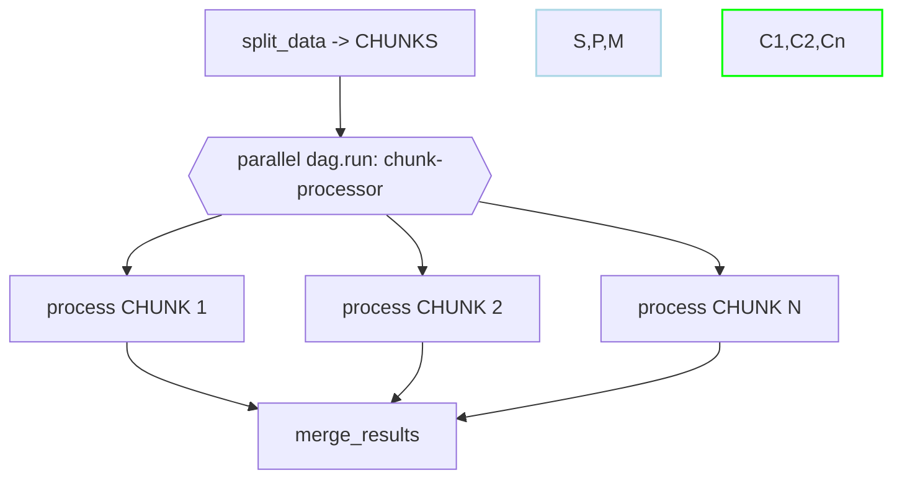

<a href="/writing-workflows/execution-control#parallel" class="learn-more">Learn more →</a>

</div>

</div>
