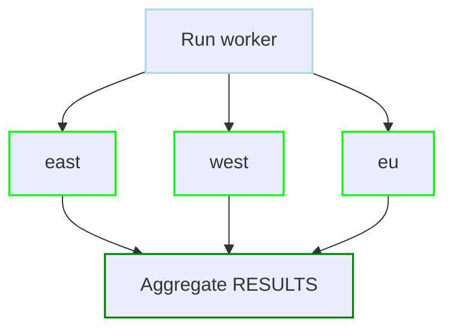

# Data & Variables Examples

Examples for environment variables, parameters, outputs, runtime context, and artifacts.

<div class="examples-grid">

<div class="example-card">

### Environment Variables

```yaml
env:
  - SOME_DIR: ${HOME}/batch
  - SOME_FILE: ${env.SOME_DIR}/some_file
  - LOG_LEVEL: debug
  - API_KEY: ${SECRET_API_KEY}
tools:
  - astral-sh/uv@0.11.14

steps:
  - working_dir: ${env.SOME_DIR}
    run: uv run --python 3.13.9 python main.py "${env.SOME_FILE}"
```

<a href="/writing-workflows/data-variables#env" class="learn-more">Learn more →</a>

</div>

<div class="example-card">

### Dotenv Files

```yaml
# Specify single dotenv file
dotenv: .env

# Load multiple files (all files loaded, later override earlier)
dotenv:
  - .env.defaults
  - .env.local
  - .env.production

steps:
  - run: echo "Database: ${env.DATABASE_URL}"
```

<a href="/writing-workflows/data-variables#dotenv" class="learn-more">Learn more →</a>

</div>

<div class="example-card">

### Secrets

```yaml
secrets:
  - name: DB_PASSWORD
    ref: prod/db-password
  - name: API_TOKEN
    provider: env
    key: PROD_API_TOKEN

steps:
  - run: ./sync.sh
    env:
      - AUTH_HEADER: "Bearer ${env.API_TOKEN}"
      - STRICT_MODE: "1"
```

<a href="/writing-workflows/secrets" class="learn-more">Learn more →</a>

</div>

<div class="example-card">

### Positional Parameters

```yaml
params: param1 param2  # Default values for $1 and $2
tools:
  - astral-sh/uv@0.11.14

steps:
  - run: uv run --python 3.13.9 python main.py $1 $2
```

<a href="/writing-workflows/data-variables#params" class="learn-more">Learn more →</a>

</div>

<div class="example-card">

### Named Parameters

```yaml
params:
  - name: foo
    type: integer
    default: 1
  - name: bar
    default: "2"
  - name: environment
    type: string
    default: dev
    enum: [dev, staging, prod]
tools:
  - astral-sh/uv@0.11.14

steps:
  - run: uv run --python 3.13.9 python main.py "${params.foo}" "${params.bar}" --env="${params.environment}"
```

<a href="/writing-workflows/data-variables#named-params" class="learn-more">Learn more →</a>

</div>

<div class="example-card">

### Output Variables

```yaml
steps:
  - id: get_today
    run: printf 'today=%s\n' "$(date +%Y%m%d)" >> "$DAGU_OUTPUT_FILE"
    outputs:
      - name: today
  - id: print_today
    run: echo "Today's date is ${steps.get_today.outputs.today}"
    depends: get_today
```

<a href="/writing-workflows/data-variables#output" class="learn-more">Learn more →</a>

</div>

<div class="example-card">

### Parallel Child Runs

```yaml
steps:
  - id: process_regions
    action: dag.run
    with:
      dag: worker
      params: "region=${ITEM}"
    parallel:
      items: [east, west, eu]
---
name: worker
params:
  - name: region
    default: ""
steps:
  - run: echo "${params.region}"
```



<a href="/writing-workflows/execution-control#parallel" class="learn-more">Learn more →</a>

</div>

<div class="example-card">

### Runtime Context

```yaml
steps:
  - run: |
      echo "DAG: ${context.dag.name}"
      echo "Run: ${context.run.id}"
      echo "Step: ${context.step.name}"
      echo "Log: ${context.paths.log_file}"
```

<a href="/writing-workflows/runtime-variables" class="learn-more">Learn more →</a>

</div>

<div class="example-card">

### Output Size Limits

```yaml
# Set maximum output size to 5MB for all steps
max_output_size: 5242880  # 5MB in bytes

steps:
  - run: "cat large-file.txt"
    output: CONTENT  # Will fail if file exceeds 5MB
```

Control output size limits to prevent memory issues.

<a href="/writing-workflows/data-variables#output-limits" class="learn-more">Learn more →</a>

</div>

<div class="example-card">

### Stream Output to Artifacts

```yaml
steps:
  - run: "echo hello"
    stdout:
      artifact: hello.txt
  
  - run: "echo error message >&2"
    stderr:
      artifact: error.txt
```

<a href="/writing-workflows/artifacts#stream-output-to-artifacts" class="learn-more">Learn more →</a>

</div>

<div class="example-card">

### JSON Path References

```yaml
steps:
  - id: produce_result
    run: |
      printf 'final_value=%s\n' "ok" >> "$DAGU_OUTPUT_FILE"
    outputs:
      - name: final_value

  - id: print_result
    run: echo "Result: ${steps.produce_result.outputs.final_value}"
    depends: produce_result
```

<a href="/writing-workflows/data-variables#json-paths" class="learn-more">Learn more →</a>

</div>

<div class="example-card">

### Structured Step Output

```yaml
steps:
  - id: build
    run: |
      printf 'version=%s\n' "v1.2.3" >> "$DAGU_OUTPUT_FILE"
    outputs:
      - name: version

  - id: publish
    run: |
      printf 'version_label=%s\n' "ver - ${steps.build.outputs.version}" >> "$DAGU_OUTPUT_FILE"
    outputs:
      - name: version_label
    depends: build

  - id: print
    run: echo "${steps.publish.outputs.version_label}"
    depends: publish
```

<a href="/writing-workflows/outputs#object-form" class="learn-more">Learn more →</a>

</div>

<div class="example-card">

### Step ID References

```yaml
tools:
  - astral-sh/uv@0.11.14

steps:
  - id: extract
    run: |
      printf 'data_path=%s\n' "$(uv run --python 3.13.9 python extract.py)" >> "$DAGU_OUTPUT_FILE"
    outputs:
      - name: data_path
  - run: |
      echo "Extracted data path: ${steps.extract.outputs.data_path}"
    depends: extract
```

<a href="/writing-workflows/data-variables#step-references" class="learn-more">Learn more →</a>

</div>

<div class="example-card">

### Computed Parameter

```yaml
params:
  - name: today
    eval: "`date '+%Y%m%d'`"
steps:
  - run: echo hello, today is ${params.today}
```

<a href="/writing-workflows/parameters#dynamic-defaults-with-eval" class="learn-more">Learn more →</a>

</div>

</div>
