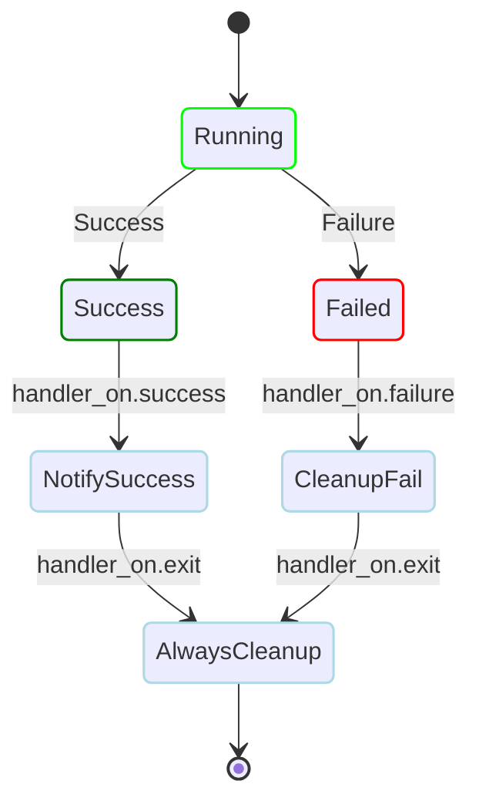

# Reliability Examples

Examples for retries, backoff, lifecycle handlers, and tolerant failure handling.

<div class="examples-grid">

<div class="example-card">

### Continue on Failure

```yaml
steps:
  # Optional task that may fail
  - id: optional_task
    run: exit 1  # This will fail
    continue_on:
      failure: true
  # This step always runs
  - id: required_task
    run: echo "This must succeed"
    depends: optional_task
```

<a href="/writing-workflows/error-handling#continue" class="learn-more">Learn more →</a>

</div>

<div class="example-card">

### Continue on Skipped

```yaml
steps:
  # Optional step that may be skipped
  - id: optional_feature
    run: echo "Enabling feature"
    preconditions:
      - condition: "${env.FEATURE_FLAG}"
        expected: "enabled"
    continue_on:
      skipped: true
  # This step always runs
  - id: main_task
    run: echo "Processing main task"
    depends: optional_feature
```

<a href="/writing-workflows/control-flow#continue-on-skipped" class="learn-more">Learn more →</a>

</div>

<div class="example-card">

### Retry on Failure

```yaml
steps:
  - run: curl https://api.example.com
    retry_policy:
      limit: 3
      interval_sec: 30
```

<a href="/writing-workflows/error-handling#retry" class="learn-more">Learn more →</a>

</div>

<div class="example-card">

### Smart Retry Policies

```yaml
steps:
  - run: curl -f https://api.example.com/data
    retry_policy:
      limit: 5
      interval_sec: 30
      exit_code: [429, 503, 504]  # Rate limit, service unavailable
```

<a href="/writing-workflows/error-handling#retry" class="learn-more">Learn more →</a>

</div>

<div class="example-card">

### Retry with Exponential Backoff

```yaml
steps:
  - run: curl https://api.example.com/data
    retry_policy:
      limit: 5
      interval_sec: 2
      backoff: true        # 2x multiplier
      max_interval_sec: 60   # Cap at 60s
      # Intervals: 2s, 4s, 8s, 16s, 32s → 60s
```

<a href="/writing-workflows/error-handling#exponential-backoff" class="learn-more">Learn more →</a>

</div>

<div class="example-card">

### Repeat with Backoff

> Looking for iteration over a list? See [Parallel Execution](/writing-workflows/examples/basic#parallel-execution-iterator).

```yaml
steps:
  - run: nc -z localhost 8080
    repeat_policy:
      repeat: while
      exit_code: [1]        # While connection fails
      interval_sec: 1
      backoff: 2.0
      max_interval_sec: 30
      limit: 20
      # Check intervals: 1s, 2s, 4s, 8s, 16s, 30s...
```

<a href="/writing-workflows/control-flow#exponential-backoff-for-repeats" class="learn-more">Learn more →</a>

</div>

<div class="example-card">

### Lifecycle Handlers

```yaml
steps:
  - run: echo "Processing main task"
handler_on:
  success:
    run: echo "SUCCESS - Workflow completed"
  failure:
    run: echo "FAILURE - Cleaning up failed workflow"
  exit:
    run: echo "EXIT - Always cleanup"
```



<a href="/writing-workflows/lifecycle-handlers" class="learn-more">Learn more →</a>

</div>

</div>
