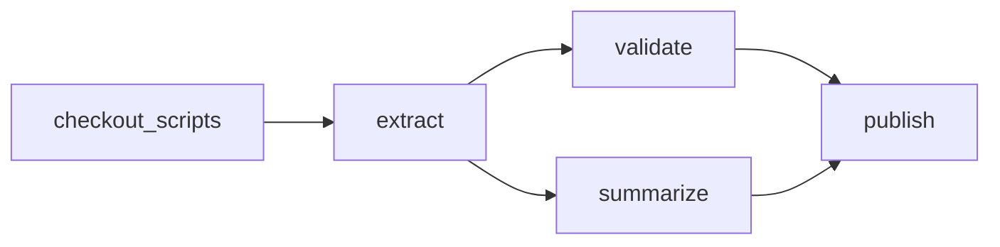

# Writing Workflows

## Workflow Structure

```yaml
description: "Process daily data"
schedule: "0 2 * * *"      # Optional: cron schedule
queue: "daily-jobs"        # Optional: assign to global queue for concurrency control
tools:                     # Optional: install portable CLIs before the run
  - jqlang/jq@jq-1.7.1

params:                    # Runtime parameters
  - name: ENVIRONMENT
    type: string
    default: staging
    enum: [dev, staging, prod]
  - name: BATCH_SIZE
    type: integer
    default: 25
    minimum: 1
    maximum: 100

env:                       # Environment variables
  - DATE: "`date +%Y-%m-%d`"
  - DATA_DIR: /tmp/data

steps:                     # Workflow steps
  - run: echo "Processing ${params.ENVIRONMENT} for date ${env.DATE} with batch ${params.BATCH_SIZE}"
```

Parameter `default` values are literal. To compute a runtime default, use `eval:` on an inline rich param definition. See [Parameters](/writing-workflows/parameters) for precedence, fallback behavior, and typed validation.

## Multiple-Step DAG

Dagu runs all ready steps at the same time. In this DAG, `checkout_scripts` gets the scripts first. Then `validate` and `summarize` both wait for `extract` and run in parallel. `publish` waits for both of them.

`defaults.retry_policy` gives each step the same retry policy unless that step sets its own `retry_policy`.

```yaml
defaults:
  retry_policy:
    limit: 2
    interval_sec: 10

working_dir: ./workspace/data-pipeline

steps:
  - id: checkout_scripts
    action: git.checkout
    with:
      repository: https://github.com/example/data-pipeline.git
      ref: v1.2.3
      path: .

  - id: extract
    depends: checkout_scripts
    run: ./scripts/extract.sh

  - id: validate
    depends: extract
    run: ./scripts/validate.sh

  - id: summarize
    depends: extract
    run: ./scripts/summarize.sh

  - id: publish
    depends: [validate, summarize]
    run: ./scripts/publish.sh
```



`git.checkout` still runs on every DAG run. If `path` is empty, it clones the repository. If `path` already contains a Git repository, it fetches and checks out the requested ref instead of cloning again. If the path exists with non-Git files, the step fails. If overlapping DAG runs can use the same `working_dir`, use a per-run directory or set `max_active_runs: 1`.

## Tool Dependencies

Declare external CLI dependencies with top-level `tools` when a host command step needs a reproducible binary version:

```yaml
tools:
  - jqlang/jq@jq-1.7.1

steps:
  - id: filter
    run: jq '.items[] | .id' input.json
```

Dagu installs the tools before the DAG starts, exposes them on `PATH` for that DAG run, and caches them under the worker-local data directory. Use this for portable CLIs such as `jq`, `yq`, linters, formatters, converters, and release helpers. Do not use it for commands that require user-managed login state or profiles, such as `gcloud` or AI agent CLIs.

See [Tools](/writing-workflows/tools) for syntax, registry behavior, sub-DAG behavior, distributed worker behavior, and current limitations.

## Base Configuration

Share common settings across all DAGs using base configuration:

```yaml
# ~/.config/dagu/base.yaml
env:
  - LOG_LEVEL: info
  - AWS_REGION: us-east-1
  - SMTP_USER: ${SMTP_USER}
  - SMTP_PASS: ${SMTP_PASS}

smtp:
  host: smtp.company.com
  port: "587"
  username: ${env.SMTP_USER}
  password: ${env.SMTP_PASS}

error_mail:
  from: alerts@company.com
  to: oncall@company.com
  attach_logs: true

hist_retention_days: 30 # Keep workflow history and logs for 30 days by default
queue: "default"      # Default queue for all DAGs (define in config.yaml)
```

DAGs automatically inherit these settings:

```yaml
# my-workflow.yaml

# Inherits all base settings
# Can override specific values:
env:
  - LOG_LEVEL: debug  # Override
  - CUSTOM_VAR: value # Addition

steps:
  - run: echo "Processing"
```

Configuration precedence: System defaults → Base config → DAG config

See [Base Configuration](/server-admin/base-config) for complete documentation on all available fields.

## Local `actions:` Definitions

`actions:` defines local shortcuts for built-in steps. Put them in a DAG file or `base.yaml`. Each shortcut can define inputs and a template. Dagu expands it into a normal step before the run starts.

```yaml
actions:
  greet:
    input_schema:
      type: object
      additionalProperties: false
      required: [message]
      properties:
        message:
          type: string
    template:
      run: |
        #!/bin/bash
        printf '%s\n' {{ json .input.message }}

steps:
  - action: greet
    with:
      message: hello
```

The most common pattern is a `run` custom action with a templated `script`. The step call site supplies typed `with` input, the schema can apply defaults, and the template expands to a normal built-in step before execution. See [Custom Actions](/dagu-actions/custom) for the exact rules.

## Dagu Actions and Third-Party Actions

Packaged actions run code from a pinned package. The caller chooses the version. The package declares its inputs, workflow, and required `tools`. Dagu installs those tool versions and runs the package workflow.

- Use [Dagu Actions](/dagu-actions/official) when a maintained `dagucloud/*` action already matches the task.
- Use [Third-Party Actions](/dagu-actions/third-party) when a non-official repository provides the package you want to pin and call.

Third-party actions are called directly by versioned repository reference:

```yaml
steps:
  - id: notify
    action: acme/dagu-action-notify@v1.2.0
    with:
      text: "Deployment finished"
```

Dagu Actions are maintained by Dagu and called with the short form:

```yaml
steps:
  - id: compute
    action: node-script@v1
    with:
      input:
        values: [1, 2, 3]
      script: |
        return { total: input.values.reduce((sum, value) => sum + value, 0) }
```

Packaged actions contain a `dagu-action.yaml` manifest and a DAG entrypoint. Dagu resolves the ref, validates the input, runs the action workflow as a sub-DAG, and exposes the action outputs as JSON. For details, see [Dagu Actions](/dagu-actions/) and [Action Package Execution](/dagu-actions/execution-model).

## Guide Sections

1. **[Basics](/writing-workflows/basics)** - Steps, commands, dependencies
2. **[Container](/writing-workflows/container)** - Run workflows in Docker containers
3. **[Control Flow](/writing-workflows/control-flow)** - Parallel execution, conditions, loops
4. **[Data & Variables](/writing-workflows/data-variables)** - Parameters, outputs, data passing
5. **[Durable Execution](/writing-workflows/durable-execution)** - Step retries, default step retries, DAG retries
6. **[Error Handling](/writing-workflows/error-handling)** - Continue-on behavior, handlers, notifications
7. **[Lifecycle Handlers](/writing-workflows/lifecycle-handlers)** - Cleanup and post-run steps
8. **[Artifacts](/writing-workflows/artifacts)** - Per-run files, preview, download, and cleanup
9. **[Persistent State](/writing-workflows/persistent-state)** - Cursors, checkpoints, and previous values across DAG runs
10. **[Tools](/writing-workflows/tools)** - Reproducible external CLI dependencies
11. **[Patterns](/writing-workflows/control-flow#patterns)** - Composition patterns
12. **[Runtime Profiles](/writing-workflows/runtime-profiles)** - Per-run profile selection for variables and secrets
13. **[Secrets](/writing-workflows/secrets)** - External providers, resolution order, masking behavior

Reusable action docs live in the [Dagu Actions](/dagu-actions/) section.

## Complete Example

```yaml
schedule: "0 2 * * *"

params:
  - name: ENVIRONMENT
    type: string
    default: staging
    enum: [dev, staging, prod]
  - name: DRY_RUN
    type: boolean
    default: false

env:
  - DATE: "`date +%Y-%m-%d`"
  - DATA_DIR: /tmp/data/${env.DATE}

tools:
  - astral-sh/uv@0.11.14

steps:
  - id: download
    run: aws s3 cp "s3://bucket/${env.DATE}.csv" "${env.DATA_DIR}/"
    retry_policy:
      limit: 3
      interval_sec: 60

  - id: validate
    run: uv run --python 3.13.9 python validate.py "${env.DATA_DIR}/${env.DATE}.csv" --env="${params.ENVIRONMENT}" --dry-run="${params.DRY_RUN}"
    continue_on:
      failure: false
    depends: download

  - id: process
    parallel: [users, orders, products]
    run: uv run --python 3.13.9 python process.py --type="${ITEM}" --date="${env.DATE}"
    depends: validate

  - id: report
    run: uv run --python 3.13.9 python report.py --date="${env.DATE}"
    depends: process

handler_on:
  failure:
    run: echo "Notifying failure for ${env.DATE}"
```

## Common Patterns

### Sequential Pipeline
```yaml
steps:
  - id: extract
    run: echo "Extracting data"
  - id: transform
    run: echo "Transforming data"
    depends: extract

  - id: load
    run: echo "Loading data"
    depends: transform
```

### Parallel Processing
```yaml
steps:
  - parallel: [file1, file2, file3]
    action: dag.run
    with:
      dag: process-file

      params: "file=${ITEM}"
---
# A child workflow for processing each file
# This can be in a same file separated by `---` or in a separate file
name: process-file
params:
  - name: file
    required: true
steps:
  - run: echo "Processing" --file "${params.file}"
```
