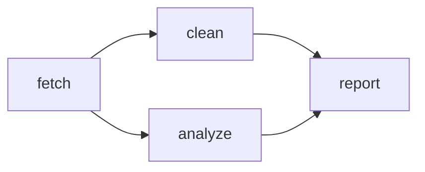

# Writing Workflows

A Dagu workflow is a YAML file with a `steps` list. Start with a command you already run, then add dependencies and operational behavior only when the workflow needs them.

## Start with one command

Save this as `hello.yaml`:

```yaml
steps:
  - run: echo "Hello from Dagu"
```

Run it:

```bash
dagu start hello.yaml
```

That is a complete workflow. A name, schedule, queue, parameter block, and runner configuration are not required.

An `id` is optional for an isolated step. Add one when another step needs to depend on it or reference its output:

```yaml
steps:
  - id: hello
    run: echo "Hello from Dagu"

  - run: echo "Finished"
    depends: hello
```

## Add dependencies to build a DAG

Each step's `depends` field lists the steps that must succeed first. Dagu starts every step whose dependencies are ready.

```yaml
steps:
  - id: fetch
    run: ./fetch.sh

  - id: clean
    run: ./clean.sh
    depends: fetch

  - id: analyze
    run: ./analyze.sh
    depends: fetch

  - id: report
    run: ./report.sh
    depends: [clean, analyze]
```


```mermaid
graph LR
  fetch --> clean
  fetch --> analyze
  clean --> report
  analyze --> report
```

The run proceeds in three stages:

1. `fetch` runs first.
2. `clean` and `analyze` become ready together, so they run in parallel.
3. `report` waits for both branches.

There is no separate parallel-execution configuration. Parallelism follows directly from the graph.

## Validate, preview, and inspect runs

Use the CLI while developing a workflow:

```bash
dagu validate pipeline.yaml             # Check the YAML
dagu dry pipeline.yaml                  # Show the execution plan
dagu start pipeline.yaml                # Run it now
dagu start --only report pipeline.yaml  # Run one step on its own
dagu history pipeline                   # List recent runs
```

Start the server to inspect the same workflows in the Web UI:

```bash
dagu start-all --dags .
```

Open <http://localhost:8080> to see the graph, live step status, logs, run history, and controls for starting, stopping, and retrying runs.

## Add operational behavior when needed

Top-level fields configure the workflow as a whole. Fields inside a step configure that command.

### Schedule it and retry failures

```yaml
schedule: "0 2 * * *"

steps:
  - run: ./nightly-sync.sh
    retry_policy:
      limit: 3
      interval_sec: 30
```

The scheduler starts this workflow every day at 02:00. A failed command is retried up to three times with 30 seconds between attempts. See [Scheduling](/writing-workflows/scheduling) and [Durable Execution](/writing-workflows/durable-execution).

### Accept parameters

```yaml
params:
  - ENVIRONMENT: staging

steps:
  - run: ./deploy.sh "${params.ENVIRONMENT}"
```

Override the value when starting the workflow:

```bash
dagu start deploy.yaml -- ENVIRONMENT=production
```

Parameters can also be typed and validated before a run starts. See [Parameters](/writing-workflows/parameters).

::: tip Container runtime access
Container examples require a Docker-compatible daemon. If Dagu runs in Docker,
[mount the host socket first](/getting-started/installation/docker#run-container-steps-when-dagu-runs-in-docker).
:::

### Run the workflow in a shared container

```yaml
container:
  image: python:3.13

steps:
  - run: python report.py
```

All steps share one workflow container and its filesystem. See [Container](/writing-workflows/container).

## Use built-in actions

`run` executes a command through a shell. For operations with structured inputs, set `action` and pass its configuration under `with`. Actions use the same dependencies, retries, conditions, status tracking, and logs as command steps.

### Run one step in Docker

Use `docker.run` when a step needs its own container:

```yaml
steps:
  - id: container_job
    action: docker.run
    with:
      image: alpine:3
      auto_remove: true
      command: echo "Hello from Docker"
```

The container is separate from containers used by other steps. See [Docker](/step-types/docker#executor-with-syntax).

### Run a command over SSH

```yaml
steps:
  - id: check_server
    action: ssh.run
    with:
      user: deploy
      host: app.example.com
      command: uptime
```

Dagu captures the remote command's status, stdout, and stderr as a normal step result. See [SSH](/step-types/ssh).

### Route to selected steps

`router.route` provides switch-style branching. Target steps implicitly depend on the router; steps in unselected routes are skipped.

```yaml
type: graph

params:
  - TARGET: staging

steps:
  - id: choose_target
    action: router.route
    with:
      value: ${params.TARGET}
      routes:
        staging: [deploy_staging]
        production: [deploy_production]

  - id: deploy_staging
    run: ./deploy.sh staging

  - id: deploy_production
    run: ./deploy.sh production
```

Exact values, `re:` regular-expression patterns, and `num:` numeric comparisons can each select one or more target steps. See [Router](/step-types/router).

### Run a coding agent

`harness.run` launches an external coding-agent CLI as a workflow step:

```yaml
steps:
  - id: review
    action: harness.run
    with:
      provider: codex
      prompt: Review the current branch and report correctness risks
```

The provider CLI must be installed and authenticated on the worker, or supplied through a containerized harness. See [Harness](/step-types/harness/) and [Sandboxed Execution](/step-types/harness/sandbox/).

### Wait for a person

```yaml
steps:
  - id: confirm
    action: human.task
    with:
      prompt: Deploy to production?

  - id: deploy
    run: ./deploy.sh
    depends: confirm
```

The run enters `Waiting` at `confirm` and releases its worker slot. Complete the task from the Web UI, REST API, or CLI to resume the same run. See [Human Tasks](/writing-workflows/human-tasks).

Other built-in actions cover [HTTP requests](/step-types/http), [SQL](/step-types/sql/), [Kubernetes jobs](/step-types/kubernetes), [S3](/step-types/s3), [Git](/step-types/git), files, archives, templates, and persistent state.

## Find the next topic

| When you want to… | Read |
|---|---|
| Learn step fields, scripts, dependencies, and defaults | [Workflow Basics](/writing-workflows/basics) |
| Pass parameters, outputs, and files between steps | [Data & Variables](/writing-workflows/data-variables) |
| Feed a previous step's output file into a command's standard input | [Standard Input](/writing-workflows/data-flow#standard-input) |
| Send DAG-local scripts and configuration to distributed workers | [File Dependencies](/writing-workflows/file-dependencies) |
| Reuse unchanged file-producing steps across runs | [Build Workflows](/writing-workflows/incremental-workflows) |
| Add conditions, loops, parallel iteration, or sub-DAGs | [Control Flow](/writing-workflows/control-flow) |
| Configure retries, timeouts, handlers, and failure behavior | [Durable Execution](/writing-workflows/durable-execution) and [Error Handling](/writing-workflows/error-handling) |
| Run HTTP, SQL, SSH, Docker, Kubernetes, or other actions | [Built-in Actions](/step-types/shell) |
| Start from copyable workflows | [Examples](/writing-workflows/examples) |
| Look up every supported field | [YAML Specification](/writing-workflows/yaml-specification) |
