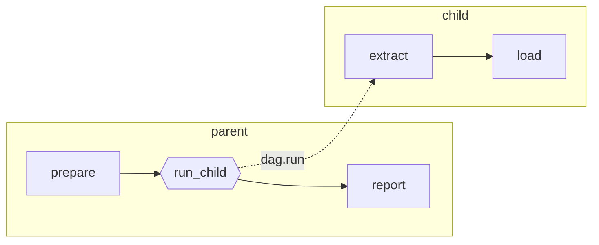

# Sub-DAGs

Run another DAG from a step and compose workflows out of smaller, reusable ones.

## Overview

A step that uses `action: dag.run` or `action: dag.enqueue` starts a **child DAG run**. The DAG containing the step is the **parent run**, and the top of the chain is the **root run**. A child run has its own DAG-run ID, its own status, its own logs, and its own work directory, and it is linked back to the step that started it.

| Action | Parent waits? | Child run | Use when |
|--------|---------------|-----------|----------|
| `dag.run` | Yes | Executes immediately as a sub-DAG of the parent | Later steps need the child's result |
| `dag.enqueue` | No | Becomes its own top-level run with status `queued` | The child is fire-and-forget work |



## Calling a Child DAG

```yaml
steps:
  - id: prepare
    run: ./prepare.sh

  - id: run_child
    action: dag.run
    with:
      dag: child-workflow
      params:
        task_id: "123"
    depends: prepare

  - id: report
    run: echo "Parent completed"
    depends: run_child
```

`with.dag` is required. `with.params` is optional. `dag.run` accepts no other `with` fields.

## Resolving the Child DAG

`with.dag` is resolved in this order:

1. A DAG document defined in the same file after `---`.
2. A DAG registered in the DAGs directory, by name (`child-workflow`) or by path relative to the DAGs directory (`workflows/child.yaml`).

Names, paths, and the `.yaml` suffix are all accepted:

```yaml
with:
  dag: child-workflow          # registered name
with:
  dag: workflows/child.yaml    # path under the DAGs directory
```

If the child cannot be resolved, the step fails during setup with `failed to find DAG "<name>"`.

## Defining Child DAGs in the Same File

Separate documents with `---` and call them by `name`. This keeps a small pipeline in one file.

```yaml
steps:
  - id: process
    action: dag.run
    with:
      dag: data-processor
      params:
        type: daily
---
name: data-processor
params:
  - name: type
    default: batch
steps:
  - id: extract
    run: echo "Extracting ${params.type} data"

  - id: transform
    run: echo "Transforming data"
    depends: extract
```

Local DAG documents are addressable only from within the file that defines them. They are not separately registered, so they cannot be started, scheduled, or queried by name on their own. Move a child into its own file once other workflows need it.

## Passing Parameters

Child DAGs receive input through `with.params` only. Declare the contract with `params:` in the child, and read it with `${params.<name>}`.

Map form is preferred:

```yaml
steps:
  - id: run_child
    action: dag.run
    with:
      dag: child
      params:
        source: production
        limit: 100
```

Space-separated string form is also accepted:

```yaml
with:
  dag: child
  params: "source=production limit=100"
```

Values are resolved in the parent before the child starts, so parent parameters, environment values, and step outputs can be forwarded:

```yaml
with:
  dag: child
  params:
    date: ${params.date}
    build: ${steps.build.outputs.version}
```

Runtime overrides passed this way stay literal in the child. See [Parameters](/writing-workflows/parameters).

## Passing Environment Values

`params` is the normal way to give a child its inputs. When a child needs a
value that is not part of its parameter contract, a step can hand it over with
`pass_env`:

```yaml
steps:
  - name: call-child
    action: dag.run
    with:
      dag: child
    pass_env: [BUILD_ID, REGION]
```

`pass_env: true` passes the values the parent workflow declared, rather than a
named list:

```yaml
steps:
  - name: call-child
    action: dag.run
    with:
      dag: child
    pass_env: true
```

### What This Is For

A child that runs in the parent's process already observes the parent's
environment. `pass_env` governs what reaches a child that runs **somewhere
else** — a child dispatched to a worker starts with only its own definition.

So `pass_env` adds values for a remote child. It is not a filter: a name list
does not restrict what a local child can see.

### What Each Form Carries

`pass_env: [NAMES]` resolves each name against the environment visible to the
calling step, so a name can come from the DAG `env`, a step `env`, or a
predecessor step's output. A name that does not resolve is skipped with a
warning.

`pass_env: true` carries the values the workflow itself declared. It reads the
run environment, so it does not include step `env` entries or step outputs, and
it never carries:

| Excluded | Why |
|----------|-----|
| Secrets | See below |
| Host values such as `HOME`, `TMPDIR`, `DOCKER_HOST` | They describe the machine running the parent |
| Dagu values such as `DAG_RUN_ID`, `DAG_RUN_WORK_DIR` | The child resolves its own |
| Params | The child owns its params; the step passes them with `params` |
| Runtime profile values | The child resolves its own profile |

Neither form carries a name reserved by Dagu, a name managed by `tools` such as
`PATH`, or a name that is not a valid environment variable name.

### Secrets Are Not Passed

`pass_env` refuses to pass a secret. Naming a secret the workflow declares fails
validation; a value that is a secret for another reason fails the step.

Declare the secret in the child instead:

```yaml
# child.yaml
secrets:
  - name: API_TOKEN
    provider: env
    key: PROD_API_TOKEN
steps:
  - run: ./deploy.sh
```

The child then resolves it through the secret provider, masks it in its own
logs, and keeps the value out of the coordinator's dispatch record. A child on a
worker resolves it through the coordinator, which authorizes the request against
that run's lease.

The refusal sees only what the calling run itself holds as a secret. A value a
run received from *its* parent arrives as ordinary run environment, so declare
secrets where they are used rather than relying on one reaching a nested run.

### Limits

`pass_env` is not supported with `action: dag.enqueue`. A queued child reads its
own environment when it is dequeued, so these values cannot reach it.

Passed values are resolved when the parent step starts the child. Retrying or
restarting re-runs the parent step and resolves them again. A child resumed
directly from its own state — approving a gate inside it, pushing a step back,
resuming an agent session — does not receive them, and a later step reads
`${NAME}` as plain text.

## Reading Child Results

A `dag.run` step writes the child run result to stdout as JSON. Capture it with `output:`:

```yaml
steps:
  - id: run_child
    action: dag.run
    with:
      dag: child
    output: CHILD

  - id: use_result
    depends: run_child
    run: |
      echo "run id:  ${CHILD.dagRunId}"
      echo "status:  ${CHILD.status}"
      echo "message: ${CHILD.outputs.MESSAGE}"
```

### Result Object

| Field | Description |
|-------|-------------|
| `name` | Child DAG name. |
| `dagRunId` | Child DAG-run ID. |
| `params` | Parameters the child ran with. |
| `outputs` | Values captured by `output:` on child steps. |
| `outputValues` | Values published by `outputs.write` or `stdout.outputs` in the child. |
| `status` | Terminal status of the child run. |

### Publishing Values From a Child

Two child-side mechanisms cross the run boundary:

```yaml
# child.yaml
steps:
  - id: build
    run: ./build.sh          # prints the image tag
    output: IMAGE            # -> ${CHILD.outputs.IMAGE}

  - id: publish
    action: outputs.write
    with:
      values:
        image: ${IMAGE}      # -> ${CHILD.outputValues.image}
```

Declared step outputs (`outputs:` with `name:`) are scoped to the DAG document that defines them. They are not visible to the parent; republish them with `outputs.write` or `stdout.outputs` when a parent needs them.

Keep returned values small. Use [Artifacts](/writing-workflows/artifacts) for files, reports, and large payloads.

An [Agent DAG](/writing-workflows/agent#reporting-from-a-sub-workflow) treats the choice between the two as load-bearing: publishing with `outputs.write` decides what the model is told about the child run, and what it is told is resent on every later turn.

## Running Children in Parallel

Add `parallel` to a `dag.run` or `dag.enqueue` step to fan out one child run per item. Each child receives `${ITEM}`.

```yaml
steps:
  - id: fanout
    action: dag.run
    with:
      dag: file-processor
      params:
        file: ${ITEM}
    parallel:
      items: [a.csv, b.csv, c.csv]
      max_concurrent: 2
    output: RESULTS
```

| Field | Description |
|-------|-------------|
| `parallel.items` | Static list of items. |
| `parallel.variable` | Variable or reference whose value expands at runtime. |
| `parallel.max_concurrent` | Maximum concurrent child runs. Must be greater than `0`. |

Object items expose their fields as `${ITEM.<field>}`:

```yaml
parallel:
  items:
    - account_id: acct_1
      region: us-east-1
    - account_id: acct_2
      region: eu-west-1
```

The captured aggregate is JSON:

```json
{
  "summary": { "total": 3, "succeeded": 3, "failed": 0 },
  "results": [ { "name": "file-processor", "dagRunId": "...", "params": "file=a.csv", "outputs": {}, "status": "succeeded" } ],
  "outputs": [ { "PROCESSED": "a.csv" } ]
}
```

```yaml
  - id: reduce
    depends: fanout
    run: echo "${RESULTS.summary.succeeded} of ${RESULTS.summary.total} succeeded"
```

`outputs` contains only the successful child runs, so its indexes do not line up with the item list. Do not infer item identity from array position; include the item in each child's own output instead.

Discovering work at runtime uses the same shape:

```yaml
steps:
  - id: discover
    run: ./list-files.sh
    outputs:
      - name: files
        type: json

  - id: process
    action: dag.run
    with:
      dag: file-processor
      params:
        file: ${ITEM}
    parallel:
      items: ${steps.discover.outputs.files}
      max_concurrent: 4
    depends: discover
```

## Queueing Children Asynchronously

`dag.enqueue` persists and queues the child run, then lets the parent continue. The parent never sees the child's result.

```yaml
steps:
  - id: queue_rollup
    action: dag.enqueue
    with:
      dag: customer-rollup
      params:
        customer_id: ${params.customer_id}
      queue: background
    output: QUEUED

  - id: continue
    depends: queue_rollup
    run: echo "Queued ${QUEUED.dagRunId}"
```

`with.queue` overrides the queue for that run. Without it, Dagu uses the child DAG's own `queue`, the base-config default, or the child's local queue. A single enqueue returns `{name, dagRunId, params, queue, status}`; a `parallel` enqueue returns `{summary: {total, queued}, runs: [...]}`.

See [Queue Assignment](/writing-workflows/queues).

## What a Child Run Does Not Inherit

### Working Directory

Every child run gets its own work directory, exposed as `DAG_RUN_WORK_DIR` and `${context.paths.work_dir}`. A child that does not declare `working_dir` runs there, not in the parent's working directory. Parallel children each get a distinct directory, so relative file writes cannot collide.

To pin a child to a specific directory, declare it in the child:

```yaml
# child.yaml
working_dir: /srv/app
steps:
  - run: pwd    # /srv/app
```

Step-level `working_dir` inside the child takes precedence over the child's root `working_dir`. An explicit `working_dir` inherited through the child's base configuration counts as explicit and is honored.

### Lifecycle Handlers

Sub-DAGs do not inherit `handler_on` from base configuration. Without this, a parent's failure alert would fire again for every nested run. Declare handlers explicitly in each child that needs them. See [Sub-DAG Handler Isolation](/writing-workflows/lifecycle-handlers#sub-dag-handler-isolation).

### Tools

Managed `tools` are scoped to one DAG run. A child that uses a pinned external command must declare its own `tools`. See [Tools](/writing-workflows/tools#sub-dags).

### Environment Values

A child dispatched to a worker starts with its own DAG `env` and the `params`
the step passed. To hand it anything else, use `pass_env`. See [Passing
Environment Values](#passing-environment-values).

### What Does Carry Over

The runtime profile selected for the parent run is passed to the child run, and child retries inherit the profile recorded on that child run. See [Runtime Profiles](/writing-workflows/runtime-profiles#sub-dags).

## Failure Handling

A failed or aborted child run fails the parent step. A partially succeeded child produces a partially succeeded parent step.

Use `continue_on` when the parent should proceed anyway:

```yaml
steps:
  - id: optional_child
    action: dag.run
    with:
      dag: nice-to-have
    continue_on:
      failure: true

  - id: next
    depends: optional_child
    run: echo "Continues even if the child failed"
```

Retries, timeouts, preconditions, and `repeat` apply to the parent step as usual and re-run the child as a unit. For retry behavior inside the child, configure `retry_policy` on the child's own steps.

## Approval Gates

`approval` on a `dag.run` step gates *after* the child finishes: the child executes fully, then the step enters `Waiting` so a reviewer can inspect the result before downstream steps run.

```yaml
steps:
  - id: run_integration_tests
    action: dag.run
    with:
      dag: integration-test-suite
    approval:
      prompt: "Review test results before deploying"

  - id: deploy
    run: ./deploy.sh production
    depends: run_integration_tests
```

See [Approval Gates](/writing-workflows/approval#gating-a-sub-dag).

## Observing and Retrying Child Runs

In the Web UI, a run's detail page lists its child runs; selecting one opens that child run.

From the CLI:

```bash
# Inspect a child run
dagu status --run-id=<root-run-id> --sub-run-id=<child-run-id> my-workflow

# Retry the whole root run (children re-run as part of it)
dagu retry --run-id=<root-run-id> my-workflow

# Retry a single step inside a persisted child run
dagu retry --run-id=<root-run-id> --sub-run-id=<child-run-id> --step=build my-workflow

# Retry the child step even if its step preconditions are no longer met
dagu retry --run-id=<root-run-id> --sub-run-id=<child-run-id> --step=build --bypass-preconditions my-workflow
```

`--sub-run-id` requires `--step`. Retry targets the root run: a child run cannot be retried as if it were a top-level run. See [Durable Execution](/writing-workflows/durable-execution).

`--bypass-preconditions` works for child runs executed locally or dispatched to a worker. It requires a local CLI context; selecting a remote server with `--context` does not support this flag. The coordinator and workers must run a version that supports the flag.

Add `--downstream` to retry and bypass step preconditions for reachable descendants inside the selected child DAG. Unrelated steps and sibling child runs retain their previous state. DAG-level preconditions and lifecycle handlers still apply. The bypass lasts only for this retry; see the [CLI reference](/getting-started/cli#retry).

The REST API exposes child runs under the root run:

```
/api/v1/dag-runs/{name}/{dagRunId}/sub-dag-runs/{subDAGRunId}/...
```

## Distributed Execution

`worker_selector` on a `dag.run` step routes the child run to a matching worker:

```yaml
steps:
  - id: run_on_gpu
    action: dag.run
    with:
      dag: train-model
    worker_selector:
      gpu: "true"
```

Two constraints apply:

- A child DAG containing approval steps cannot be dispatched to a worker.
- The worker must be able to resolve the child DAG. If a parent is dispatched to a worker without a local DAG cache, child resolution fails; set `worker_selector: local` on the parent, or make the child available to the worker.

See [Distributed Execution](/server-admin/distributed/).

## Limitations

- `human.task` steps are allowed only in root DAGs. A child DAG containing one is rejected.
- Declared step outputs do not cross a run boundary.
- Local DAG documents cannot be started, scheduled, or queried independently.

## Related

- [Control Flow](/writing-workflows/control-flow): dependencies, iteration, and routing
- [Parameters](/writing-workflows/parameters): declaring and overriding child inputs
- [Outputs](/writing-workflows/outputs): publishing values from steps
- [Queue Assignment](/writing-workflows/queues): where enqueued children run
- [YAML Specification](/writing-workflows/yaml-specification#child-dag-actions): field reference
